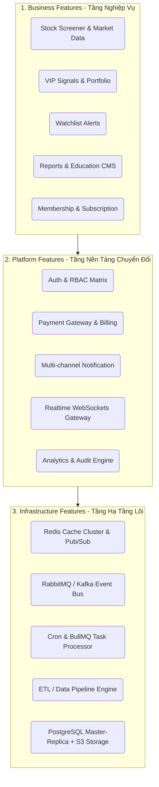
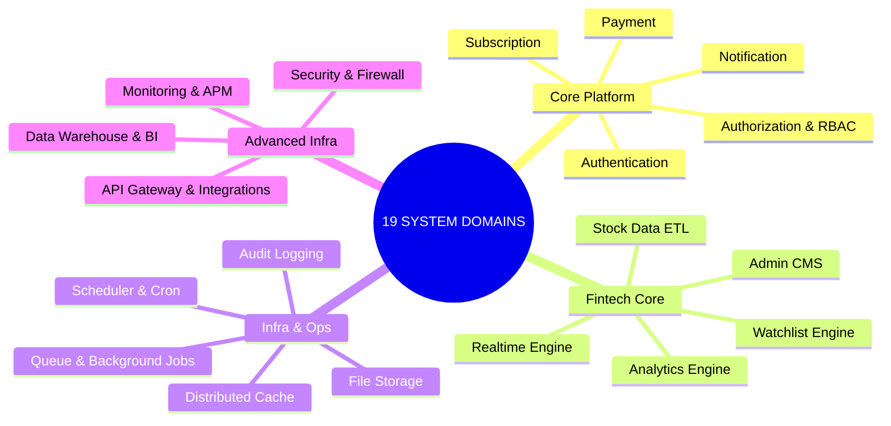
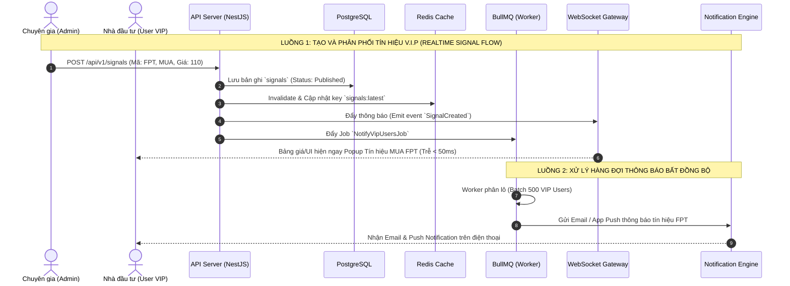
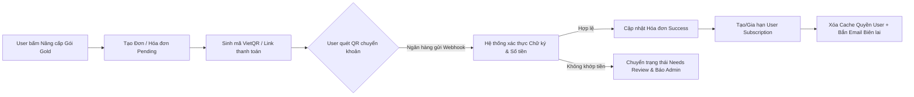
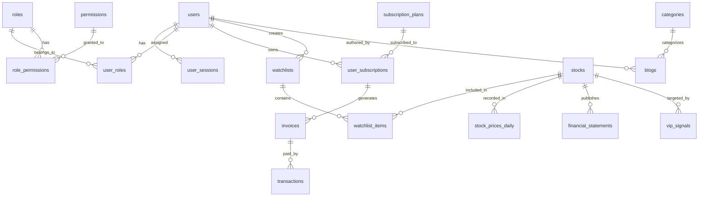

# 🏛️ FINTOP DATA — BÁO CÁO KIỂM TOÁN VÀ ĐẶC TẢ KIẾN TRÚC HỆ THỐNG (SYSTEM, BACKEND & INFRASTRUCTURE SPECIFICATION)

**Phiên bản:** 2.0 (Production-Ready Spec)  
**Tác giả:** FinTop System Architecture Team  
**Mục tiêu:** Đặc tả kiến trúc tổng thể, phân tích chuyên sâu 19 system domains, luồng dữ liệu (data flows), background systems, danh sách database entities và đề xuất chuẩn kiến trúc Backend (NestJS / Microservices / Event-Driven) phục vụ cho việc thiết kế ERD, Database và lập trình hệ thống FinTop DATA ở quy mô lớn.

---

## 📑 MỤC LỤC
1. [Phân tích tổng quan Backend tiềm ẩn và Phân tầng kiến trúc](#1-phân-tích-tổng-quan-backend-tiềm-ẩn-và-phân-tầng-kiến-trúc)
2. [Đặc tả chi tiết 19 System Domains](#2-đặc-tả-chi-tiết-19-system-domains)
3. [Phân tích các luồng dữ liệu & sự kiện (Data & Event Flows)](#3-phân-tích-các-luồng-dữ-liệu--sự-kiện-data--event-flows)
4. [Phân tích hệ thống chạy ngầm (Background Systems)](#4-phân-tích-hệ-thống-chạy-ngầm-background-systems)
5. [Đầy đủ Database Entities theo từng Domain (ERD Readiness)](#5-đầy-đủ-database-entities-theo-từng-domain-erd-readiness)
6. [Đề xuất Kiến trúc Backend Chuẩn (Next-Gen FinTop Architecture)](#6-đề-xuất-kiến-trúc-backend-chuẩn-next-gen-fintop-architecture)

---

## 1. PHÂN TÍCH TỔNG QUAN BACKEND TIỀM ẨN VÀ PHÂN TẦNG KIẾN TRÚC

Hệ thống FinTop DATA hiện tại vận hành theo mô hình phân quyền Role-based cứng trên nền tảng web monolithic (hoặc dịch vụ backend đơn giản). Tuy nhiên, để đáp ứng hàng trăm nghìn nhà đầu tư truy cập cùng lúc với yêu cầu dữ liệu realtime (bảng giá, tín hiệu, phân tích TA/FA), hệ thống cần được phân rã thành 3 tầng kiến trúc chuẩn mực:



### Phân rã 3 Lớp Hệ Thống (Three-Tier Feature Separation)
1. **Business Features (Tầng Nghiệp Vụ Khách Hàng & Vận Hành):** Nơi xử lý trực tiếp các giá trị cốt lõi của sản phẩm đầu tư tài chính, bao gồm bộ lọc chứng khoán (Screener), định giá doanh nghiệp, danh mục đầu tư mẫu (Model Portfolio), quản trị tín hiệu chuyên gia (Signals) và kho tri thức/báo cáo phân tích.
2. **Platform Features (Tầng Nền Tảng & Dịch Vụ Dùng Chung):** Các module cung cấp dịch vụ nền cho toàn hệ thống, như xác thực người dùng (Authentication), ma trận phân quyền (RBAC), cổng thanh toán tự động, dịch vụ thông báo đa kênh (Email/SMS/Push/Socket) và hệ thống phân tích người dùng (User Analytics).
3. **Infrastructure Features (Tầng Hạ Tầng Kỹ Thuật Lõi):** Nền tảng hạ tầng kỹ thuật bảo đảm hiệu năng cao (High Availability & Scalability), bao gồm cụm Redis Cache phân tán, hàng đợi tin nhắn (Message Queue), hệ thống cron/scheduler chạy ngầm, quy trình ETL kéo dữ liệu chứng khoán và lớp lưu trữ dữ liệu (Database + Object Storage).

---

## 2. ĐẶC TẢ CHI TIẾT 19 SYSTEM DOMAINS



---

### 2.1. Authentication System (Hệ thống Xác thực)
* **Mô tả chức năng:** Chịu trách nhiệm định danh người dùng, cấp phát và xác thực các phiên đăng nhập an toàn giữa các thiết bị (Web, App).
* **Feature hiện có:** Đăng ký bằng Email/Password, Đăng nhập cơ bản, Quên mật khẩu qua email, Đổi mật khẩu.
* **Feature còn thiếu:** Đăng nhập một chạm qua mạng xã hội (Google, Apple ID, Zalo Login), Xác thực 2 bước (2FA OTP/Google Authenticator), Quản lý danh sách thiết bị đang đăng nhập (Force logout thiết bị nghi ngờ).
* **Feature chuẩn Fintech:** SSO (Single Sign-On) cho hệ sinh thái FinTop (Web, App, Diễn đàn), Tự động phát hiện bất thường (đăng nhập từ IP quốc gia lạ).
* **Dữ liệu chính:** Thông tin định danh (Email, Password hash, Salt), Danh sách Refresh Tokens, Lịch sử đăng nhập (IP, User-Agent, Device).
* **Entities/Tables:** `users`, `user_sessions`, `auth_tokens`, `login_histories`.
* **Event flows:** `UserRegisteredEvent` -> Tạo profile mặc định -> Gửi email chào mừng. `UserLoggedInEvent` -> Ghi log IP/Thiết bị -> Cấp cặp token JWT (Access/Refresh).
* **Dependencies:** Kết nối chặt chẽ với `Authorization & RBAC`, `Notification System` (gửi mã OTP), `Audit Log System`.

---

### 2.2. Authorization & RBAC System (Hệ thống Phân quyền)
* **Mô tả chức năng:** Kiểm soát quyền hạn truy cập của từng tài khoản dựa trên Vai trò (Role) và Quyền chi tiết (Permission) theo từng Module.
* **Feature hiện có:** Phân quyền tĩnh theo 8 Role cố định (CEO, Sale, Editor, Client...) để ẩn/hiện menu Tín hiệu VIP, Danh mục VIP trên web.
* **Feature còn thiếu:** Ma trận phân quyền động (Role-Permission Builder trên UI), Phân quyền theo cấp dữ liệu (Row-level security - ví dụ: Sale chỉ được xem dữ liệu của khách hàng mình phụ trách).
* **Feature chuẩn Fintech:** Kiểm soát truy cập dựa trên thuộc tính (ABAC - Attribute-Based Access Control) như thời hạn gói hội viên, địa chỉ IP văn phòng cho nhân viên.
* **Dữ liệu chính:** Danh sách Roles, Danh sách Permissions, Ma trận Role_Permissions, Danh sách User_Roles.
* **Entities/Tables:** `roles`, `permissions`, `role_permissions`, `user_roles`.
* **Event flows:** Khi User truy cập API -> Middleware check JWT -> Lấy danh sách Permissions từ Redis Cache -> So khớp với yêu cầu của endpoint -> Allow / Deny.
* **Dependencies:** Phụ thuộc vào `Authentication` và `Cache System` (để không phải truy vấn DB liên tục cho mỗi request).

---

### 2.3. Subscription System (Hệ thống Gói dịch vụ)
* **Mô tả chức năng:** Quản lý vòng đời các gói hội viên (Standard, Silver, Gold, Diamond), thời hạn sử dụng và quyền lợi kèm theo.
* **Feature hiện có:** Bảng giá 4 gói dịch vụ, Form gửi yêu cầu nâng cấp gói, Trạng thái hội viên trên trang thông tin cá nhân.
* **Feature còn thiếu:** Quản lý bảng giá động, Quản lý chu kỳ thanh toán (Tháng, Quý, Năm), Tự động nhắc nhở trước khi hết hạn (3 ngày, 1 ngày), Nâng cấp/Hạ cấp gói tự động tính bù trừ tiền (Proration).
* **Feature chuẩn Fintech:** Tự động gia hạn (Auto-renewal) qua thẻ tín dụng/ví điện tử, Quản lý mã giảm giá (Vouchers/Promo codes), Chế độ dùng thử (Free Trial 7 ngày).
* **Dữ liệu chính:** Thông tin gói (Tên, Giá, Quyền lợi), Đơn đăng ký gói (User, Gói, Ngày bắt đầu, Ngày kết thúc, Trạng thái).
* **Entities/Tables:** `subscription_plans`, `user_subscriptions`, `vouchers`, `voucher_redemptions`.
* **Event flows:** `SubscriptionExpiringEvent` (cron job phát hiện) -> Bắn thông báo nhắc nhở gia hạn. `SubscriptionActivatedEvent` -> Mở khóa các tính năng VIP trong hệ thống.
* **Dependencies:** Liên kết mật thiết với `Payment System`, `Authorization & RBAC`, `Notification System`.

---

### 2.4. Payment System (Hệ thống Thanh toán & Gạch nợ)
* **Mô tả chức năng:** Xử lý và ghi nhận toàn bộ các giao dịch tài chính phát sinh từ việc mua gói dịch vụ, nạp tiền hoặc nâng cấp tài khoản.
* **Feature hiện có:** Màn hình Admin phê duyệt thanh toán thủ công (`/system/approvepayment/index`).
* **Feature còn thiếu:** Tích hợp cổng thanh toán trực tuyến (VNPay, MoMo, ZaloPay, VietQR 24/7 với nội dung chuyển khoản động), Hệ thống tự động gạch nợ (Webhook / IPN listener), Quản lý hóa đơn (Invoices), Quy trình hoàn tiền (Refund).
* **Feature chuẩn Fintech:** Ví điện tử nội bộ (FinTop Wallet), Hỗ trợ thanh toán quốc tế (Stripe/PayPal cho Việt kiều), Đối soát tài chính tự động (Reconciliation) hàng ngày với ngân hàng.
* **Dữ liệu chính:** Hóa đơn thanh toán, Mã giao dịch (Transaction ID), Số tiền, Phương thức (Banking, MoMo...), Trạng thái (Pending, Success, Failed, Refunded).
* **Entities/Tables:** `invoices`, `transactions`, `payment_gateways`, `refunds`.
* **Event flows:** User chọn gói -> Tạo `Invoice` (Pending) -> Gen VietQR code -> Ngân hàng báo Webhook thành công -> Cập nhật `Transaction` (Success) -> Kích hoạt `Subscription` tương ứng -> Bắn email biên lai.
* **Dependencies:** Kết nối với `Subscription System`, `API Integration System` (ngân hàng/cổng thanh toán) và `Queue System` (để xử lý IPN bất đồng bộ).

---

### 2.5. Notification System (Hệ thống Thông báo Đa kênh)
* **Mô tả chức năng:** Quản lý và điều phối các thông báo từ hệ thống tới người dùng qua đa phương thức (In-app Bell, Email, SMS, Web Push, Mobile Push).
* **Feature hiện có:** Chuông thông báo in-app cơ bản trên thanh header.
* **Feature còn thiếu:** Bắn email tự động (Biên lai, Nhắc hạn, Đặt lại mật khẩu), Gửi tin nhắn SMS OTP/Zalo ZNS, Web Push notification (ngay cả khi không mở tab web), Quản lý mẫu thông báo (Templates).
* **Feature chuẩn Fintech:** Tùy chỉnh cài đặt thông báo (User Notification Preferences - user tự tắt/bật thông báo email hay SMS), Hệ thống xếp hàng và gom thông báo (Batching notifications) tránh làm phiền user.
* **Dữ liệu chính:** Danh sách thông báo, Kênh gửi (Email, SMS, Push), Người nhận, Nội dung định dạng, Trạng thái (Unread, Read, Sent, Failed).
* **Entities/Tables:** `notification_templates`, `notifications`, `user_notification_settings`, `notification_logs`.
* **Event flows:** Hệ thống kích hoạt event (ví dụ `VipSignalCreated`) -> Notification Worker nhặt event -> Phân loại user nhận -> Đẩy vào Queue tương ứng (Email queue, Push queue) -> Gửi qua nhà cung cấp dịch vụ.
* **Dependencies:** Phụ thuộc vào `Queue/Background Job System`, `Realtime System` và `External APIs` (SendGrid, Twilio, Firebase FCM, Zalo OA).

---

### 2.6. Realtime System (Hệ thống Dữ liệu Thời gian thực)
* **Mô tả chức năng:** Đảm bảo dữ liệu bảng giá, khớp lệnh, chỉ số thị trường và các tín hiệu giao dịch mới được truyền tải tới hàng chục nghìn client ngay lập tức với độ trễ dưới 100ms.
* **Feature hiện có:** Dữ liệu bảng giá và biểu đồ được nhúng qua widget FireAnt (phụ thuộc hạ tầng bên thứ ba).
* **Feature còn thiếu:** Kênh WebSockets/SSE (Server-Sent Events) độc lập do FinTop quản lý, Đẩy thông báo tín hiệu VIP realtime, Cập nhật trạng thái lời/lỗ danh mục VIP realtime trên UI không cần tải lại trang.
* **Feature chuẩn Fintech:** Cụm WebSocket Server phân tán (Node.js/Go) sử dụng Redis Pub/Sub để đồng bộ message giữa các node, Tự động nén dữ liệu (Protobuf hoặc Gzip) để giảm băng thông.
* **Dữ liệu chính:** Các gói tin giá (OHLCV, Bid/Ask), Tín hiệu chuyên gia mới, Trạng thái kết nối của client.
* **Entities/Tables:** Không lưu DB trực tiếp, hoạt động chủ yếu trên RAM / Cache và Redis PubSub channels.
* **Event flows:** Nguồn cấp dữ liệu báo giá mới -> Server đẩy vào kênh Redis `stock_quotes:VN30` -> Các WebSocket Gateway subscribe kênh này -> Broadcast xuống tất cả trình duyệt đang mở trang bảng giá.
* **Dependencies:** Phụ thuộc `Cache System` (Redis Pub/Sub), `Authentication` (để xác thực kết nối WebSocket có đủ quyền nhận tín hiệu VIP hay không).

---

### 2.7. Watchlist System (Hệ thống Danh mục Theo dõi)
* **Mô tả chức năng:** Nơi người dùng cá nhân tạo và quản lý các rổ cổ phiếu quan tâm, đồng thời thiết lập các ngưỡng cảnh báo tự động.
* **Feature hiện có:** Chưa có tính năng Watchlist cá nhân trên hệ thống hiện tại.
* **Feature còn thiếu:** Tạo nhiều Watchlist (ví dụ: "Cổ phiếu BĐS", "Lướt sóng"), Thêm/xóa mã nhanh chóng, Thiết lập cảnh báo giá (Giá vượt 50,000, Khối lượng đột biến > 200% trung bình 20 phiên, RSI chạm vùng quá mua).
* **Feature chuẩn Fintech:** Đồng bộ Watchlist tức thì giữa Web và Mobile App, Tính toán hiệu suất (Performance tracker) mô phỏng lời/lỗ cho Watchlist cá nhân.
* **Dữ liệu chính:** Tên danh mục, Danh sách mã CP, Các quy tắc cảnh báo (Condition, Threshold).
* **Entities/Tables:** `watchlists`, `watchlist_items`, `price_alerts`, `alert_histories`.
* **Event flows:** Cập nhật giá realtime chạy ngầm -> Hệ thống kiểm tra bảng `price_alerts` trong Redis -> Nếu chạm ngưỡng -> Kích hoạt `Notification System` gửi SMS/App push cho user.
* **Dependencies:** Phụ thuộc vào `Realtime System`, `Stock Data ETL` và `Notification System`.

---

### 2.8. Analytics System (Hệ thống Thống kê & Phân tích)
* **Mô tả chức năng:** Theo dõi các chỉ số sức khỏe của nền tảng (Doanh thu, Người dùng hoạt động) và hành vi tương tác của khách hàng.
* **Feature hiện có:** Các con số tổng quan cơ bản trên Dashboard Admin (Số lượng user, bài viết).
* **Feature còn thiếu:** Phân tích DAU (Daily Active Users), MAU, Phễu chuyển đổi (Registration -> Free -> Premium), Tỷ lệ duy trì (Retention Rate), Thống kê mã cổ phiếu được tra cứu nhiều nhất.
* **Feature chuẩn Fintech:** Phân tích hành vi nâng cao (Heatmap click trang web, luồng di chuyển trang), Hệ thống dự báo rời bỏ (Churn prediction) dùng Machine Learning để cảnh báo Sale chăm sóc user sắp hết hạn.
* **Dữ liệu chính:** Nhật ký truy cập (Page views, Clicks, Search keywords), Dữ liệu mua hàng theo thời gian.
* **Entities/Tables:** `user_activities`, `system_kpis`, `search_logs`, `daily_analytics_summaries`.
* **Event flows:** User bấm tìm kiếm mã "HPG" -> Gửi event bất đồng bộ qua queue -> Ghi vào bảng `search_logs` -> Đêm cron job tổng hợp ra bảng xếp hạng TOP mã CP hot nhất tuần.
* **Dependencies:** Phụ thuộc `Queue System` (để không làm chậm tốc độ phản hồi của web) và `Data Warehouse`.

---

### 2.9. Audit Log System (Hệ thống Nhật ký Kiểm toán)
* **Mô tả chức năng:** Ghi nhận và bảo mật toàn bộ dấu vết thao tác của người dùng và quản trị viên (Ai đã làm gì, vào lúc nào, từ IP nào, dữ liệu trước/sau khi đổi).
* **Feature hiện có:** Chưa hiển thị trên giao diện Admin.
* **Feature còn thiếu:** Ghi log tự động cho mọi thao tác CRUD quan trọng (Sửa thông tin user, Phê duyệt tiền, Chỉnh sửa tín hiệu VIP, Đổi cấu hình hệ thống).
* **Feature chuẩn Fintech:** Nhật ký chống chối bỏ (Tamper-proof logs) bằng cách băm chuỗi liên hoàn (Blockchain-like hashing) để bảo đảm Admin không thể sửa log nhằm che giấu sai phạm.
* **Dữ liệu chính:** User ID, Action name, Table name, Record ID, Old Values (JSON), New Values (JSON), IP Address, Timestamp.
* **Entities/Tables:** `audit_logs`, `security_incident_logs`.
* **Event flows:** Admin chỉnh sửa số điện thoại khách hàng -> Interceptor/Observer trong ORM bắt sự kiện -> So sánh diff -> Đẩy bản ghi log vào DB qua Queue.
* **Dependencies:** Tương tác sâu với tầng ORM/Database và `Security System`.

---

### 2.10. File Storage System (Hệ thống Quản lý Lưu trữ)
* **Mô tả chức năng:** Quản lý toàn bộ tài sản kỹ thuật số (Hình ảnh avatar, Ảnh bài viết, File báo cáo PDF chuyên sâu, Video hướng dẫn).
* **Feature hiện có:** Upload ảnh trong CKEditor và Avatar cá nhân (lưu trực tiếp trên thư mục server cục bộ).
* **Feature còn thiếu:** Quản lý kho Media tập trung (Media Library), Tối ưu hóa ảnh tự động (Nén ảnh, chuyển sang định dạng WebP), Chế độ bảo mật file PDF (Chỉ cho user VIP tải, chống chia sẻ link ngoài).
* **Feature chuẩn Fintech:** Phân phối qua mạng lưới CDN toàn cầu (Cloudflare/AWS CloudFront), Đóng dấu bản quyền (Watermarking) tự động lên ảnh và file PDF (đóng dấu Email/SĐT của user tải để chống leak dữ liệu).
* **Dữ liệu chính:** Metadata của file (Tên, Kích thước, Định dạng, Đường dẫn URL, Thuộc tính phân quyền, Người upload).
* **Entities/Tables:** `media_files`, `report_files`, `file_downloads`.
* **Event flows:** User upload avatar -> Hệ thống tải lên thư mục tạm -> Worker nén sang WebP 200x200 -> Đẩy lên S3 Storage -> Lưu URL vào bảng `users`.
* **Dependencies:** Kết nối với `Queue System` (nén ảnh nặng) và `Cloud Storage APIs` (AWS S3, MinIO).

---

### 2.11. ETL / Data Pipeline System (Hệ thống Xử lý & Đồng bộ Dữ liệu)
* **Mô tả chức năng:** Kéo, chuẩn hóa và tổng hợp khối lượng lớn dữ liệu chứng khoán từ các nguồn cung cấp ngoài (FireAnt, Sở GDCK, SSI, VNDirect, dữ liệu vĩ mô từ Tổng cục Thống kê) về cơ sở dữ liệu FinTop.
* **Feature hiện có:** Cập nhật thông số cổ phiếu thủ công trên UI hoặc chạy ngầm đơn giản.
* **Feature còn thiếu:** Hệ thống kéo dữ liệu tự động (ETL pipelines) OHLCV mỗi phút/ngày, Đồng bộ Báo cáo tài chính (Cân đối kế toán, Kết quả KD, Lưu chuyển tiền tệ) mỗi quý, Tính toán tự động các chỉ số tài chính (P/E, P/B, EPS, ROE, ROA, Debt/Equity).
* **Feature chuẩn Fintech:** Tự động phát hiện lỗi dữ liệu (Data anomaly detection - ví dụ giá cổ phiếu chia cổ tức bị giảm đột ngột cần điều chỉnh lịch sử), Hệ thống tính toán chỉ báo kỹ thuật (RSI, MACD, Bollinger Bands, MA20/50/200) hàng loạt trên server.
* **Dữ liệu chính:** Dữ liệu giao dịch theo phiên, BCTC 4 quý gần nhất, Hồ sơ doanh nghiệp (Cổ đông lớn, Lãnh đạo, Lịch sử trả cổ tức).
* **Entities/Tables:** `stocks`, `stock_prices_daily`, `stock_prices_intraday`, `financial_statements`, `financial_indicators`, `sector_analytics`.
* **Event flows:** 15:15 mỗi ngày (Đóng cửa sàn) -> Kích hoạt ETL Pipeline -> Gọi API đối tác kéo giá đóng cửa của 1600 mã -> Chạy thuật toán tính Xếp hạng TA/FA mới -> Lưu vào DB và làm mới Cache Redis.
* **Dependencies:** Phụ thuộc vào `Scheduler/Cronjob`, `Queue System` và `External Data Providers`.

---

### 2.12. Queue / Background Job System (Hệ thống Hàng đợi Bất đồng bộ)
* **Mô tả chức năng:** Quản lý và xử lý bất đồng bộ các tác vụ nặng hoặc tốn thời gian nhằm giải phóng tài nguyên cho luồng xử lý web chính (HTTP request/response).
* **Feature hiện có:** Chưa có kiến trúc Queue chuẩn mực rõ ràng.
* **Feature còn thiếu:** Hàng đợi xử lý gửi hàng nghìn email/SMS, Hàng đợi tính toán thuật toán định giá cổ phiếu, Hàng đợi xuất file báo cáo tổng hợp.
* **Feature chuẩn Fintech:** Cơ chế tự động thử lại khi lỗi (Automatic Retries with Exponential Backoff - ví dụ: gửi webhook thanh toán lỗi sẽ thử lại sau 1m, 5m, 15m), Hàng đợi ưu tiên (Priority queues - thông báo OTP nạp tiền ưu tiên cao hơn email bản tin tuần).
* **Dữ liệu chính:** Tên tác vụ (Job name), Dữ liệu đầu vào (Payload JSON), Trạng thái (Waiting, Active, Completed, Failed), Số lần thử (Attempts).
* **Entities/Tables:** Quản lý qua Redis (với BullMQ) hoặc RabbitMQ / bảng `jobs`.
* **Event flows:** Web API nhận yêu cầu xuất báo cáo danh mục 50 trang -> Trả về HTTP 202 Accepted (Kèm JobID) -> Worker nhặt JobID xuất PDF ngầm -> Hoàn thành -> Bắn thông báo chuông in-app cho user tải.
* **Dependencies:** Kết nối mật thiết với `Redis Cache`, `File Storage` và toàn bộ các modules có tác vụ nặng.

---

### 2.13. Scheduler / Cronjob System (Hệ thống Tác vụ Định kỳ)
* **Mô tả chức năng:** Điều phối và thực thi chính xác các tác vụ cần lặp lại theo mốc thời gian cố định (Hàng giờ, Hàng ngày, Cuối tuần, Cuối tháng).
* **Feature hiện có:** Chưa có giao diện quản lý trên Admin.
* **Feature còn thiếu:** Chạy chốt sổ dữ liệu ngày lúc 16:00, Kiểm tra và khóa các tài khoản VIP hết hạn lúc 00:01, Gửi bản tin tóm tắt thị trường sáng lúc 07:30 hàng ngày, Backup dữ liệu tự động lúc 02:00 sáng.
* **Feature chuẩn Fintech:** Hệ thống khóa phân tán (Distributed Lock - đảm bảo nếu chạy nhiều server thì một cron job chỉ chạy đúng 1 lần), Quản lý lịch trình trực tiếp trên UI Admin (Tạm dừng, Chạy ngay lập tức để test).
* **Dữ liệu chính:** Biểu thức thời gian (Cron expression), Tên handler, Trạng thái kích hoạt, Log thực thi (Thời gian chạy, Kết quả).
* **Entities/Tables:** `scheduled_jobs`, `job_execution_logs`.
* **Event flows:** Đến giờ hẹn -> Scheduler lấy khóa Redis Lock -> Kích hoạt hàm xử lý hoặc đẩy Job vào Queue -> Ghi kết quả vào bảng `job_execution_logs`.
* **Dependencies:** Phụ thuộc vào `Queue System` và `Monitoring System` (để báo động nếu cron job quan trọng thất bại).

---

### 2.14. Cache System (Hệ thống Bộ nhớ đệm Phân tán)
* **Mô tả chức năng:** Lưu trữ tạm thời các dữ liệu thường xuyên được truy vấn nhằm giảm tải tới 90% áp lực truy vấn trực tiếp vào Database chính.
* **Feature hiện có:** Chưa tối ưu hóa cache chuyên sâu cho API.
* **Feature còn thiếu:** Cache danh sách mã cổ phiếu, Cache kết quả tính toán bộ lọc (Screener) theo từng bộ tiêu chuẩn, Cache bài viết báo cáo phân tích, Cache phiên đăng nhập và Permissions của user.
* **Feature chuẩn Fintech:** Cấu trúc Cache nhiều lớp (Multi-level caching: L1 In-memory RAM, L2 Redis Cluster phân tán), Chiến lược vô hiệu hóa cache thông minh (Cache Invalidation - ví dụ: khi Admin sửa bài viết, lập tức xóa key cache tương ứng thay vì chờ hết TTL).
* **Dữ liệu chính:** Key-Value pairs, Hash maps (cho OHLCV), Sorted Sets (cho Bảng xếp hạng TOP mã CP).
* **Entities/Tables:** Không dùng DB SQL, lưu trữ trực tiếp trên Redis Cluster.
* **Event flows:** Client gọi API lấy danh sách bài viết VIP -> Check Redis key `blogs:vip:page1` -> Nếu HIT: Trả về lập tức (5ms) -> Nếu MISS: Truy vấn DB (100ms) -> Lưu vào Redis với TTL 1 giờ -> Trả về client.
* **Dependencies:** Nằm giữa tầng API/Controllers và Database.

---

### 2.15. API Integration Gateway (Cổng Tích hợp Đối tác)
* **Mô tả chức năng:** Nơi giao tiếp chuẩn mực, an toàn giữa hệ thống FinTop với các đối tác dịch vụ bên ngoài (Ngân hàng, Nguồn dữ liệu, Email/SMS) cũng như cung cấp Open API cho đối tác thứ ba.
* **Feature hiện có:** Tích hợp FireAnt Widget.
* **Feature còn thiếu:** Cổng tích hợp API Ngân hàng (VietQR / Open Banking), Tích hợp nhà cung cấp dữ liệu chứng khoán quốc tế (TradingView / Bloomberg / Reuters), Cổng cung cấp API thương mại (FinTop Open API) cho các quỹ đầu tư muốn mua số liệu.
* **Feature chuẩn Fintech:** Giới hạn tốc độ gọi (Rate Limiting / Throttling), Quản lý API Keys và Webhook Endpoints cho đối tác, Chuyển đổi và chuẩn hóa định dạng dữ liệu (Data Transformation).
* **Dữ liệu chính:** API Keys, Secret Tokens, Webhook URLs, Lịch sử và nhật ký gọi API (API Access Logs).
* **Entities/Tables:** `api_clients`, `api_keys`, `webhook_endpoints`, `api_request_logs`.
* **Event flows:** Đối tác gọi vào `/api/v1/screener` -> API Gateway kiểm tra `x-api-key` -> Kiểm tra hạn mức Rate Limit (ví dụ tối đa 100 req/min) -> Trừ hạn mức -> Cho phép đi qua Service xử lý.
* **Dependencies:** Phụ thuộc `Security System` và `Cache` (để đếm rate limit nhanh).

---

### 2.16. Monitoring & Logging System (Hệ thống Giám sát & Ghi nhận Hệ thống)
* **Mô tả chức năng:** Giám sát liên tục sức khỏe máy chủ (CPU, RAM, Disk), theo dõi hiệu năng ứng dụng (APM) và tập hợp toàn bộ log lỗi phát sinh.
* **Feature hiện có:** Chưa có trên giao diện quản trị web.
* **Feature còn thiếu:** Theo dõi thời gian phản hồi API (Latency), Theo dõi tỷ lệ lỗi (Error rate 5xx, 4xx), Báo động khi hệ thống quá tải hoặc hết bộ nhớ.
* **Feature chuẩn Fintech:** Tích hợp hệ sinh thái ELK Stack (Elasticsearch, Logstash, Kibana) hoặc Grafana/Prometheus/Loki, Cảnh báo tức thì qua Telegram/Slack cho nhóm kỹ sư khi có sự cố nghiêm trọng (P0 Incident).
* **Dữ liệu chính:** Server metrics (CPU, Memory), Application logs (Info, Warn, Error, Fatal), Traces (Dấu vết thực thi xuyên suốt các microservices).
* **Entities/Tables:** Lưu trữ dạng chuỗi thời gian (Time-series) trên InfluxDB, Prometheus hoặc Elasticsearch.
* **Event flows:** Database CPU vượt quá 85% trong 3 phút liên tục -> Prometheus Alertmanager phát hiện -> Đẩy tin nhắn khẩn cấp vào nhóm Telegram của đội Ops.
* **Dependencies:** Chạy độc lập và gắn vào mọi thành phần hạ tầng của dự án.

---

### 2.17. Security & Firewall System (Hệ thống Bảo mật & Tường lửa)
* **Mô tả chức năng:** Bảo vệ hệ thống trước các cuộc tấn công mạng (DDoS, SQL Injection, XSS) và phòng chống rò rỉ dữ liệu.
* **Feature hiện có:** Bảo mật cơ bản của framework backend.
* **Feature còn thiếu:** Mã hóa dữ liệu nhạy cảm (Số điện thoại, CCCD, thông tin ngân hàng) ngay trong Database (Data at Rest Encryption), Chống tấn công vét cạn (Brute-force protection) tại form đăng nhập, Kiểm tra tính hợp lệ của mọi input đầu vào (Sanitization).
* **Feature chuẩn Fintech:** Tích hợp tường lửa ứng dụng web (WAF - Cloudflare/AWS WAF), Kiểm soát phiên đăng nhập đồng thời (Chỉ cho phép 1 tài khoản đăng nhập trên 1 thiết bị Web và 1 App), Quét lỗ hổng bảo mật tự động (Vulnerability scanning).
* **Dữ liệu chính:** IP Blacklist / Whitelist, Quy tắc phát hiện tấn công, Báo cáo sự cố bảo mật.
* **Entities/Tables:** `ip_blacklists`, `security_rules`, `waf_logs`.
* **Event flows:** 1 IP gọi vào `/login` sai mật khẩu 5 lần trong 1 phút -> Đưa IP vào bảng `ip_blacklists` trong Redis với thời hạn khóa 15 phút -> Các request sau từ IP này lập tức bị từ chối (HTTP 429 / 403).
* **Dependencies:** Nằm ở vành đai ngoài cùng (Gateway) và các middleware xác thực.

---

### 2.18. Admin CMS System (Hệ thống Quản trị Nội dung)
* **Mô tả chức năng:** Nơi đội ngũ quản trị viên và chuyên gia sản xuất, chỉnh sửa và xuất bản các bài viết, báo cáo phân tích, sách cẩm nang.
* **Feature hiện có:** Trang quản trị Bài viết (`/system/blog/index`), Quản trị danh mục (`/system/category/index`), Quản trị cẩm nang (`/system/handbook/index`).
* **Feature còn thiếu:** Quy trình kiểm duyệt bài viết (Editorial Workflow: Draft -> Pending Review -> Approved -> Published), Lên lịch đăng bài tự động theo giờ (Scheduled publishing), Quản lý phiên bản bài viết (Revision history - khôi phục lại nội dung cũ nếu sửa sai).
* **Feature chuẩn Fintech:** Tối ưu hóa SEO tự động (Tạo sitemap, meta tags, og:image), Gắn liên kết thông minh tự động (Khi trong bài viết có gõ mã "HPG", tự động biến thành link bấm ra trang chi tiết cổ phiếu HPG).
* **Dữ liệu chính:** Bài viết, Tác giả, Chuyên mục, Thẻ tags, Trạng thái kiểm duyệt, Lượt xem.
* **Entities/Tables:** `blogs`, `categories`, `tags`, `blog_tags`, `blog_revisions`.
* **Event flows:** Editor viết xong bài báo cáo -> Bấm "Gửi kiểm duyệt" -> Bài viết chuyển trạng thái `Pending Review` -> Bắn email thông báo cho Trưởng ban biên tập -> Duyệt -> Đăng công khai và bắn thông báo cho User VIP.
* **Dependencies:** Kết nối với `File Storage`, `Notification System` và `Cache System`.

---

### 2.19. Data Warehouse & BI Readiness (Hệ thống Kho Dữ liệu & Phân tích Thông minh)
* **Mô tả chức năng:** Chuẩn bị sẵn sàng hạ tầng dữ liệu lớn (Big Data) để tập hợp toàn bộ dữ liệu giao dịch, dữ liệu thị trường và hành vi người dùng về một kho lưu trữ tập trung phục vụ cho việc tạo báo cáo BI (Business Intelligence) và huấn luyện AI.
* **Feature hiện có:** Chưa có kiến trúc Data Warehouse.
* **Feature còn thiếu:** Đồng bộ dữ liệu từ DB giao dịch (OLTP) sang kho dữ liệu phân tích (OLAP - ClickHouse hoặc Google BigQuery) hàng đêm, Tạo các Data Marts chuyên biệt (Ví dụ: Data Mart Chăm sóc khách hàng, Data Mart Phân tích thị trường).
* **Feature chuẩn Fintech:** Mô hình hóa dữ liệu (Star Schema / Snowflake Schema), Tích hợp sẵn sàng với các công cụ BI hàng đầu (PowerBI, Tableau, Apache Superset), Cung cấp dữ liệu sạch cho module FinTop AI đưa ra lời khuyên đầu tư.
* **Dữ liệu chính:** Bảng sự kiện tổng hợp (Fact tables), Bảng chiều phân tích (Dimension tables: Ngày, User, Mã CK, Gói dịch vụ).
* **Entities/Tables:** Các bảng OLAP chuyên dụng (`fact_transactions`, `dim_users`, `dim_stocks`, `dim_dates`).
* **Event flows:** 03:00 sáng -> ETL job trích xuất toàn bộ dữ liệu phát sinh trong ngày từ PostgreSQL -> Transform theo chuẩn Star Schema -> Load vào ClickHouse -> Cập nhật các bảng dashboard BI của Ban lãnh đạo.
* **Dependencies:** Đứng ở vị trí cuối cùng trong chuỗi dữ liệu, thu thập từ tất cả các hệ thống.

---
---

## 3. PHÂN TÍCH CÁC LUỒNG DỮ LIỆU & SỰ KIỆN (DATA & EVENT FLOWS)



### 3.1. Stock Data Flow (Luồng Dữ liệu Cổ phiếu & Thị trường)
1. **Thu thập (Ingestion):** Tác vụ kéo dữ liệu định kỳ (ETL Cron) kết nối tới API nhà cung cấp (FireAnt / Sở GDCK) mỗi 1 phút trong phiên giao dịch.
2. **Chuẩn hóa (Transformation):** Hệ thống lọc bỏ các bản ghi nhiễu, tính toán các mức giá cao nhất/thấp nhất (High/Low), khối lượng giao dịch tích lũy, và so sánh với giá tham chiếu để xác định % tăng/giảm.
3. **Lưu trữ (Storage & Caching):** Dữ liệu nến ngày (Daily) và nến phút (Intraday) được chèn vào DB PostgreSQL (bảng `stock_prices_daily`). Đồng thời, thông số mới nhất được băm (hash) và đẩy vào Redis Cache (`stock:quotes:FPT`).
4. **Phân phối (Distribution):** Các client đang truy cập trang Bảng giá hoặc Bộ lọc nhận dữ liệu lập tức qua kênh WebSocket hoặc lấy từ Redis Cache thông qua REST API với tốc độ cực nhanh (< 10ms).

### 3.2. Payment & Subscription Flow (Luồng Thanh toán & Kích hoạt Gói)


---

## 4. PHÂN TÍCH HỆ THỐNG CHẠY NGẦM (BACKGROUND SYSTEMS)

Để bảo đảm hệ thống vận hành trơn tru và không bị gián đoạn, FinTop DATA cần thiết lập 6 cụm xử lý nền tảng chạy ngầm độc lập:

```
+--------------------------------------------------------------------------------------------------+
|                                    FINTOP BACKGROUND ENGINE                                       |
+------------------------------------+-------------------------------------------------------------+
| 1. CRON JOBS (Lập trình định kỳ)   | • 15:15: Chốt dữ liệu nến ngày (Daily Closing).             |
|                                    | • 00:01: Vô hiệu hóa các gói VIP hết hạn (Expire subs).     |
|                                    | • 02:00: Backup toàn bộ Database ra file mã hóa lên S3.     |
+------------------------------------+-------------------------------------------------------------+
| 2. QUEUE JOBS (Hàng đợi tác vụ)    | • MailQueue: Phân phối hàng chục nghìn email bản tin/alert. |
| (Sử dụng Redis + BullMQ)           | • ReportQueue: Tổng hợp số liệu và đóng gói PDF nặng.       |
|                                    | • IndexQueue: Cập nhật chỉ mục tìm kiếm Elasticsearch.     |
+------------------------------------+-------------------------------------------------------------+
| 3. REALTIME ENGINE (WebSocket)     | • Redis Pub/Sub kết nối nhiều node Socket Gateway.          |
| (Socket.io / Nest Gateway)         | • Kênh riêng `user_alerts:#id` cho thông báo cá nhân.       |
|                                    | • Kênh chung `market_broadcast` cho thông tin thị trường.   |
+------------------------------------+-------------------------------------------------------------+
| 4. CACHE LAYER (Redis Cluster)     | • In-memory caching cho toàn bộ bảng phân quyền JWT.        |
|                                    | • Bộ nhớ đệm bảng giá và kết quả tính toán Screener.        |
+------------------------------------+-------------------------------------------------------------+
| 5. ETL PIPELINES                   | • Kéo và làm sạch số liệu Báo cáo tài chính quý/năm.        |
| (Data Ingestion & Scrubbing)       | • Tự động tính toán các Xếp hạng TA (Kỹ thuật) / FA (Cơ bản)|
+------------------------------------+-------------------------------------------------------------+
| 6. EXTERNAL INTEGRATIONS           | • Giao tiếp bảo mật SSL/TLS với FireAnt, Cafef, Ngân hàng.  |
|                                    | • Cơ chế Fallback (Nếu nhà cung cấp A sập -> Chuyển sang B).|
+------------------------------------+-------------------------------------------------------------+
```

---

## 5. ĐẦY ĐỦ DATABASE ENTITIES THEO TỪNG DOMAIN (ERD READINESS)

Dưới đây là danh sách toàn bộ các thực thể (Tables/Entities) chuẩn hóa, được thiết kế với đầy đủ khóa chính (PK), khóa ngoại (FK) và các trường thông tin chuẩn bị trực tiếp cho việc thiết kế ERD và ánh xạ vào Prisma ORM hoặc TypeORM:



### 5.1. Nhóm Core & RBAC (Xác thực & Phân quyền)
* `users`: `id (PK)`, `email (UQ)`, `password_hash`, `full_name`, `phone`, `dob`, `address`, `avatar_url`, `broker_id`, `risk_taste`, `status (Active/Inactive)`, `created_at`, `updated_at`.
* `user_sessions`: `id (PK)`, `user_id (FK)`, `refresh_token`, `ip_address`, `user_agent`, `expires_at`, `is_revoked`.
* `roles`: `id (PK)`, `name (UQ)`, `code (CEO, CLIENT_VIP...)`, `description`, `is_system`.
* `permissions`: `id (PK)`, `module`, `action (create, read, update, delete)`, `code (UQ)`.
* `role_permissions`: `role_id (FK)`, `permission_id (FK)`.
* `user_roles`: `user_id (FK)`, `role_id (FK)`.

### 5.2. Nhóm Subscription & Billing (Thanh toán & Gói dịch vụ)
* `subscription_plans`: `id (PK)`, `name`, `code (UQ)`, `tier_level (1:Std, 2:Sil, 3:Gold, 4:Dia)`, `price_monthly`, `price_yearly`, `features_summary (JSON)`, `is_active`.
* `user_subscriptions`: `id (PK)`, `user_id (FK)`, `plan_id (FK)`, `start_date`, `end_date`, `status (Active, Expired, Cancelled)`, `auto_renew`.
* `invoices`: `id (PK)`, `invoice_no (UQ)`, `user_id (FK)`, `subscription_id (FK)`, `amount`, `discount_amount`, `tax_amount`, `final_amount`, `status (Pending, Paid, Cancelled)`, `due_date`, `created_at`.
* `transactions`: `id (PK)`, `invoice_id (FK)`, `transaction_ref (UQ)`, `payment_gateway (VNPay, VietQR...)`, `paid_amount`, `status (Success, Failed)`, `bank_code`, `payment_time`.

### 5.3. Nhóm Stock Data & Signals (Dữ liệu CK & Khuyến nghị)
* `sectors`: `id (PK)`, `name`, `code (UQ)`, `description`.
* `stocks`: `id (PK)`, `symbol (UQ - ví dụ: HPG)`, `company_name`, `exchange (HOSE, HNX, UPCOM)`, `sector_id (FK)`, `total_shares`, `market_cap`, `is_active`.
* `stock_prices_daily`: `id (PK)`, `stock_id (FK)`, `trading_date`, `open_price`, `high_price`, `low_price`, `close_price`, `volume`, `value`, `change_percent`, `foreign_buy`, `foreign_sell`.
* `financial_statements`: `id (PK)`, `stock_id (FK)`, `year`, `quarter (1, 2, 3, 4, 0:Yearly)`, `report_type (BalanceSheet, IncomeStatement, CashFlow)`, `data_payload (JSONB)`.
* `financial_indicators`: `id (PK)`, `stock_id (FK)`, `period_date`, `pe_ratio`, `pb_ratio`, `eps`, `roe`, `roa`, `debt_to_equity`, `fa_rating_score`, `ta_rating_score`.
* `vip_signals`: `id (PK)`, `stock_id (FK)`, `created_by (FK - Expert)`, `action_type (BUY, SELL, HOLD)`, `recommended_price_range`, `target_price_1`, `target_price_2`, `cut_loss_price`, `time_horizon (Short, Mid, Long)`, `analysis_note`, `status (Draft, Published, Closed)`, `closed_price`, `profit_loss_percent`.
* `recommended_portfolios`: `id (PK)`, `name`, `expert_id (FK)`, `strategy_desc`, `current_cash_weight`, `current_stock_weight`, `total_nav`, `created_at`.
* `portfolio_items`: `id (PK)`, `portfolio_id (FK)`, `stock_id (FK)`, `buy_price`, `current_price`, `volume`, `weight_percent`, `profit_loss_percent`.

### 5.4. Nhóm Watchlist & Alerts (Theo dõi & Cảnh báo)
* `watchlists`: `id (PK)`, `user_id (FK)`, `name`, `is_default`, `created_at`.
* `watchlist_items`: `watchlist_id (FK)`, `stock_id (FK)`, `added_at`, `note`.
* `price_alerts`: `id (PK)`, `user_id (FK)`, `stock_id (FK)`, `alert_type (PRICE_ABOVE, PRICE_BELOW, VOLUME_SURGE)`, `threshold_value`, `notification_channel (EMAIL, SMS, APP)`, `is_triggered`, `triggered_at`, `is_active`.

### 5.5. Nhóm Content & Reports CMS (Nội dung & Báo cáo)
* `categories`: `id (PK)`, `name`, `slug (UQ)`, `parent_id (FK)`, `sort_order`.
* `tags`: `id (PK)`, `name`, `slug (UQ)`.
* `blogs`: `id (PK)`, `title`, `slug (UQ)`, `summary`, `content`, `author_id (FK)`, `category_id (FK)`, `thumbnail_url`, `is_vip_only`, `status (Draft, Pending, Published)`, `published_at`, `view_count`.
* `blog_tags`: `blog_id (FK)`, `tag_id (FK)`.
* `report_files`: `id (PK)`, `title`, `stock_id (FK - optional)`, `sector_id (FK - optional)`, `file_url`, `file_size_bytes`, `pages_count`, `is_vip_only`, `uploaded_by (FK)`, `created_at`.

### 5.6. Nhóm System, Logging & Analytics (Hệ thống & Thống kê)
* `audit_logs`: `id (PK)`, `user_id (FK)`, `action_type`, `table_name`, `record_id`, `old_values (JSONB)`, `new_values (JSONB)`, `ip_address`, `created_at`.
* `system_kpis`: `id (PK)`, `recorded_date (UQ)`, `total_active_users`, `total_vip_users`, `daily_revenue`, `total_page_views`, `api_latency_ms`.
* `api_request_logs`: `id (PK)`, `api_client_id (FK)`, `endpoint`, `method`, `status_code`, `execution_time_ms`, `ip_address`, `created_at`.

---

## 6. ĐỀ XUẤT KIẾN TRÚC BACKEND CHUẦN (NEXT-GEN FINTOP ARCHITECTURE)

Để đáp ứng các yêu cầu khắt khe của một nền tảng Fintech hiện đại (Độ tin cậy 99.99%, Mở rộng quy mô linh hoạt, Dễ dàng bảo trì và Thử nghiệm tự động), hệ thống Backend FinTop DATA mới nên được phát triển trên nền tảng **NestJS** kết hợp kiến trúc **Modular Monolith** (hoặc Microservices cho các cụm tải nặng như Realtime và ETL).

```
+--------------------------------------------------------------------------------------------------+
|                                    NESTJS BACKEND ARCHITECTURE                                    |
+--------------------------------------------------------------------------------------------------+
|                                      API GATEWAY / CONTROLLERS                                   |
|               (Auth Guard, RBAC Guard, Rate Limiter Middleware, Validation Pipes)                |
+------------------------------------------------+-------------------------------------------------+
|              CORE BUSINESS MODULES             |             INFRASTRUCTURE MODULES              |
|                                                |                                                 |
|  • AuthModule (JWT, OAuth2, 2FA)               |  • DatabaseModule (Prisma / TypeORM)            |
|  • UserModule (Profiles, Roles, Permissions)   |  • CacheModule (Redis Cluster + BullMQ)         |
|  • MarketModule (Stocks, Screener, Charts)     |  • RealtimeModule (Socket.io Gateways)          |
|  • SignalModule (VIP Signals, Portfolios)      |  • NotificationModule (Email, SMS, FCM Push)    |
|  • BillingModule (Plans, Invoices, Webhooks)   |  • StorageModule (AWS S3 / Cloud CDN)           |
|  • CmsModule (Blogs, Reports, Handbooks)       |  • TelemetryModule (Prometheus / Winston Logs)  |
+------------------------------------------------+-------------------------------------------------+
|                                 EVENT BUS / REDIS PUB-SUB LAYER                                  |
+--------------------------------------------------------------------------------------------------+
|                               POSTGRESQL DB + REDIS CACHE + S3 STORAGE                           |
+--------------------------------------------------------------------------------------------------+
```

### 6.1. Cấu trúc thư mục Chuẩn (NestJS Directory Structure)
Cấu trúc mã nguồn áp dụng Clean Architecture, tách biệt rõ ràng giữa tầng Giao tiếp (Controllers/Gateways), tầng Nghiệp vụ (Services/Use-Cases) và tầng Dữ liệu (Repositories/Prisma).

```
fintop-backend/
├── prisma/
│   ├── schema.prisma              ← Cấu trúc Database toàn diện (Theo mục 5)
│   ├── migrations/                ← Các phiên bản thay đổi DB
│   └── seeders/                   ← Script tạo dữ liệu gốc (Roles, Plans)
│
├── src/
│   ├── common/                    ← Thành phần dùng chung toàn hệ thống
│   │   ├── decorators/            ← @CurrentUser(), @RequiredPermissions()
│   │   ├── filters/               ← AllExceptionsFilter (Xử lý lỗi tập trung)
│   │   ├── guards/                ← JwtAuthGuard, PermissionsGuard, ThrottlerGuard
│   │   ├── interceptors/          ← LoggingInterceptor, TransformResponseInterceptor
│   │   └── utils/                 ← Các hàm tính toán tài chính, mã hóa
│   │
│   ├── modules/                   ← Các Module nghiệp vụ độc lập (Feature Modules)
│   │   ├── auth/                  ← Module Xác thực (Login, Tokens, 2FA)
│   │   ├── users/                 ← Module Quản lý User & Client
│   │   ├── rbac/                  ← Module Phân quyền (Roles & Permissions)
│   │   ├── market/                ← Module Dữ liệu CK & Bộ lọc Screener
│   │   ├── signals/               ← Module Khuyến nghị V.I.P & Danh mục mẫu
│   │   ├── watchlists/            ← Module Danh mục theo dõi cá nhân & Cảnh báo
│   │   ├── billing/               ← Module Gói dịch vụ & Gạch nợ thanh toán
│   │   ├── cms/                   ← Module Quản trị Bài viết, Báo cáo & Cẩm nang
│   │   ├── analytics/             ← Module Thống kê số liệu KPI Admin
│   │   └── etl/                   ← Module Đồng bộ và chuẩn hóa số liệu chứng khoán
│   │
│   ├── infra/                     ← Các Module Giao tiếp Hạ tầng Lõi
│   │   ├── database/              ← PrismaClient Provider
│   │   ├── cache/                 ← Redis Cluster Service
│   │   ├── queue/                 ← BullMQ Queue Workers
│   │   ├── realtime/              ← WebSocket Gateway & Redis IoAdapter
│   │   ├── mailer/                ← Dịch vụ gửi Email (SendGrid / Nodemailer)
│   │   └── storage/               ← Dịch vụ lưu trữ S3 Storage
│   │
│   ├── app.module.ts              ← Root Module gom kết nối
│   └── main.ts                    ← Entry point (Cấu hình Port, CORS, Swagger)
│
├── test/                          ← Thư mục chứa Unit Test & E2E Test
├── .env.example                   ← File biến môi trường mẫu
├── Dockerfile                     ← Cấu hình đóng gói Docker container
└── docker-compose.yml             ← Cấu hình môi trường dev (Postgres, Redis, RabbitMQ)
```

### 6.2. Các Luồng Thiết Kế Cốt Lõi Trong Kiến Trúc Mới
1. **Event-Driven Decoupling (Tách rời các module bằng sự kiện):** Khi một nghiệp vụ phát sinh (ví dụ: Gạch nợ hóa đơn thành công trong `BillingModule`), thay vì gọi trực tiếp sang `UserModule` và `NotificationModule`, hệ thống kích hoạt sự kiện `EventEmitter2.emit('invoice.paid', data)`. Các listener độc lập nhặt sự kiện để gia hạn gói và bắn email. Điều này bảo đảm nếu dịch vụ email bị nghẽn, giao dịch thanh toán của khách hàng vẫn thành công tuyệt đối.
2. **High-Performance Caching Strategy (Chiến lược Cache hiệu năng cao):** Toàn bộ các API truy vấn thông tin tĩnh hoặc thay đổi chậm (Bộ lọc Screener, Báo cáo phân tích, Bảng giá các gói) đều đi qua Interceptor Cache. Sử dụng Redis Cluster làm backing store với thời gian sống (TTL) linh hoạt từ 5 phút đến 1 ngày.
3. **Robust Error Handling & Audit Logging:** Mọi HTTP Request đều đi qua `LoggingInterceptor` để ghi nhận thời gian thực thi. Mọi lỗi phát sinh đều được `AllExceptionsFilter` bắt lại, định dạng chuẩn thành HTTP 400/500 JSON và đẩy log vào hệ thống Telemetry (Winston/Elasticsearch) để kỹ sư truy vết mà không làm rò rỉ stack trace nhạy cảm ra ngoài trình duyệt.

---

## 🎯 KẾT LUẬN & BƯỚC TIẾP THEO

Bản đặc tả kiến trúc này đã vẽ nên bức tranh toàn cảnh và lộ trình chuyên sâu để nâng cấp hệ thống **FinTop DATA** từ một nền tảng cơ bản thành một hệ thống **Fintech Enterprise-Grade** thực thụ.

Với 19 System Domains được định nghĩa rõ ràng, sơ đồ luồng dữ liệu chuẩn xác và thiết kế thực thể Database đầy đủ, chúng ta đã hoàn toàn sẵn sàng cho các bước thực thi tiếp theo:
1. **Thiết kế ERD (Entity Relationship Diagram) chi tiết** dựa trên các thực thể đã liệt kê tại mục 5.
2. **Cập nhật và hoàn thiện file `schema.prisma`** với toàn bộ các quan hệ bảng và index tối ưu.
3. **Khởi tạo và lập trình các NestJS Modules** theo đúng cấu trúc chuẩn mực tại mục 6.
