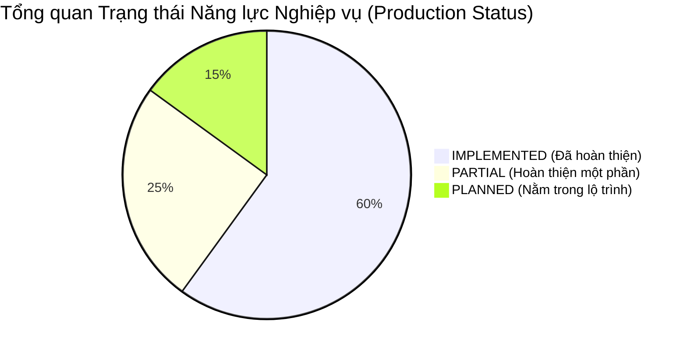
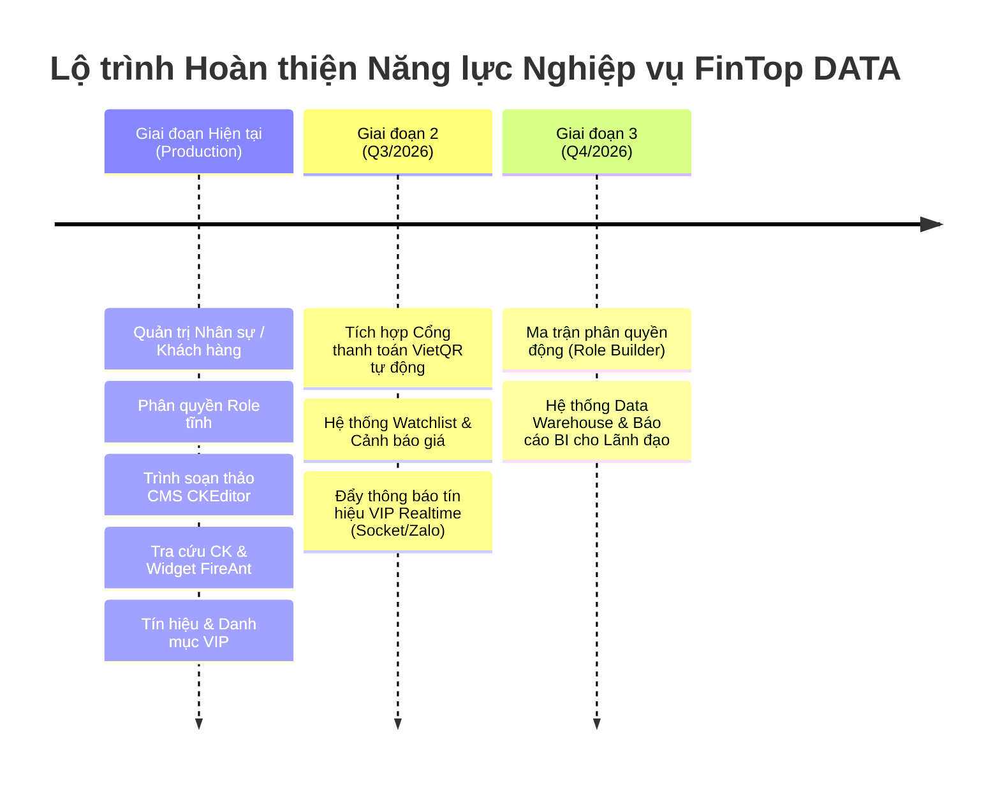

# 🏛️ FINTOP DATA — ĐẶC TẢ NĂNG LỰC NGHIỆP VỤ CHUẨN HÓA (BUSINESS CAPABILITIES SPECIFICATION)

**Phiên bản:** 1.5 (Normalized Source of Truth)  
**Mục tiêu:** Định nghĩa chuẩn hóa toàn bộ năng lực nghiệp vụ (Business Capabilities) của nền tảng FinTop DATA. Tài liệu được thiết kế hoàn toàn phi cảm tính, loại bỏ các nhận xét giao diện, đóng vai trò là **System Source of Truth** duy nhất cho các đội ngũ Kiến trúc sư, Backend, Frontend, Database và các trợ lý AI trong toàn bộ vòng đời phát triển dự án.

---

## 📑 MỤC LỤC & MA TRẬN TỔNG QUAN NĂNG LỰC NGHIỆP VỤ

| STT | Tên miền nghiệp vụ (Domain) | Trạng thái Sản phẩm (Production Status) | Tầng hệ thống | Cấp độ truy cập (Access Level) |
| :---: | :--- | :---: | :---: | :--- |
| 1 | **[Authentication Domain](#1-authentication-domain)** | `IMPLEMENTED` / `PLANNED` | Platform | Public, Client, Staff, Admin |
| 2 | **[User Profile Domain](#2-user-profile-domain)** | `IMPLEMENTED` | Business | Client VIP, Standard |
| 3 | **[Subscription Domain](#3-subscription-domain)** | `IMPLEMENTED` / `PARTIAL` | Platform | Client, Staff, Admin |
| 4 | **[Stock Market Domain](#4-stock-market-domain)** | `IMPLEMENTED` / `PARTIAL` | Business | Public, Standard, Silver+ |
| 5 | **[Screener Domain](#5-screener-domain)** | `IMPLEMENTED` / `PLANNED` | Business | Silver, Gold, Diamond |
| 6 | **[Watchlist Domain](#6-watchlist-domain)** | `PLANNED` | Business | Gold, Diamond |
| 7 | **[Reports Domain](#7-reports-domain)** | `IMPLEMENTED` / `PARTIAL` | Business | Standard, Gold, Diamond |
| 8 | **[CMS Domain](#8-cms-domain)** | `IMPLEMENTED` / `PARTIAL` | Platform | Editor, Editor Pro, EdAdmin |
| 9 | **[Signals Domain](#9-signals-domain)** | `IMPLEMENTED` | Business | Gold, Diamond, Expert |
| 10 | **[Portfolio Domain](#10-portfolio-domain)** | `IMPLEMENTED` | Business | Diamond, Expert |
| 11 | **[Notification Domain](#11-notification-domain)** | `PARTIAL` / `PLANNED` | Platform | All Authenticated Users |
| 12 | **[Payment Domain](#12-payment-domain)** | `PARTIAL` / `PLANNED` | Platform | Client, Sale Admin |
| 13 | **[Analytics Domain](#13-analytics-domain)** | `PARTIAL` / `PLANNED` | Platform | CEO, Sale Admin, Editor Admin |
| 14 | **[Admin Domain](#14-admin-domain)** | `IMPLEMENTED` | Business | Staff (All Roles) |
| 15 | **[RBAC Domain](#15-rbac-domain)** | `IMPLEMENTED` / `PLANNED` | Platform | System Admin, CEO |

---
---

## 🏢 ĐẶC TẢ CHI TIẾT 15 DOMAINS NGHIỆP VỤ

### 1. AUTHENTICATION DOMAIN
* **Purpose:** Quản lý vòng đời xác thực danh tính, bảo mật quyền truy cập vào các cổng dịch vụ (Client & Admin).
* **Business Goals:** Bảo đảm tỷ lệ đăng nhập thành công > 99.9%, ngăn chặn truy cập trái phép, bảo mật thông tin người dùng.
* **Core Features:**
  * Đăng ký tài khoản (Email, Mật khẩu, Mã giới thiệu Broker).
  * Đăng nhập / Đăng xuất (Cấp phát JWT, Quản lý Session).
  * Đặt lại mật khẩu (Gửi liên kết xác thực qua Email).
  * Đổi mật khẩu bảo mật (Yêu cầu mật khẩu hiện tại).
* **Production Status:**
  * `IMPLEMENTED`: Đăng ký, Đăng nhập, Đăng xuất, Quên/Đổi mật khẩu qua email.
  * `PLANNED`: Đăng nhập một chạm OAuth2 (Google/Zalo/Apple), Xác thực đa yếu tố (2FA OTP/TOTP).
* **Access Levels:** Public (Unauthenticated) cho Đăng ký/Đăng nhập/Quên MK; Authenticated cho Đăng xuất/Đổi MK.
* **Subscription Gating:** Không áp dụng (Hoạt động độc lập với gói dịch vụ).
* **Related Modules:** `UserModule`, `NotificationModule` (Gửi email OTP), `RbacModule`.
* **Related Entities:** `users`, `user_sessions`, `auth_tokens`.
* **Related Workflows:** `UserRegistrationWorkflow`, `PasswordResetWorkflow`.
* **Frontend Behaviors:** Form validation phía client (độ dài mật khẩu, định dạng email), lưu trữ JWT trong HttpOnly cookies hoặc Secure LocalStorage, tự động chuyển hướng khi token hết hạn (HTTP 401).
* **Backend Behaviors:** Băm mật khẩu bằng `bcrypt` (10 rounds), tạo Access Token (TTL 1h) và Refresh Token (TTL 30d) chuẩn JWT, ghi log IP và User-Agent vào bảng session.
* **Hidden Logic:** Tự động thu hồi (revoke) toàn bộ Refresh Token của user khi phát hiện đổi mật khẩu hoặc bị Admin khóa tài khoản.
* **Dependencies:** Dịch vụ gửi email SMTP (SendGrid / AWS SES), Redis Cluster (lưu trữ blacklist token).

---

### 2. USER PROFILE DOMAIN
* **Purpose:** Lưu trữ và quản lý hồ sơ thông tin cá nhân, định danh rủi ro và các thông số kết nối môi giới của nhà đầu tư.
* **Business Goals:** Cá nhân hóa trải nghiệm khách hàng, cung cấp dữ liệu đầu vào cho hệ thống phân bổ khách hàng cho Sale và các khuyến nghị đầu tư tự động.
* **Core Features:**
  * Cập nhật thông tin cơ bản (Họ tên, Ngày sinh, Số điện thoại, Địa chỉ).
  * Cập nhật thông tin đầu tư (Công ty chứng khoán đang dùng, ID VPS, ID Người giới thiệu / Broker).
  * Khảo sát khẩu vị rủi ro (Risk Taste: Thận trọng, Cân bằng, Mạo hiểm).
  * Quản lý hình ảnh đại diện (Upload và Crop Avatar).
* **Production Status:**
  * `IMPLEMENTED`: Quản lý 100% các trường thông tin cá nhân, đầu tư, rủi ro, và tính năng upload/crop ảnh đại diện.
* **Access Levels:** Client (All Tiers).
* **Subscription Gating:** Không áp dụng.
* **Related Modules:** `AuthModule`, `StorageModule`, `AdminClientModule`.
* **Related Entities:** `users`, `broker_assignments`.
* **Related Workflows:** `ProfileUpdateWorkflow`, `AvatarUploadWorkflow`.
* **Frontend Behaviors:** Render form cập nhật thông tin tại `/client/infor/index`, tích hợp thư viện Cropper.js xử lý cắt ảnh vuông trước khi gửi lên server.
* **Backend Behaviors:** Xác thực payload đầu vào, kiểm tra Broker ID tồn tại trong bảng `users` (Role Sale) trước khi gán quan hệ quản lý khách hàng.
* **Hidden Logic:** Khi Khách hàng cập nhật ID Người giới thiệu, hệ thống tự động chèn/cập nhật bản ghi trong bảng `clients` bên Admin Portal và chuyển quyền phụ trách cho Sale tương ứng.
* **Dependencies:** Hệ thống File Storage S3 (hoặc thư mục tĩnh cục bộ).

---

### 3. SUBSCRIPTION DOMAIN
* **Purpose:** Quản lý các cấp độ hội viên (Tiers), quyền lợi truy cập tính năng và chu kỳ sử dụng dịch vụ của khách hàng.
* **Business Goals:** Thúc đẩy doanh thu thông qua mô hình phân tầng dịch vụ (Freemium sang Premium).
* **Core Features:**
  * Bảng giá gói hội viên (Standard, Silver, Gold, Diamond).
  * Quản lý thông tin gói và đặc quyền kèm theo.
  * Yêu cầu nâng cấp gói (Upgrade request form).
  * Quản lý trạng thái và thời hạn sử dụng gói.
* **Production Status:**
  * `IMPLEMENTED`: Bảng giá so sánh đặc quyền 4 gói tại `/client/privileges/index`, form yêu cầu nâng cấp, theo dõi cấp bậc trên hồ sơ.
  * `PARTIAL`: Việc kích hoạt gói hiện đang thực hiện thủ công thông qua phê duyệt của Admin.
  * `PLANNED`: Chu kỳ tự động gia hạn (Auto-renewal), Quản lý mã giảm giá (Vouchers), Gói dùng thử 7 ngày (Free Trial).
* **Access Levels:** Client (All Tiers), Sale Admin, CEO.
* **Subscription Gating:** Mọi tài khoản mới đăng ký mặc định thuộc gói `Standard` (Tier Level 1).
* **Related Modules:** `PaymentModule`, `RbacModule`, `NotificationModule`.
* **Related Entities:** `subscription_plans`, `user_subscriptions`, `invoices`.
* **Related Workflows:** `SubscriptionUpgradeWorkflow`, `SubscriptionExpirationWorkflow`.
* **Frontend Behaviors:** Render bảng so sánh tính năng linh hoạt. Tại các nút CTA, kiểm tra gói hiện tại của user; nếu đang ở gói thấp hơn -> Mở modal yêu cầu nâng cấp.
* **Backend Behaviors:** So khớp và tính toán ngày hết hạn (`end_date = NOW() + duration`), ghi nhận lịch sử thay đổi tier trong bảng `user_subscriptions`.
* **Hidden Logic:** Cơ chế tự động kiểm tra và hạ cấp (Auto-downgrade) tài khoản về gói `Standard` khi thời gian hiện tại vượt quá `end_date`.
* **Dependencies:** Hệ thống Cron/Scheduler và Redis Caching.

---

### 4. STOCK MARKET DOMAIN
* **Purpose:** Cung cấp thông tin tổng quan thị trường, bảng giá trực tuyến và bộ chỉ số kỹ thuật/tài chính của toàn bộ cổ phiếu niêm yết.
* **Business Goals:** Trở thành công cụ tra cứu hàng ngày số 1 của nhà đầu tư, giữ chân người dùng ở lại trang web.
* **Core Features:**
  * Bảng giá tra cứu cổ phiếu HOSE, HNX, UPCOM.
  * Biểu đồ giá chuyên nghiệp (Tích hợp OHLCV, Volume, Các công cụ vẽ).
  * Bảng xếp hạng TA (Technical Analysis - Xếp hạng Kỹ thuật: A, B, C...).
  * Bảng xếp hạng FA (Fundamental Analysis - Xếp hạng Cơ bản: A+, B...).
  * Phân tích Xu hướng cổ phiếu và Vùng giá giao dịch khuyến nghị.
* **Production Status:**
  * `IMPLEMENTED`: Bảng tra cứu dữ liệu chứng khoán TA/FA, nhúng trực tiếp widget biểu đồ nâng cao FireAnt.
  * `PARTIAL`: Dữ liệu OHLCV realtime hiện tại phụ thuộc vào nguồn cấp FireAnt Widget.
  * `PLANNED`: Biểu đồ dòng tiền tự xây dựng, Bản đồ nhiệt toàn thị trường (Heatmap).
* **Access Levels:** Public (Tra cứu cơ bản), Standard, Silver+.
* **Subscription Gating:** Thông tin điểm số cơ bản (TA/FA) mở cho Standard. Các phân tích vùng giá giao dịch chi tiết mở cho Silver+.
* **Related Modules:** `EtlModule`, `RealtimeModule`.
* **Related Entities:** `stocks`, `sectors`, `stock_prices_daily`, `financial_indicators`.
* **Related Workflows:** `MarketDataIngestionWorkflow`.
* **Frontend Behaviors:** Hiển thị thanh tìm kiếm mã CP động (Autocomplete), render bảng dữ liệu phân trang hoặc infinite scroll. Tích hợp iframe/widget FireAnt.
* **Backend Behaviors:** Truy vấn danh sách cổ phiếu kết hợp join bảng chỉ số tài chính/kỹ thuật mới nhất, tối ưu hóa qua index `symbol`.
* **Hidden Logic:** Thuật toán tính điểm TA/FA tự động chạy ngầm mỗi cuối ngày giao dịch dựa trên dữ liệu giá đóng cửa và BCTC quý mới nhất.
* **Dependencies:** API nguồn cấp dữ liệu chứng khoán ngoài (FireAnt / Sở GDCK), Redis Cache.

---

### 5. SCREENER DOMAIN
* **Purpose:** Cung cấp bộ công cụ lọc chứng khoán đa chiều giúp nhà đầu tư tìm kiếm các cơ hội tiềm năng theo tiêu chí cụ thể.
* **Business Goals:** Hỗ trợ ra quyết định đầu tư nhanh chóng, tạo điểm nhấn công nghệ cho các gói hội viên trả phí.
* **Core Features:**
  * Bộ lọc đa tiêu chí (Theo sàn, Nhóm ngành, Tín hiệu hành động MUA/BÁN/NẮM GIỮ).
  * Bộ lọc kỹ thuật (RSI, MACD, MA20/50/200, Bollinger Bands).
  * Bộ lọc tài chính (P/E, P/B, EPS, ROE, Tăng trưởng doanh thu/lợi nhuận).
  * Bảng kết quả lọc trực quan cập nhật tức thì.
  * Lưu bộ lọc cá nhân (Saved Screeners).
* **Production Status:**
  * `IMPLEMENTED`: Lọc theo sàn, nhóm ngành và tín hiệu hành động tại trang Tra cứu và TOP Cổ phiếu.
  * `PLANNED`: Bộ lọc động tùy biến tham số (Condition Builder) và tính năng lưu bộ lọc cá nhân.
* **Access Levels:** Silver (Lọc cơ bản), Gold / Diamond (Toàn bộ tiêu chí nâng cao).
* **Subscription Gating:** User thuộc gói Standard không thể truy cập giao diện bộ lọc nâng cao (Hiển thị Paywall).
* **Related Modules:** `MarketModule`, `EtlModule`, `SubscriptionModule`.
* **Related Entities:** `screener_rules`, `user_saved_screeners`.
* **Related Workflows:** `StockScreeningExecutionWorkflow`.
* **Frontend Behaviors:** Giao diện chọn điều kiện lọc dạng thẻ tag, tự động gọi API debounce (300ms) để làm mới bảng kết quả bên dưới mà không cần bấm nút Submit.
* **Backend Behaviors:** Trình xây dựng truy vấn động (Dynamic Query Builder) chuyển đổi JSON điều kiện lọc thành câu lệnh SQL WHERE tối ưu hóa trên PostgreSQL.
* **Hidden Logic:** Hệ thống tự động lưu trữ cache các kết quả bộ lọc phổ biến (Ví dụ: "Cổ phiếu vượt đỉnh 52 tuần") trên Redis trong 5 phút.
* **Dependencies:** Redis Cache và Dữ liệu chỉ báo tài chính/kỹ thuật.

---

### 6. WATCHLIST DOMAIN
* **Purpose:** Cho phép người dùng tạo các danh mục theo dõi cổ phiếu quan tâm và nhận cảnh báo biến động.
* **Business Goals:** Tăng tần suất tương tác hàng ngày (DAU), tạo sợi dây liên kết cá nhân hóa giữa user và nền tảng.
* **Core Features:**
  * Tạo, chỉnh sửa và xóa nhiều Watchlist riêng biệt.
  * Thêm/xóa mã cổ phiếu vào Watchlist bằng 1 click.
  * Theo dõi biến động giá, khối lượng và % thay đổi của các mã trong rổ.
  * Thiết lập cảnh báo giá tự động (Price & Volume Alerts).
* **Production Status:**
  * `PLANNED`: Toàn bộ domain Watchlist đang nằm trong lộ trình kiến trúc phát triển mới.
* **Access Levels:** Client Gold, Diamond.
* **Subscription Gating:** Tính năng Watchlist và Cảnh báo giá bị khóa hoàn toàn với user Standard.
* **Related Modules:** `MarketModule`, `RealtimeModule`, `NotificationModule`.
* **Related Entities:** `watchlists`, `watchlist_items`, `price_alerts`.
* **Related Workflows:** `WatchlistAlertEvaluationWorkflow`.
* **Frontend Behaviors:** Nút icon Ngôi sao xuất hiện cạnh mã cổ phiếu trên mọi bảng giá. Khi bấm vào, hiện dropdown chọn Watchlist để chèn nhanh.
* **Backend Behaviors:** Quản lý danh sách mã CP theo `user_id` trong DB, đồng thời duy trì danh sách cảnh báo giá trực tiếp trong bộ nhớ đệm Redis để so khớp tốc độ cao.
* **Hidden Logic:** Khi luồng giá realtime báo về, hệ thống đối chiếu ngầm với danh sách ngưỡng cảnh báo của user; nếu vượt ngưỡng -> Đẩy event vào Queue gửi SMS/Push lập tức.
* **Dependencies:** WebSocket Engine và Hệ thống Hàng đợi Thông báo.

---

### 7. REPORTS DOMAIN
* **Purpose:** Quản lý và phân phối các báo cáo phân tích chuyên sâu (Thị trường, Ngành, Doanh nghiệp) từ ban biên tập đến nhà đầu tư.
* **Business Goals:** Khẳng định uy tín chuyên môn của FinTop, là nguồn giá trị tri thức cốt lõi thuyết phục khách hàng nâng cấp gói VIP.
* **Core Features:**
  * Phân loại báo cáo 4 cấp: Thị trường tổng hợp, V.I.P Đầu tư, Báo cáo Ngành, Báo cáo Doanh nghiệp.
  * Tìm kiếm và lọc báo cáo theo mã CP, ngành nghề hoặc từ khóa.
  * Xem trực tiếp nội dung bài báo cáo định dạng chuẩn.
  * Tải trực tiếp file đính kèm PDF chất lượng cao.
  * Lưu trữ bài viết yêu thích (Bookmarks).
* **Production Status:**
  * `IMPLEMENTED`: Hệ thống phân loại 4 tab trực quan tại `/client/about/index`, tính năng tìm kiếm và lọc.
  * `PARTIAL`: Các bài viết hiện đang nhúng nội dung HTML hoặc liên kết Google Drive, chưa có kho quản lý và tải file PDF trực tiếp từ server.
  * `PLANNED`: Tính năng Bookmark và Theo dõi lịch sử đọc báo cáo.
* **Access Levels:** Standard (Báo cáo thị trường chung), Gold & Diamond (Toàn quyền đọc/tải Báo cáo VIP Ngành & DN).
* **Subscription Gating:** Kiểm tra thuộc tính `is_vip_only` trên bản ghi. Nếu `true` và user < Gold -> Khóa nội dung, hiển thị Paywall banner.
* **Related Modules:** `CmsModule`, `SubscriptionModule`, `StorageModule`.
* **Related Entities:** `blogs`, `categories`, `report_files`, `user_bookmarks`.
* **Related Workflows:** `ReportAccessControlWorkflow`.
* **Frontend Behaviors:** Render danh sách bài viết dưới dạng lưới (Grid) hoặc danh sách (List). Các bài VIP có cờ "V.I.P" góc trên.
* **Backend Behaviors:** Phân quyền động tại endpoint `/api/v1/reports/:id` dựa trên JWT tier claims.
* **Hidden Logic:** Hệ thống đếm lượt xem (page view) bất đồng bộ qua queue mỗi khi user mở trang chi tiết để tránh nghẽn DB.
* **Dependencies:** File Storage (S3 / MinIO).

---

### 8. CMS DOMAIN
* **Purpose:** Nơi đội ngũ chuyên gia và biên tập viên sản xuất, kiểm duyệt và quản trị nội dung bài viết, báo cáo, cẩm nang đầu tư.
* **Business Goals:** Cung cấp công cụ xuất bản nội dung nhanh chóng, trực quan, bảo đảm quy trình kiểm duyệt chất lượng nội dung trước khi ra công chúng.
* **Core Features:**
  * Quản trị Bài viết (`/system/blog/index`): Tạo mới, chỉnh sửa, xóa, gắn cờ VIP/Basic.
  * Trình soạn thảo chuyên nghiệp (Tích hợp CKEditor đầy đủ công cụ định dạng và tải ảnh).
  * Quản trị Danh mục và Thể loại (`/system/category/index`).
  * Quản trị Cẩm nang Nhà đầu tư (`/system/handbook/index`).
  * Quy trình kiểm duyệt bài viết (Draft -> Pending Review -> Published).
* **Production Status:**
  * `IMPLEMENTED`: Toàn bộ tính năng CRUD bài viết, danh mục, cẩm nang, tích hợp trình soạn thảo CKEditor, gán quyền hiển thị VIP/Basic.
  * `PARTIAL`: Quy trình duyệt bài viết hiện tại phụ thuộc vào thao tác check/uncheck trạng thái hiển thị của Admin.
  * `PLANNED`: Lên lịch xuất bản tự động (Scheduled Publishing), Quản lý lịch sử phiên bản (Revisions).
* **Access Levels:** Editor (Tạo bài Basic), Editor Pro (Tạo bài VIP), Editor Admin & CEO (Toàn quyền CRUD và Xuất bản).
* **Subscription Gating:** Không áp dụng (Module nội bộ Admin).
* **Related Modules:** `StorageModule`, `NotificationModule`, `CacheModule`.
* **Related Entities:** `blogs`, `categories`, `tags`, `handbooks`.
* **Related Workflows:** `CmsEditorialWorkflow`.
* **Frontend Behaviors:** Giao diện Admin bảng quản trị bài viết hỗ trợ lọc theo trạng thái, tìm kiếm tiêu đề. Form tạo bài viết tích hợp CKEditor hoạt động ổn định.
* **Backend Behaviors:** Lưu trữ nội dung HTML sạch vào DB, upload ảnh lên thư mục lưu trữ và trả về URL chèn vào bài viết.
* **Hidden Logic:** Tự động vô hiệu hóa toàn bộ cache liên quan đến danh sách bài viết (`blogs:*`) trên Redis mỗi khi có một bài viết mới được chuyển sang trạng thái `Published`.
* **Dependencies:** Dịch vụ lưu trữ hình ảnh/file.

---

### 9. SIGNALS DOMAIN
* **Purpose:** Quản lý và phân phối các tín hiệu khuyến nghị giao dịch (MUA, BÁN, NẮM GIỮ) trực tiếp từ đội ngũ chuyên gia đến khách hàng VIP.
* **Business Goals:** Đem lại giá trị thực chiến tức thì, yếu tố quyết định cao nhất khiến nhà đầu tư sẵn sàng chi tiền mua gói Gold/Diamond.
* **Core Features:**
  * Tạo Tín hiệu V.I.P mới (`/system/signal/index`: Gán mã CP, Khuyến nghị MUA/BÁN, Vùng giá mua, Mục tiêu chốt lời, Điểm cắt lỗ).
  * Quản lý trạng thái tín hiệu (Active, Reached Target, Cut Loss, Closed).
  * Bảng Tín hiệu V.I.P thực chiến trên Client (`/recommendationsIndex`).
  * Bắn thông báo đẩy tức thì (Push notification) khi có tín hiệu mới.
* **Production Status:**
  * `IMPLEMENTED`: Toàn bộ luồng tạo tín hiệu trên Admin và hiển thị bảng Tín hiệu V.I.P bên phía Client Portal.
  * `PLANNED`: Tích hợp hệ thống bắn thông báo đẩy realtime qua WebSocket và Zalo ZNS.
* **Access Levels:** Client Gold & Diamond (Xem tín hiệu), Editor Pro, Chuyên gia, CEO (Tạo và quản lý tín hiệu).
* **Subscription Gating:** Gated tuyệt đối đối với các gói Standard và Silver (Hiển thị Paywall).
* **Related Modules:** `RealtimeModule`, `NotificationModule`, `MarketModule`.
* **Related Entities:** `vip_signals`, `stocks`.
* **Related Workflows:** `VipSignalPublishingWorkflow`.
* **Frontend Behaviors:** Bảng tín hiệu VIP hiển thị các thẻ màu nổi bật (Xanh lá = MUA, Đỏ = BÁN). Nút bấm xem chi tiết lý do khuyến nghị.
* **Backend Behaviors:** Lưu bản ghi khuyến nghị, tính toán tỷ lệ % lợi nhuận kỳ vọng (`(target - buy) / buy * 100`).
* **Hidden Logic:** Tự động đối chiếu ngầm giá thị trường realtime với điểm chốt lời/cắt lỗ của tín hiệu. Khi giá chạm đích -> Chuyển trạng thái tín hiệu thành `Closed` và ghi nhận % thực tế.
* **Dependencies:** Realtime Stock Quotes Engine.

---

### 10. PORTFOLIO DOMAIN
* **Purpose:** Nơi các chuyên gia xây dựng, theo dõi và công khai các danh mục đầu tư mẫu (Model Portfolios) theo nhiều chiến lược khác nhau (Tăng trưởng, Cổ tức, Lướt sóng).
* **Business Goals:** Minh chứng hiệu quả đầu tư thực tế của FinTop qua các con số tăng trưởng NAV minh bạch, thu hút tệp khách hàng NAV lớn (Diamond).
* **Core Features:**
  * Quản lý Danh mục V.I.P (`/system/recommended/index`: Tên danh mục, Chuyên gia quản lý, Chiến lược).
  * Phân bổ tỷ trọng tài sản (Tỷ lệ Tiền mặt / Cổ phiếu).
  * Quản lý các mã cổ phiếu trong rổ (Giá vốn mua vào, Khối lượng).
  * Tự động tính toán giá trị tài sản ròng (NAV) và % lời/lỗ theo giá realtime thị trường.
  * Bảng theo dõi Danh mục V.I.P cho nhà đầu tư (`/categoryFintopIndex`).
* **Production Status:**
  * `IMPLEMENTED`: Màn hình quản trị danh mục bên Admin và giao diện theo dõi danh mục thực chiến bên Client Portal.
* **Access Levels:** Client Diamond (Xem danh mục), Chuyên gia, Editor Pro, CEO (Quản trị danh mục).
* **Subscription Gating:** Độc quyền duy nhất cho gói Diamond. Các tier Standard, Silver, Gold bị khóa hoàn toàn.
* **Related Modules:** `MarketModule`, `RealtimeModule`.
* **Related Entities:** `recommended_portfolios`, `portfolio_items`.
* **Related Workflows:** `PortfolioNavCalculationWorkflow`.
* **Frontend Behaviors:** Biểu đồ tròn (Pie chart) trực quan hóa tỷ trọng các mã cổ phiếu và tiền mặt trong danh mục. Bảng chi tiết từng mã cập nhật màu sắc theo % lãi/lỗ.
* **Backend Behaviors:** Nhận luồng giá realtime, chạy thuật toán tính tổng NAV của danh mục = `Cash + SUM(item.volume * current_price)`.
* **Hidden Logic:** Lưu trữ kết quả tính toán NAV trên Redis Cache, làm mới mỗi 1 phút trong giờ giao dịch để bảo đảm tốc độ tải trang cực nhanh.
* **Dependencies:** Nguồn dữ liệu giá khớp lệnh trực tuyến.

---

### 11. NOTIFICATION DOMAIN
* **Purpose:** Điều phối và gửi các thông báo quan trọng từ hệ thống đến người dùng qua đa phương thức (In-app, Email, SMS, Web/Mobile Push).
* **Business Goals:** Giữ liên lạc liên tục với khách hàng, thông báo kịp thời các biến động tài khoản và tín hiệu giao dịch khẩn cấp.
* **Core Features:**
  * Chuông thông báo in-app (Thanh Header).
  * Gửi email tự động (Biên lai thanh toán, Nhắc gia hạn gói, Xác thực tài khoản).
  * Bắn thông báo đẩy (Push notifications) khi có tín hiệu VIP hoặc cảnh báo giá.
  * Quản lý mẫu thông báo (Templates) và cấu hình kênh nhận thông báo của user.
* **Production Status:**
  * `PARTIAL`: Chuông thông báo in-app cơ bản trên thanh header.
  * `PLANNED`: Tích hợp hệ thống Email tự động, SMS/Zalo ZNS và Web Push qua Message Queue.
* **Access Levels:** All Authenticated Users (Nhận thông báo), System Admin (Cấu hình hệ thống).
* **Subscription Gating:** Không áp dụng. User VIP nhận thêm các luồng thông báo tín hiệu ưu tiên (Priority Queue).
* **Related Modules:** `QueueModule`, `RealtimeModule`, `AuthModule`.
* **Related Entities:** `notifications`, `notification_templates`, `user_notification_settings`.
* **Related Workflows:** `AsynchronousNotificationDispatchWorkflow`.
* **Frontend Behaviors:** Icon chuông có badge đỏ hiển thị số thông báo chưa đọc. Click mở danh sách dropdown, bấm vào từng mục sẽ chuyển hướng đến trang liên quan.
* **Backend Behaviors:** Nơi tiếp nhận event từ các module khác (`VipSignalCreated`, `InvoicePaid`), định dạng theo template và đẩy vào hàng đợi (BullMQ).
* **Hidden Logic:** Phân lô (Batching) và giới hạn tần suất gửi tin nhắn (Throttling) để tránh spam người dùng (Ví dụ không gửi quá 3 tin SMS trong 1 giờ cho 1 user).
* **Dependencies:** RabbitMQ / Redis BullMQ, API đối tác (SendGrid, Twilio, Zalo OA).

---

### 12. PAYMENT DOMAIN
* **Purpose:** Quản lý quy trình tài chính, tạo hóa đơn, xác thực dòng tiền và kích hoạt các gói dịch vụ cho khách hàng.
* **Business Goals:** Tối ưu hóa trải nghiệm thanh toán, giảm thiểu thao tác thủ công, bảo đảm an toàn và đối soát dòng tiền chính xác.
* **Core Features:**
  * Tạo hóa đơn thanh toán (Invoices).
  * Tích hợp thanh toán mã QR ngân hàng (VietQR 24/7 với số tiền và nội dung chuyển khoản động).
  * Màn hình Admin phê duyệt thanh toán (`/system/approvepayment/index`).
  * Xử lý Webhook tự động gạch nợ từ ngân hàng.
  * Quản lý lịch sử giao dịch và hoàn tiền (Refunds).
* **Production Status:**
  * `PARTIAL`: Màn hình quản lý danh sách yêu cầu nâng cấp và bấm xác nhận (Approve) thủ công từ phía Sale Admin.
  * `PLANNED`: Cổng VietQR tự động, xử lý Webhook IPN tự động gạch nợ và tạo biên lai điện tử.
* **Access Levels:** Client (Thanh toán), Sale Admin & CEO (Phê duyệt, Đối soát).
* **Subscription Gating:** Nằm ở ranh giới chuyển đổi từ gói Standard sang các gói Premium.
* **Related Modules:** `SubscriptionModule`, `NotificationModule`, `RbacModule`.
* **Related Entities:** `invoices`, `transactions`.
* **Related Workflows:** `PaymentGatewayWebhookWorkflow`, `ManualPaymentApprovalWorkflow`.
* **Frontend Behaviors:** Modal hiển thị rõ ràng thông tin đơn hàng, số tiền và hình ảnh mã QR Code. Đồng hồ đếm ngược 15 phút thời gian duy trì mã QR.
* **Backend Behaviors:** Tạo mã hóa đơn duy nhất (`FINTOP_INV_1025`), gọi API đối tác sinh chuỗi VietQR. Khi nhận Webhook thành công -> So khớp số tiền -> Chuyển status đơn hàng.
* **Hidden Logic:** Khóa chống xử lý đúp (Idempotency Lock trên Redis) bảo đảm một mã giao dịch ngân hàng chuyển về chỉ kích hoạt đúng 1 lần duy nhất trong DB.
* **Dependencies:** API Cổng thanh toán / Ngân hàng mở (Open Banking API).

---

### 13. ANALYTICS DOMAIN
* **Purpose:** Thu thập, xử lý và trực quan hóa các số liệu hiệu suất hoạt động kinh doanh (KPI) và dữ liệu hành vi người dùng.
* **Business Goals:** Cung cấp thông tin tình báo kinh doanh (BI) hỗ trợ Ban lãnh đạo ra quyết định chiến lược và giúp đội ngũ Sale theo dõi hiệu suất cá nhân.
* **Core Features:**
  * Dashboard tổng quan Admin (`/system/home/index`: Tổng user, số bài viết, số khách VIP).
  * Biểu đồ phân tích doanh thu theo ngày/tháng/quý.
  * Thống kê lượt xem (Traffic) và tương tác của từng bài viết, báo cáo.
  * Thống kê hiệu suất hoa hồng và lượng khách hàng của từng nhân viên Sale.
  * Phân tích phễu chuyển đổi và tỷ lệ duy trì (Retention Rate).
* **Production Status:**
  * `PARTIAL`: Dashboard Admin hiện tại hiển thị các thẻ số liệu tổng quan cơ bản.
  * `PLANNED`: Hệ thống phân tích chuyên sâu DAU/MAU, Phễu chuyển đổi và Báo cáo tự động cho CEO.
* **Access Levels:** CEO, Sale Admin, Editor Admin (Theo dõi tổng thể), Sale (Chỉ xem số liệu cá nhân).
* **Subscription Gating:** Không áp dụng.
* **Related Modules:** `AdminModule`, `BillingModule`, `UserModule`.
* **Related Entities:** `system_kpis`, `user_activities`.
* **Related Workflows:** `DailyAnalyticsAggregationWorkflow`.
* **Frontend Behaviors:** Tích hợp thư viện biểu đồ chuyên nghiệp (Chart.js / ApexCharts / ECharts) hiển thị số liệu tương tác mượt mà.
* **Backend Behaviors:** Cung cấp API tổng hợp số liệu với bộ lọc theo khoảng thời gian (Date range filter).
* **Hidden Logic:** Quá trình tổng hợp dữ liệu nặng được thực hiện ngầm vào 02:00 sáng hàng ngày bởi các Cronjob, ghi sẵn kết quả vào bảng `system_kpis` để sẵn sàng truy vấn tức thì.
* **Dependencies:** Hệ thống Cron/Scheduler và Database Replicas (Để không ảnh hưởng DB chính).

---

### 14. ADMIN DOMAIN
* **Purpose:** Cung cấp bộ công cụ toàn diện quản trị hồ sơ nhân sự, tài khoản khách hàng và phân bổ quyền hạn quản lý trong nội bộ FinTop.
* **Business Goals:** Vận hành trơn tru quy trình quản lý khách hàng, bảo đảm tính minh bạch và an toàn dữ liệu nội bộ.
* **Core Features:**
  * Quản trị Nhân sự (`/system/user/index`): Tạo mới, sửa thông tin, khóa tài khoản, reset mật khẩu nhân viên.
  * Quản trị Khách hàng (`/system/client/index`): Quản lý hồ sơ KH, gán KH cho Sale phụ trách, theo dõi trạng thái gói.
  * Gán Vai trò (Role Assignment) và thay đổi cấp bậc hội viên trực tiếp cho KH.
  * Chuyển đổi hàng loạt khách hàng từ Sale A sang Sale B (Khi nhân sự nghỉ việc).
* **Production Status:**
  * `IMPLEMENTED`: Toàn bộ các tính năng quản lý danh sách, tạo mới, chỉnh sửa, khóa/mở khóa tài khoản, reset mật khẩu và phân bổ Sale phụ trách.
* **Access Levels:** CEO, Assistant CEO, Sale Admin (Toàn quyền), Sale (Quyền quản lý tệp KH riêng).
* **Subscription Gating:** Không áp dụng.
* **Related Modules:** `RbacModule`, `UserProfileModule`, `BillingModule`.
* **Related Entities:** `users`, `user_roles`.
* **Related Workflows:** `StaffManagementWorkflow`, `ClientAllocationWorkflow`.
* **Frontend Behaviors:** Bảng dữ liệu Admin với các cột thông tin chi tiết, hỗ trợ tìm kiếm nhanh theo tên/SĐT, tích hợp các nút thao tác nhanh (Sửa, Khóa, Đổi mật khẩu) trong Modal.
* **Backend Behaviors:** Xử lý logic gán quan hệ `broker_id` giữa bảng `users` (Khách hàng) với `users` (Sale).
* **Hidden Logic:** Hệ thống cấm tuyệt đối việc xóa vĩnh viễn (Hard Delete) tài khoản khỏi DB. Thao tác xóa trên giao diện thực chất là chuyển cờ `status = 'Inactive'` (Soft Delete) để bảo toàn dữ liệu đối soát lịch sử.
* **Dependencies:** Database chính.

---

### 15. RBAC DOMAIN
* **Purpose:** Kiến trúc và thực thi ma trận bảo mật phân quyền đa lớp dựa trên Vai trò (Role) và Quyền hạn (Permission) cho toàn bộ hệ thống.
* **Business Goals:** Bảo đảm an ninh thông tin tuyệt đối, ngăn chặn mọi rủi ro nhân viên thao tác vượt cấp hay truy cập trái phép vào dữ liệu nhạy cảm.
* **Core Features:**
  * Quản lý danh sách Vai trò (Roles: CEO, Sale Admin, Editor Pro...).
  * Quản lý danh sách Quyền hạn (Permissions: `create:user`, `read:vip_signals`, `approve:payment`).
  * Thực thi kiểm tra quyền tại tầng Middleware/Guard cho mọi API endpoint.
  * Quản trị và phân bổ Role cho tài khoản nhân sự.
* **Production Status:**
  * `IMPLEMENTED`: Hệ thống phân quyền tĩnh dựa trên 8 Role định sẵn trong mã nguồn.
  * `PLANNED`: Giao diện quản lý Role & Permission động (Ma trận Checkbox trên UI) và Phân quyền cấp độ bản ghi (Row-Level Security).
* **Access Levels:** CEO và System Admin.
* **Subscription Gating:** Tương tác với `SubscriptionModule` để gán quyền động cho tệp Client.
* **Related Modules:** `AuthModule`, `CacheModule`.
* **Related Entities:** `roles`, `permissions`, `role_permissions`, `user_roles`.
* **Related Workflows:** `RbacVerificationWorkflow`.
* **Frontend Behaviors:** Cung cấp hàm tiện ích toàn cục `hasPermission(permCode)` và `hasRole(roleList)` để bọc các DOM nhạy cảm trên UI.
* **Backend Behaviors:** `RolesGuard` và `PermissionsGuard` được gắn tại mức Controller/Method trong NestJS, tự động kiểm tra trước khi cho phép đi vào logic xử lý.
* **Hidden Logic:** Mọi thông tin Role và Permission của user được nạp sẵn vào Redis Cache ngay khi đăng nhập. Mọi thay đổi phân quyền từ Admin sẽ lập tức kích hoạt lệnh xóa key cache tương ứng để áp dụng ngay lập tức mà không cần user đăng nhập lại.
* **Dependencies:** Redis Cache Cluster.

---
---

## 🚀 ĐỊNH HƯỚNG SẢN PHẨM & LỘ TRÌNH PHÁT TRIỂN (ROADMAP)

Tài liệu Đặc tả Năng lực Nghiệp vụ này xác lập ranh giới rõ ràng giữa **hiện trạng hệ thống (Production Truth)** và **các bước tiến công nghệ tiếp theo (Roadmap)**:

---

## 🎯 TỔNG KẾT SOURCE OF TRUTH

Tài liệu **Business Capabilities Specification** đã hoàn thành sứ mệnh chuẩn hóa toàn bộ bức tranh nghiệp vụ của hệ thống **FinTop DATA** theo tiêu chuẩn kỹ thuật khắt khe nhất. Toàn bộ 15 Domains được định nghĩa rõ ràng với bộ từ vựng chuẩn xác (`IMPLEMENTED`, `PARTIAL`, `PLANNED`) và ánh xạ chi tiết đến các luồng dữ liệu, thực thể DB cũng như hành vi hệ thống.

Đây là tài sản kỹ thuật nền tảng, là **Source of Truth chính thức** và duy nhất để dẫn dắt toàn bộ các công đoạn thiết kế kiến trúc, thiết kế cơ sở dữ liệu và phát triển mã nguồn production-ready cho nền tảng tài chính đầu tư cao cấp FinTop DATA.
