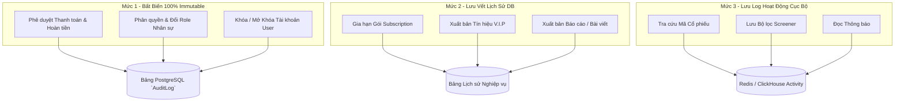

# 🛡️ CHIẾN LƯỢC KIỂM TOÁN CƠ SỞ DỮ LIỆU (DATABASE AUDIT STRATEGY)

**Ngày thực hiện:** 18/05/2026  
**Mục tiêu:** Định nghĩa phạm vi kiểm toán, kiến trúc nhật ký bất biến (Immutable Logging), chiến lược lưu vết thao tác quản trị, bảo mật và tài chính cho toàn bộ hệ thống FinTop DATA nhằm đáp ứng tiêu chuẩn Fintech Enterprise.

---

## 1. PHẠM VI KIỂM TOÁN & PHÂN LỌC MỨC ĐỘ (AUDIT SCOPE)



---

## 2. ĐẶC TẢ BẢNG NHẬT KÝ BẤT BIẾN (`AUDITLOG`)
Bảng `AuditLog` là trái tim của hệ thống kiểm tra bảo mật. Mọi hành động thuộc Mức 1 bắt buộc phải chèn 1 bản ghi vào bảng này thông qua cơ chế Queue bất đồng bộ.

### Cấu trúc Schema Đề xuất
```prisma
model AuditLog {
  id         BigInt   @id @default(autoincrement())
  userId     Int      // Người thực hiện (Admin/Staff/System)
  action     String   // Mã thao tác (UPDATE_ROLE, APPROVE_PAYMENT)
  tableName  String   // Tên bảng chịu tác động (User, Invoice)
  recordId   String   // ID bản ghi chịu tác động
  oldValues  Json?    // Giá trị trước khi đổi
  newValues  Json?    // Giá trị sau khi đổi
  ipAddress  String?  // IP thực hiện
  userAgent  String?  // Thông tin trình duyệt/thiết bị
  createdAt  DateTime @default(now())

  @@index([userId, createdAt])
  @@index([tableName, recordId])
}
```

### Nguyên tắc Bất biến (100% Immutability)
* Bảng `AuditLog` chỉ hỗ trợ duy nhất thao tác `INSERT`.
* Tuyệt đối cấm mọi thao tác `UPDATE` hay `DELETE` trên bảng này ở mức Database User Permissions (Phân quyền tài khoản kết nối PostgreSQL của ứng dụng).

---

## 3. CHIẾN LƯỢC LƯU VẾT THEO DOMAIN (DOMAIN LOGGING STRATEGY)

### 3.1. Admin Action Logging (Nhật ký Quản trị)
* **Đối tượng theo dõi:** CEO, Assistant CEO, Sale Admin, Editor Admin.
* **Hành động bắt buộc ghi log:** Gán/Gỡ Role của nhân viên, Phân bổ tệp KH từ Sale A sang Sale B, Reset mật khẩu user.

### 3.2. Security Logging (Nhật ký Bảo mật)
* **Hành động:** Thử đăng nhập thất bại quá 5 lần (Trigger cơ chế khóa IP), Thay đổi mật khẩu, Đăng nhập từ IP/Quốc gia lạ.

### 3.3. Payment & Subscription Logging (Nhật ký Tài chính)
* **Hành động:** Nhận Webhook VietQR (Ghi rõ toàn bộ payload IPN từ ngân hàng), Phê duyệt hóa đơn thủ công (Ghi rõ ID của Sale Admin duyệt), Tự động gia hạn hoặc cắt gói khi hết hạn.

### 3.4. Publish & Review Logging (Nhật ký Biên tập)
* **Hành động:** Xuất bản hoặc Gỡ bài viết (`Blog`), Tạo hoặc Đóng Tín hiệu V.I.P (`VipSignal`). Ghi nhận ID của tác giả và người duyệt.

---

## 4. CHIẾN LƯỢC LƯU TRỮ VÀ DỌN DẸP (RETENTION STRATEGY)
* **Dữ liệu Mức 1 (`AuditLog`):** Lưu trữ vĩnh viễn (Permanent Retention). Dữ liệu sau 2 năm sẽ được phân vùng (Partitioning) hoặc chuyển sang kho lưu trữ lạnh (AWS S3 Glacier).
* **Dữ liệu Mức 2 (Lịch sử nghiệp vụ):** Lưu trữ 5 năm.
* **Dữ liệu Mức 3 (Activity Log):** Lưu trữ 90 ngày trên Redis hoặc Elasticsearch trước khi tự động dọn dẹp.

---

## 5. MA TRẬN RỦI RO KIỂM TOÁN VÀ MỨC ĐỘ TỰ TIN

| STT | Khía Cạnh Kiểm Toán | Rủi Ro Nền Tảng (Audit Risk) | Mức Độ Tự Tin | Mức Ưu Tiên |
| :---: | :--- | :--- | :---: | :---: |
| 1 | Thao tác Phê duyệt Tiền | Nếu không ghi log `approvedById`, khi xảy ra thất thoát dòng tiền sẽ không thể truy vết ai đã bấm duyệt. | `HIGH` | `P0` |
| 2 | Phân quyền Nhân sự | Nếu AssCEO tự ý gán quyền CEO cho một tài khoản khác mà không có log, hệ thống sẽ bị chiếm quyền hoàn toàn. | `HIGH` | `P0` |
| 3 | Hiệu năng Ghi Log | Nếu ghi log đồng bộ trực tiếp vào DB, các luồng API sẽ bị nghẽn trễ. Bắt buộc phải đẩy qua BullMQ. | `HIGH` | `P1` |

Chiến lược kiểm toán đã được quy hoạch rõ ràng và minh bạch, sẵn sàng cho bước thiết lập chiến lược truy xuất và tối ưu hóa dữ liệu (Data Access Strategy).
