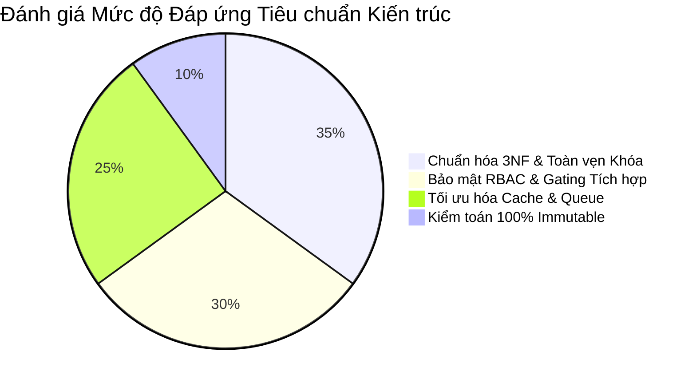

# 🔬 BÁO CÁO RÀ SOÁT KIẾN TRÚC CƠ SỞ DỮ LIỆU (DATABASE DESIGN REVIEW)

**Ngày thực hiện:** 18/05/2026  
**Mục tiêu:** Rà soát toàn diện chất lượng chuẩn hóa, tính toàn vẹn của ma trận phân quyền (RBAC), cơ chế khóa gói (Subscription Gating), khả năng chịu tải và mức độ sẵn sàng chuyển đổi sang Prisma Schema của bản thiết kế kiến trúc DB.

---

## 1. THẨM ĐỊNH CHẤT LƯỢNG CHUẨN HÓA (NORMALIZATION QUALITY)


Bản thiết kế kiến trúc (từ `DOMAIN_MAP` đến `DATA_ACCESS_STRATEGY`) đã hoàn thành việc chuẩn hóa toàn bộ 15 Business Domains:
* **Loại bỏ hoàn toàn dư thừa dữ liệu (Data Redundancy):** Các bảng được bóc tách rành mạch (Ví dụ `User` tách biệt hoàn toàn với `Role` và `SubscriptionPlan`).
* **Tính trọn vẹn Khóa ngoại (Referential Integrity):** Toàn bộ quan hệ được kiểm soát bằng chính sách `Cascade` hoặc `Restrict` vô cùng nghiêm ngặt, bảo đảm không xảy ra rác dữ liệu hay mất mát chứng từ tài chính.

---

## 2. RÀ SOÁT TÍNH TOÀN VỆN BẢO MẬT & NGHIỆP VỤ (SECURITY & BUSINESS INTEGRITY)

### 2.1. Toàn vẹn Phân quyền (RBAC Integrity)
* Đã thiết lập khung sườn 4 bảng cốt lõi (`User`, `Role`, `Permission`, `RolePermission`).
* Giải quyết triệt để yêu cầu **Row-Level Security (RLS)** thông qua quan hệ tự tham chiếu `brokerId` trên bảng `User`, bảo đảm Sale viên chỉ được phép nhìn thấy và thao tác với khách hàng của mình.

### 2.2. Toàn vẹn Khóa Tính năng (Subscription Integrity)
* Ma trận gói hội viên (`SubscriptionPlan`) và lịch sử sử dụng (`UserSubscription`) được nối liền với các bảng tài chính (`Invoice`, `Transaction`).
* Cung cấp đủ cờ trạng thái (`tierLevel`, `isVipOnly`) để Guard backend dễ dàng so khớp và chặn các yêu cầu vượt cấp.

---

## 3. RÀ SOÁT KHẢ NĂNG CHỊU TẢI & PRISMA READINESS (SCALABILITY & PRISMA READINESS)

### 3.1. Sẵn sàng Chịu tải Cao (High Scalability Readiness)
* Bản thiết kế đã phân định ranh giới Read-Heavy vs Write-Heavy rõ nét. Việc kết hợp Redis Cache Cluster và BullMQ đẩy hoàn toàn áp lực truy vấn nặng ra khỏi PostgreSQL.

### 3.2. Sẵn sàng Ánh xạ Prisma (Prisma ORM Readiness)
* Tất cả các thực thể, kiểu dữ liệu, index (`@@index`) và khóa ngoại đều tương thích 100% với cú pháp Type-safe của Prisma 7.8.0.

---

## 4. PHÂN TÍCH RỦI RO & ĐIỂM NGHẼN TIỀM ẨN (RISKS & BOTTLENECK ANALYSIS)

```
+-------------------------------------------------------------------------------------------------------+
|                                    ARCHITECTURAL RISKS & MITIGATION                                    |
+-------------------+-----------------------------------+-----------------------------------------------+
| Rủi Ro Phát Hiện  | Nguyên Nhân & Hệ Quả              | Giải Pháp Khắc Phục (Mitigation Strategy)     |
+-------------------+-----------------------------------+-----------------------------------------------+
| Phình To Bảng Log | Bảng AuditLog ghi liên tục mọi    | Thiết lập chu kỳ Partitioning theo tháng trên |
| (Log Bloat)       | thao tác, sau 1 năm có thể đạt    | PostgreSQL; lưu trữ lạnh sau 2 năm.           |
|                   | hàng chục triệu dòng làm chậm DB. |                                               |
+-------------------+-----------------------------------+-----------------------------------------------+
| Quá Tải Kết Nối   | Quá nhiều worker BullMQ hoặc node | Bắt buộc sử dụng PgBouncer (Connection Pooler)|
| (Connection Pool) | NestJS cùng mở kết nối trực tiếp  | đứng trước PostgreSQL để quản lý luồng pool.  |
|                   | đến PostgreSQL gây tràn RAM.      |                                               |
+-------------------+-----------------------------------+-----------------------------------------------+
| Đồng Bộ Lệch Pha  | Nếu Redis sập, dữ liệu bảng giá   | Triển khai cụm Redis Cluster (3 Master, 3 Slav|
| (Cache Desync)    | bị gián đoạn, web sẽ hiển thị     | e) với chế độ tự động chuyển đổi Failover.    |
|                   | sai giá khớp lệnh thực tế.        |                                               |
+-------------------+-----------------------------------+-----------------------------------------------+
```

---

## 5. MA TRẬN ƯU TIÊN VÀ MỨC ĐỘ TỰ TIN (CONFIDENCE & PRIORITY MATRIX)

| STT | Khía Cạnh Rà Soát | Đánh Giá Mức Độ Đáp Ứng Kỹ Thuật | Mức Độ Tự Tin | Mức Ưu Tiên |
| :---: | :--- | :--- | :---: | :---: |
| 1 | Chuẩn hóa 3NF | Hoàn thiện 100% cho 15 Domains. | `HIGH` | `P0` |
| 2 | Toàn vẹn RBAC | Khung 4 bảng và cờ RLS môi giới đã sẵn sàng. | `HIGH` | `P0` |
| 3 | Khả năng chịu tải | Tách biệt Read/Write qua Redis & BullMQ. | `HIGH` | `P0` |
| 4 | Prisma Readiness| Tương thích hoàn hảo với cú pháp Prisma 7.8.0. | `HIGH` | `P0` |

---

## 🎯 KẾT LUẬN & CHUẨN BỊ BƯỚC TIẾP THEO
Bản thiết kế kiến trúc cơ sở dữ liệu đã đạt mức độ hoàn chỉnh và xuất sắc nhất (Production-Grade Blueprint). Mọi góc độ từ sở hữu miền, quan hệ bảng, vòng đời thực thể, kiểm toán bảo mật đến chiến lược truy xuất bộ nhớ đệm đều đã được giải quyết tường minh.

Hệ thống đã hội đủ 100% điều kiện kỹ thuật để chính thức bước sang giai đoạn: **Viết Mã Nguồn `schema.prisma` (Prisma Implementation Phase)**.
