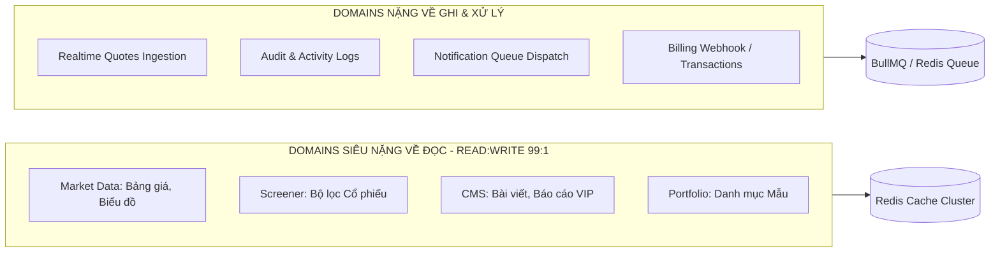
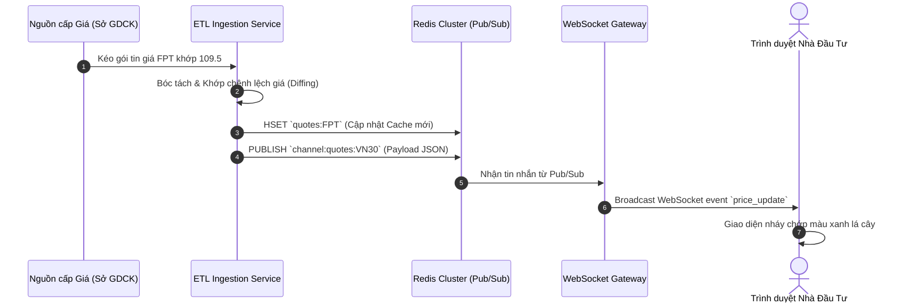

# ⚡ CHIẾN LƯỢC TRUY XUẤT CƠ SỞ DỮ LIỆU (DATA ACCESS STRATEGY)

**Ngày thực hiện:** 18/05/2026  
**Mục tiêu:** Quy hoạch ranh giới truy xuất dữ liệu giữa Prisma ORM, cụm Redis Cache và hệ thống Hàng đợi BullMQ nhằm đạt hiệu năng tối đa (> 10,000 req/sec) cho nền tảng FinTop DATA.

---

## 1. PHÂN HOẠCH ĐẶC TÍNH TRUY XUẤT DOMAIN (READ VS WRITE HEAVY DOMAINS)



---

## 2. CHIẾN LƯỢC TRUY XUẤT BỘ NHỚ ĐÊM (REDIS CACHING STRATEGY)

Để bảo vệ Database PostgreSQL khỏi quá tải, toàn bộ các Domain Read-Heavy bắt buộc tuân thủ quy tắc Cache-First:

```
+-------------------+---------------------------+--------------------+--------------------------------+
| Tên Domain / Dữ Liệu Key Cache Đề Xuất          | TTL Mặc Định       | Chiến Lược Làm Mới (Invalidation) |
+-------------------+---------------------------+--------------------+--------------------------------+
| Quyền User (RBAC) | user:perms:#id            | 7 ngày (Hoặc JWT)  | Xóa ngay khi Admin đổi quyền.  |
| Gói User (Sub)    | user:tier:#id             | 7 ngày (Hoặc JWT)  | Xóa ngay khi gia hạn / cắt gói.|
| Bảng Giá CP       | market:quotes:VN30        | 1 giây (Realtime)  | Cập nhật đè liên tục từ ETL.   |
| Bộ Lọc Cổ Phiếu   | screener:results:#hash    | 5 phút             | Tự động hết hạn (TTL expiration|
| Chi tiết Bài Viết | blogs:detail:#slug        | 24 giờ             | Xóa ngay khi Editor bấm sửa.   |
| Danh sách Bài VIP | blogs:list:vip:#page      | 1 giờ              | Xóa khi xuất bản bài mới.      |
| Danh Mục Mẫu NAV  | portfolio:nav:#id         | 1 phút             | Cập nhật ngầm từ Job tính NAV. |
+-------------------+---------------------------+--------------------+--------------------------------+
```

---

## 3. RANH GIỚI PRISMA ORM & TRANSACTIONS

### 3.1. Ranh giới Repository (Repository Boundaries)
* **Tuyệt đối cấm gọi trực tiếp `prisma.user.findMany()` từ Controller:** Mọi thao tác truy vấn DB bắt buộc phải bọc qua một lớp Service hoặc Repository chuyên dụng (`UserRepository`, `MarketRepository`).
* **Tránh Join ngầm định quá sâu (Deep Joins):** Hạn chế tối đa việc dùng thuộc tính `include` lồng nhau quá 3 cấp trong Prisma để tránh tạo ra các câu lệnh SQL phình to làm chậm DB.

### 3.2. Quản lý Giao dịch (Prisma Transactions Boundaries)
Sử dụng `prisma.$transaction` bắt buộc cho các luồng xử lý đa bảng nhạy cảm:
1. **Luồng Thanh toán:** Cập nhật `Invoice` sang PAID + Tạo `Transaction` + Cập nhật `UserSubscription` + Cập nhật `tierLevel` trên `User`. Tất cả phải nằm trong 1 Transaction duy nhất (All or Nothing).
2. **Luồng Tạo Tín hiệu VIP:** Chèn `VipSignal` + Chèn các mốc `SignalTarget` + Ghi log.

---

## 4. CHIẾN LƯỢC TƯƠNG TÁC HÀNG ĐỢI & REALTIME (QUEUE & WEBSOCKET)



---

## 5. MA TRẬN RỦI RO TRUY XUẤT VÀ MỨC ĐỘ TỰ TIN

| STT | Vấn Đề Truy Xuất (Access Issue) | Rủi Ro & Đánh Giá (Risk & Reasoning) | Mức Độ Tự Tin | Mức Ưu Tiên |
| :---: | :--- | :--- | :---: | :---: |
| 1 | Truy Vấn DB Trực Tiếp | Nếu không dùng Redis cho bảng giá, 10,000 CCU sẽ tạo ra 10,000 query/s đánh sập PostgreSQL lập tức. | `HIGH` | `P0` |
| 2 | Khóa Giao Dịch (Deadlock) | Nếu thao tác gạch nợ thanh toán không bọc trong `$transaction`, rủi ro tiền mất nhưng không kích hoạt gói. | `HIGH` | `P0` |
| 3 | Đồng Bộ Dữ Liệu Cache | Nếu thiếu cơ chế Invalidation khi sửa bài viết, web sẽ hiển thị thông tin cũ gây mất uy tín. | `HIGH` | `P1` |

Chiến lược truy xuất dữ liệu đã được tối ưu hóa toàn diện, sẵn sàng cho bước thẩm định và rà soát thiết kế tổng thể (Database Design Review).
