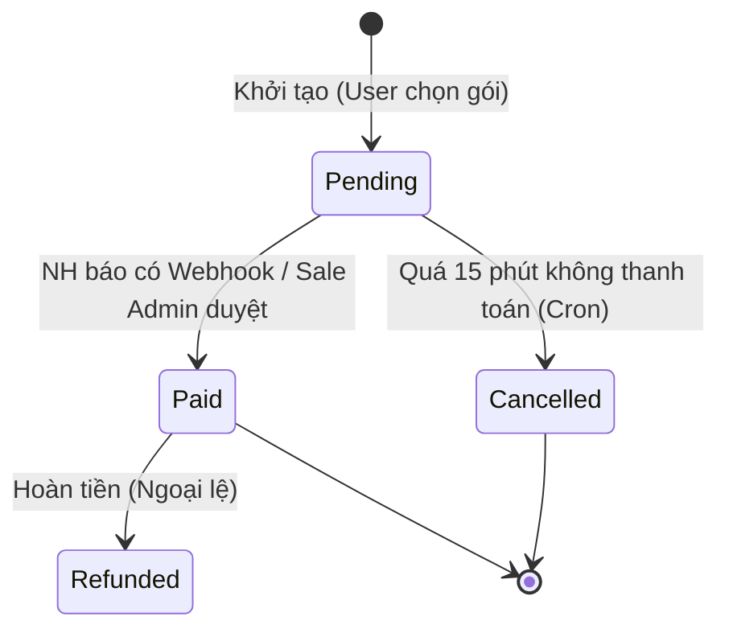
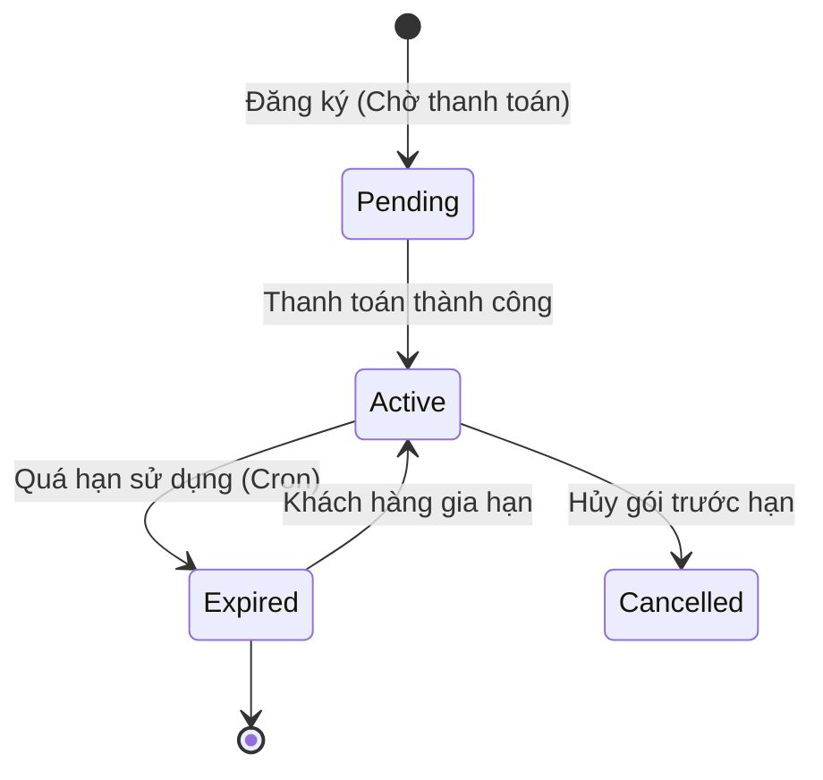
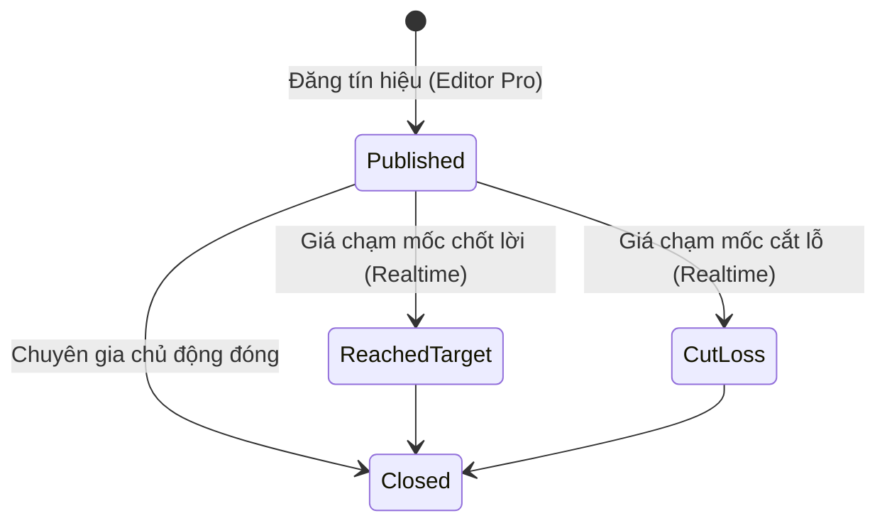
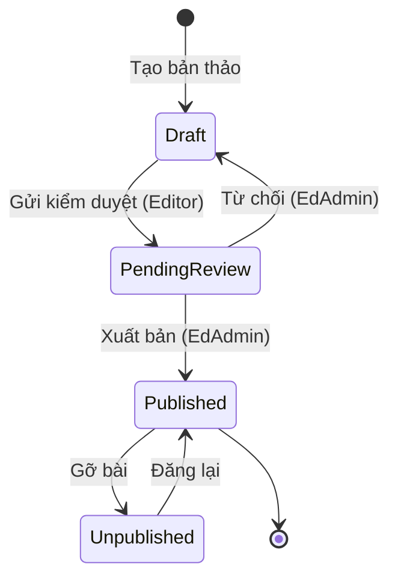

# 🔄 BẢN ĐỒ VÒNG ĐỜI THỰC THỂ (ENTITY LIFECYCLE MAP)

**Ngày thực hiện:** 18/05/2026  
**Mục tiêu:** Đặc tả các mốc trạng thái (Lifecycle states), quy tắc chuyển đổi (State transitions), sự kiện kích hoạt (Triggers), các bước chuyển đổi bất hợp lệ (Invalid transitions) và quy định ghi log kiểm toán cho các thực thể trọng điểm trong hệ thống FinTop DATA.

---

## 1. QUY TRÌNH CHUYỂN ĐỔI TRẠNG THÁI HÓA ĐƠN (`INVOICE`)

* **Trạng thái hợp lệ:** `PENDING`, `PAID`, `CANCELLED`, `REFUNDED`.
* **Trạng thái khởi tạo mặc định:** `PENDING`.
* **Chuyển đổi hợp lệ:**
  * `PENDING` -> `PAID`: Khi nhận Webhook VietQR thành công hoặc Sale Admin bấm xác nhận. Kích hoạt event `InvoicePaidEvent`.
  * `PENDING` -> `CANCELLED`: Khi hệ thống chạy Cronjob quét các hóa đơn quá hạn 15 phút chưa thanh toán.
* **Chuyển đổi bất hợp lệ (Invalid Transitions - Bị chặn bởi Guard/Service):**
  * `PAID` -> `PENDING` hoặc `PAID` -> `CANCELLED` (Cấm tuyệt đối hủy hóa đơn đã thanh toán).
  * `CANCELLED` -> `PAID` (Hóa đơn đã hủy không thể phục hồi, user phải tạo mã QR mới).
* **Yêu cầu kiểm toán:** Mọi thao tác chuyển sang `PAID` hoặc `REFUNDED` bắt buộc ghi 1 bản ghi vào bảng `AuditLog` kèm theo mã tham chiếu giao dịch.

---

## 2. VÒNG ĐỜI GÓI DỊCH VỤ (`USER_SUBSCRIPTION`)

* **Trạng thái hợp lệ:** `PENDING`, `ACTIVE`, `EXPIRED`, `CANCELLED`.
* **Chuyển đổi hợp lệ:**
  * `PENDING` -> `ACTIVE`: Khi `InvoicePaidEvent` được phát ra. Hệ thống thiết lập `startDate = NOW()`, `endDate = NOW() + duration`.
  * `ACTIVE` -> `EXPIRED`: Cronjob 00:01 sáng quét các gói có `endDate < NOW()`. Bắn event `SubscriptionExpiredEvent`.
* **Hành vi hệ thống ngầm:** Khi chuyển sang `EXPIRED`, hệ thống tự động cập nhật `tierLevel = 1` (Standard) trên bảng `User` và vô hiệu hóa Redis Cache quyền hạn.

---

## 3. VÒNG ĐỜI TÍN HIỆU V.I.P (`VIP_SIGNAL`)

* **Trạng thái hợp lệ:** `PUBLISHED`, `REACHED_TARGET`, `CUT_LOSS`, `CLOSED`.
* **Chuyển đổi hợp lệ:**
  * `[*] -> PUBLISHED`: Editor Pro tạo khuyến nghị. Bắn Push notification cho client Gold+.
  * `PUBLISHED` -> `REACHED_TARGET` / `CUT_LOSS`: Engine so khớp giá tự động phát hiện giá khớp lệnh hiện tại chạm ngưỡng.
  * `PUBLISHED` / `REACHED_TARGET` / `CUT_LOSS` -> `CLOSED`: Khóa sổ tín hiệu, ghi nhận tỷ lệ % lợi nhuận đạt được vào DB.
* **Chuyển đổi bất hợp lệ:** Không thể chuyển từ `CLOSED` quay ngược về `PUBLISHED`.

---

## 4. VÒNG ĐỜI BÀI VIẾT CMS (`BLOG`)

* **Trạng thái hợp lệ:** `DRAFT`, `PENDING_REVIEW`, `PUBLISHED`, `UNPUBLISHED`.
* **Quy tắc phân quyền (RBAC Enforcement):**
  * Editor chỉ có quyền tạo `DRAFT` và chuyển sang `PENDING_REVIEW`.
  * Chỉ Editor Admin, Editor Pro và CEO mới có quyền chuyển trạng thái sang `PUBLISHED` hoặc `UNPUBLISHED`.
* **Cache Invalidation:** Chuyển sang `PUBLISHED` -> Tự động xóa các key Redis `blogs:list:*`.

---

## 5. MA TRẬN RỦI RO CHUYỂN ĐỔI VÀ MỨC ĐỘ TỰ TIN

| STT | Thực Thể (Entity) | Điểm Nút Rủi Ro (Transition Risk Point) | Mức Độ Tự Tin | Mức Ưu Tiên |
| :---: | :--- | :--- | :---: | :---: |
| 1 | `Invoice` | Thiếu kiểm tra trạng thái trước khi cập nhật `PAID` có thể gây lỗ hổng thanh toán đúp (Double spending). | `HIGH` | `P0` |
| 2 | `UserSubscription` | Nếu Cronjob hết hạn bị lỗi, user VIP sẽ được dùng chùa miễn phí vô thời hạn. | `HIGH` | `P0` |
| 3 | `VipSignal` | Nếu không khóa trạng thái `CLOSED`, chuyên gia có thể gian lận sửa lại giá vốn sau khi khớp lệnh. | `HIGH` | `P1` |
| 4 | `Blog` | Editor tự ý đổi trạng thái sang `PUBLISHED` nếu thiếu `RolesGuard` bảo vệ tại endpoint. | `HIGH` | `P1` |

Vòng đời các thực thể đã được định hình rõ nét, sẵn sàng cho việc thiết lập chiến lược kiểm toán toàn diện (Audit Strategy).
