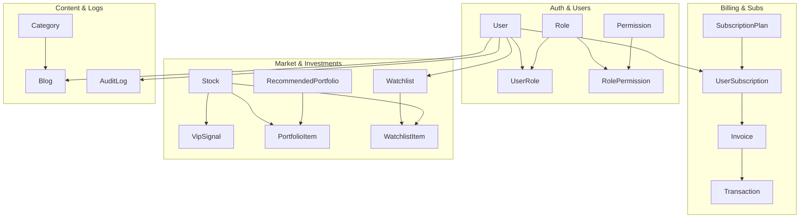

# 🗂️ BẢN ĐỒ THỰC THỂ CƠ SỞ DỮ LIỆU (DATABASE ENTITY MAP)

**Ngày thực hiện:** 18/05/2026  
**Mục tiêu:** Đặc tả chi tiết mục đích, thuộc tính, vòng đời và yêu cầu bảo mật của từng thực thể (Entity) cốt lõi trong cơ sở dữ liệu hệ thống FinTop DATA trước khi triển khai trên Prisma Schema.

---

## 1. QUY CHUẨN THIẾT KẾ THỰC THỂ (ENTITY DESIGN STANDARDS)
Tất cả các thực thể nghiệp vụ bắt buộc tuân thủ bộ quy chuẩn sau:
* **Khóa chính (PK):** Sử dụng kiểu số nguyên tự tăng `Int @id @default(autoincrement())` cho hiệu năng index tối ưu.
* **Trường kiểm toán bắt buộc (Audit Fields):** `createdAt DateTime @default(now())`, `updatedAt DateTime @updatedAt`.
* **Chính sách xóa mềm (Soft Delete Policy):** Sử dụng trường `deletedAt DateTime?`. Không thực hiện xóa vật lý (Hard Delete) trừ bảng session.
* **Quy chuẩn đặt tên (Naming Convention):** Tên bảng PascalCase số ít (Ví dụ `User`, `VipSignal`). Tên trường camelCase (`tierLevel`, `buyPrice`).

---

## 2. ĐẶC TẢ CHI TIẾT CÁC THỰC THỂ CỐT LÕI (CORE ENTITIES SPECIFICATION)



---

### 2.1. Nhóm Auth & RBAC (Xác thực & Phân quyền)

#### Entity: `User`
* **Mục đích:** Lưu trữ hồ sơ định danh, trạng thái và thiết lập đầu tư của khách hàng và nhân viên.
* **Miền sở hữu (Owner Domain):** `User Domain`.
* **Quan hệ (Relationships):** 1-N với `UserRole`, `UserSession`, `BrokerAssignment` (với tư cách Sale hoặc Client), `UserSubscription`, `Watchlist`, `Blog`.
* **Vòng đời (Lifecycle):** `Pending_Verification` -> `Active` -> `Inactive` (Khóa/Soft Delete).
* **Trường bất biến (Immutable Fields):** `id`, `createdAt`.
* **Trường khả biến (Mutable Fields):** `email`, `passwordHash`, `fullName`, `phone`, `brokerId` (FK), `riskTaste`, `status`, `tierLevel`, `avatarUrl`, `updatedAt`, `deletedAt`.
* **RBAC & Sub Sensitivity:** Cực kỳ nhạy cảm (Chỉ User hoặc Admin có quyền xem/sửa).

#### Entity: `Role` & `Permission`
* **Mục đích:** Định nghĩa danh mục Vai trò (`CEO`, `Sale`, `ClientVIP`) và Quyền hạn (`create:blog`, `read:vip`).
* **Quan hệ:** Nhiều-Nhiều qua bảng trung gian `RolePermission` và `UserRole`.
* **Trường bất biến:** `id`, `code` (Ví dụ `CLIENT_GOLD`, `APPROVE_PAYMENT`).
* **Trường khả biến:** `name`, `description`, `isActive`.

---

### 2.2. Nhóm Gói dịch vụ & Thanh toán (Subscription & Billing)

#### Entity: `SubscriptionPlan`
* **Mục đích:** Danh mục bảng giá gói hội viên (Standard, Silver, Gold, Diamond).
* **Quan hệ:** 1-N với `UserSubscription`.
* **Trường bất biến:** `id`, `planCode` (Ví dụ `GOLD_1Y`, `DIA_6M`).
* **Trường khả biến:** `name`, `price`, `durationDays`, `tierLevel` (1-4), `description`, `features`, `isActive`.

#### Entity: `UserSubscription`
* **Mục đích:** Quản lý gói dịch vụ và thời hạn sử dụng thực tế của từng khách hàng.
* **Quan hệ:** N-1 với `User` và `SubscriptionPlan`, 1-N với `Invoice`.
* **Vòng đời:** `Pending` -> `Active` -> `Expired` -> `Cancelled`.
* **Trường khả biến:** `userId` (FK), `planId` (FK), `startDate`, `endDate`, `status`, `isTrial`, `updatedAt`.
* **Yêu cầu kiểm toán:** Bắt buộc ghi log khi gia hạn hoặc đổi tier.

#### Entity: `Invoice` & `Transaction`
* **Mục đích:** Quản lý hóa đơn chuyển khoản và thông tin dòng tiền đối soát từ ngân hàng (VietQR).
* **Quan hệ:** `Invoice` 1-1 với `Transaction`.
* **Vòng đời Hóa đơn:** `Pending` -> `Paid` -> `Cancelled`.
* **Trường khả biến Hóa đơn:** `invoiceCode` (Duy nhất), `userId`, `planId`, `amount`, `status`, `qrCodeUrl`, `approvedById` (FK - SaleAdmin duyệt).
* **Trường bất biến Giao dịch:** `transactionRef` (Mã tham chiếu NH), `amount`, `bankName`, `paidAt`.

---

### 2.3. Nhóm Thị trường & Tín hiệu VIP (Market & Signals)

#### Entity: `Stock` & `StockPriceDaily`
* **Mục đích:** Danh sách mã chứng khoán và dữ liệu nến ngày lịch sử.
* **Trường bất biến Stock:** `id`, `symbol` (Duy nhất - `FPT`, `HPG`), `sectorId` (FK).
* **Trường khả biến Stock:** `companyName`, `exchange` (HOSE/HNX/UPCOM), `taScore` (A, B...), `faScore` (A+...).

#### Entity: `VipSignal`
* **Mục đích:** Khuyến nghị MUA/BÁN thực chiến từ chuyên gia.
* **Miền sở hữu:** `Signals Domain`.
* **Quan hệ:** N-1 với `Stock` và `User` (Editor Pro/Chuyên gia đăng).
* **Vòng đời:** `Published` -> `ReachedTarget` / `CutLoss` -> `Closed`.
* **Trường bất biến:** `id`, `stockId`, `signalType` (`BUY`/`SELL`), `buyPriceMin`, `buyPriceMax`, `targetPrice`, `stopLossPrice`, `createdAt`.
* **Trường khả biến:** `status`, `achievedGainPercent`, `closedAt`, `notes`.
* **Subscription Sensitivity:** Cực kỳ nhạy cảm (Gated cho Gold/Diamond Tier).

#### Entity: `RecommendedPortfolio` & `PortfolioItem`
* **Mục đích:** Danh mục đầu tư mẫu của chuyên gia và các mã cổ phiếu trong rổ.
* **Quan hệ:** `RecommendedPortfolio` 1-N với `PortfolioItem`.
* **Trường khả biến:** `name`, `expertId`, `strategy`, `currentNav`, `cashPercent`, `stockPercent`.

---

### 2.4. Nhóm Tương tác & Nội dung (Watchlist, CMS & Logs)

#### Entity: `Watchlist` & `PriceAlert`
* **Mục đích:** Rổ cổ phiếu quan tâm và thiết lập cảnh báo giá của user.
* **Quan hệ:** N-1 với `User`, 1-N với `WatchlistItem`.
* **Trường khả biến:** `name`, `targetPrice`, `isTriggered`.

#### Entity: `Blog` & `Category`
* **Mục đích:** Quản lý kho bài viết, báo cáo phân tích và cẩm nang.
* **Quan hệ:** N-1 với `Category` và `User` (Tác giả).
* **Vòng đời:** `Draft` -> `PendingReview` -> `Published` -> `Unpublished`.
* **Trường khả biến:** `title`, `slug`, `content`, `thumbnailUrl`, `isVipOnly` (Boolean), `status`, `publishedAt`.
* **Subscription Sensitivity:** Nếu `isVipOnly = true`, khóa nội dung với user Standard.

#### Entity: `AuditLog`
* **Mục đích:** Nhật ký thao tác nhạy cảm của hệ thống.
* **Vòng đời:** Bất biến (100% Immutable). Không bao giờ được phép sửa/xóa.
* **Trường bất biến:** `id`, `userId`, `action` (`UPDATE_ROLE`, `APPROVE_PAYMENT`), `tableName`, `recordId`, `oldValues` (JSON), `newValues` (JSON), `ipAddress`, `userAgent`, `createdAt`.

---

## 3. MA TRẬN BẢO MẬT VÀ KIỂM TOÁN THỰC THỂ (SECURITY & AUDIT MATRIX)

```
+----------------------+-------------------+-------------------+-------------------+-------------------+
| Tên Thực Thể         | Xóa Mềm (Soft Del)| Ghi Log Kiểm Toán | Mức Nhạy Cảm RBAC | Mức Nhạy Cảm Sub  |
+----------------------+-------------------+-------------------+-------------------+-------------------+
| User                 | 🟢 Bắt buộc       | 🟢 Mật khẩu/Role  | 🔴 Rất cao        | ⚪ Không          |
| Role / Permission    | 🟢 Bắt buộc       | 🟢 Mọi thao tác   | 🔴 Rất cao (CEO)  | ⚪ Không          |
| UserSubscription     | ⚪ Không (Archive)| 🟢 Mọi thao tác   | 🟡 Trung bình     | 🔴 Cốt lõi        |
| Invoice / Transaction| ⚪ Không (Bất biến)🟢 100% Immutable| 🔴 Rất cao (Sale) | 🔴 Cốt lõi        |
| VipSignal / Portfolio| 🟢 Bắt buộc       | 🟡 Thao tác đóng  | 🟡 Trung bình     | 🔴 Gated (Gold+)  |
| Blog                 | 🟢 Bắt buộc       | 🟡 Thao tác đăng  | 🟡 Trung bình     | 🟡 Gated (VIP)    |
| AuditLog             | ⚪ Không (Bất biến)⚪ Không áp dụng   | 🔴 Super Admin    | ⚪ Không          |
+----------------------+-------------------+-------------------+-------------------+-------------------+
```

---

## 4. MA TRẬN ƯU TIÊN VÀ MỨC ĐỘ TỰ TIN (EVIDENCE & PRIORITY)

| STT | Tên Bảng (Table Name) | Bằng Chứng Cần Bổ Sung (Missing in Prisma) | Mức Độ Tự Tin | Mức Ưu Tiên |
| :---: | :--- | :--- | :---: | :---: |
| 1 | `User` | Thêm các trường `phone`, `brokerId`, `status`, `tierLevel`, `deletedAt`. | `HIGH` | `P0` |
| 2 | `Role`, `Permission` | Tạo 4 bảng cho khung kiểm soát truy cập trung tâm (Centralized RBAC). | `HIGH` | `P0` |
| 3 | `UserSubscription` | Tạo bảng theo dõi ngày bắt đầu, hết hạn và trạng thái hội viên. | `HIGH` | `P0` |
| 4 | `Invoice`, `Transaction`| Tạo bảng lưu trữ mã đơn hàng VietQR và đối soát ngân hàng. | `HIGH` | `P0` |
| 5 | `VipSignal`, `Portfolio`| Tạo kho chứa dữ liệu khuyến nghị và tính toán NAV thực chiến. | `HIGH` | `P1` |
| 6 | `AuditLog` | Bảng nhật ký kiểm toán bất biến (Immutable Log). | `HIGH` | `P1` |

Bản đồ thực thể đã được phân tích tường minh, sẵn sàng cho bước thiết lập ma trận quan hệ (Relationship Map) giữa các bảng.
