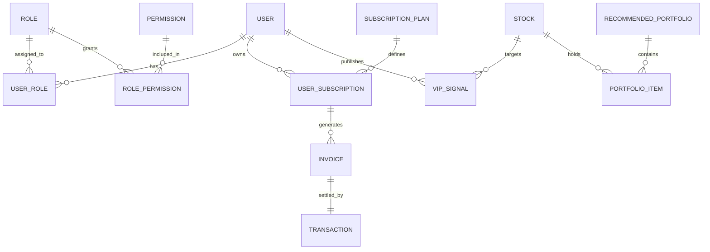

# 🔗 BẢN ĐỒ QUAN HỆ CƠ SỞ DỮ LIỆU (DATABASE RELATIONSHIP MAP)

**Ngày thực hiện:** 18/05/2026  
**Mục tiêu:** Thiết lập kiến trúc quan hệ (1-1, 1-N, N-N), chính sách xóa dây chuyền (Cascade policy), chiến lược đánh chỉ mục (Indexing strategy) và các bảng trung gian (Junction tables) cho toàn bộ hệ thống FinTop DATA trước khi ánh xạ vào Prisma.

---

## 1. TỔNG QUAN CÁC QUAN HỆ CỐT LÕI (CORE RELATIONSHIPS OVERVIEW)



---

## 2. QUY CHUẨN THỰC THI QUAN HỆ (RELATIONSHIP GOVERNANCE)

### 2.1. Chính sách Xóa dây chuyền (Cascade Policy)
* **Tuyệt đối cấm `OnDelete: Cascade` trên dữ liệu nhạy cảm:** Các bảng liên quan đến tài chính (`Invoice`, `Transaction`, `UserSubscription`) và hoạt động người dùng (`AuditLog`, `VipSignal`) bắt buộc sử dụng `OnDelete: Restrict` hoặc `OnDelete: SetNull`.
* **Áp dụng `Cascade` cho bảng thành phần:** Chỉ sử dụng `Cascade` trên các bảng phụ thuộc hoàn toàn vào thực thể cha, ví dụ xóa `User` -> tự động xóa `UserSession`, `AuthToken` hoặc xóa `Watchlist` -> tự động xóa `WatchlistItem`.

### 2.2. Bảng Trung Gian (Junction Tables)
Mọi quan hệ Nhiều-Nhiều (N-N) đều phải được cụ thể hóa thông qua một bảng trung gian có định nghĩa trường `createdAt` rõ ràng thay vì sử dụng quan hệ ngầm định (Implicit many-to-many) của Prisma.

---

## 3. CHI TIẾT MA TRẬN QUAN HỆ (RELATIONSHIP SPECIFICATION MATRIX)

### 3.1. Nhóm Phân quyền & Định danh (Auth & RBAC)
* **`User` <---> `UserRole` <---> `Role` (N-N):**
  * Bảng trung gian: `UserRole` (PK composite `[userId, roleId]`).
  * Cascade: `User` -> `UserRole` (`Cascade`), `Role` -> `UserRole` (`Restrict`).
  * Index: Khóa ngoại `@relation(fields: [userId], references: [id], onDelete: Cascade) @@index([userId])`.

* **`Role` <---> `RolePermission` <---> `Permission` (N-N):**
  * Bảng trung gian: `RolePermission` (PK composite `[roleId, permissionId]`).
  * Cascade: `Role` -> `RolePermission` (`Cascade`), `Permission` -> `RolePermission` (`Cascade`).

* **`User` (Sale) ---> `User` (Client) (1-N - Broker Assignment):**
  * FK: `brokerId Int?` trên bảng `User`.
  * Cascade: `OnDelete: SetNull` (Khi nhân sự Sale nghỉ việc, tệp KH tự động chuyển về trạng thái chờ phân bổ).
  * Index: `@@index([brokerId])`.

---

### 3.2. Nhóm Dịch vụ & Thanh toán (Subscription & Billing)
* **`SubscriptionPlan` ---> `UserSubscription` (1-N):**
  * FK: `planId Int` trên bảng `UserSubscription`.
  * Cascade: `OnDelete: Restrict` (Không được xóa một gói dịch vụ nếu đang có khách hàng sử dụng).
  * Index: `@@index([userId, status])`.

* **`UserSubscription` ---> `Invoice` (1-N):**
  * FK: `subscriptionId Int` trên bảng `Invoice`.
  * Cascade: `OnDelete: Restrict`.

* **`Invoice` <---> `Transaction` (1-1):**
  * FK: `invoiceId Int @unique` trên bảng `Transaction`.
  * Cascade: `OnDelete: Restrict`. Bảo đảm không thể mất dữ liệu đối soát ngân hàng.

---

### 3.3. Nhóm Thị trường & Tín hiệu (Market & Signals)
* **`Sector` ---> `Stock` (1-N):**
  * FK: `sectorId Int` trên bảng `Stock`.
  * Cascade: `OnDelete: Restrict`.
  * Index: `@@index([symbol]) @@index([sectorId])`.

* **`Stock` ---> `VipSignal` (1-N):**
  * FK: `stockId Int` trên bảng `VipSignal`.
  * Cascade: `OnDelete: Restrict`.
  * Index: `@@index([stockId, status])`.

* **`RecommendedPortfolio` ---> `PortfolioItem` <---> `Stock` (1-N-1):**
  * Bảng con: `PortfolioItem`. FK: `portfolioId`, `stockId`.
  * Cascade: `RecommendedPortfolio` -> `PortfolioItem` (`Cascade`), `Stock` -> `PortfolioItem` (`Restrict`).

---

## 4. CHIẾN LƯỢC ĐÁNH CHỈ MỤC TỐI ƯU HÓA (INDEXING STRATEGY)

```
+------------------------+------------------------------------+---------------------------------------+
| Tên Bảng               | Khóa Chỉ Mục (Indexed Columns)     | Mục Đích Tối Ưu Hóa (Query Target)    |
+------------------------+------------------------------------+---------------------------------------+
| User                   | @@index([email, status])           | Tối ưu hóa truy vấn đăng nhập & auth. |
| User                   | @@index([brokerId])                | Tối ưu hóa Row-Level Security cho Sale|
| UserSession            | @@index([token])                   | Tốc độ kiểm tra session middleware.   |
| UserSubscription       | @@index([userId, status, endDate]) | Tối ưu hóa Guard kiểm tra tier & cron.|
| Invoice                | @@index([invoiceCode])             | Tìm kiếm nhanh khi nhận Webhook NH.   |
| Stock                  | @@index([symbol])                  | Autocomplete thanh tìm kiếm mã CP.    |
| VipSignal              | @@index([status, createdAt])       | Render bảng tín hiệu realtime cho VIP.|
| Blog                   | @@index([slug, status])            | Load chi tiết bài viết và SEO.        |
+------------------------+------------------------------------+---------------------------------------+
```

---

## 5. MA TRẬN RỦI RO VÀ MỨC ĐỘ TỰ TIN (EVIDENCE & CONFIDENCE)

| STT | Quan Hệ Trọng Điểm (Critical Relation) | Đánh Giá Rủi Ro Bất Nhất (Risk Assessment) | Mức Độ Tự Tin | Mức Ưu Tiên |
| :---: | :--- | :--- | :---: | :---: |
| 1 | `User` <-> `UserRole` <-> `Role` | Nếu thiếu `OnDelete: Cascade` từ User, rác dữ liệu sẽ tồn đọng khi xóa tài khoản. | `HIGH` | `P0` |
| 2 | `Invoice` <-> `Transaction` | Nếu dùng Cascade, một admin vô tình xóa hóa đơn sẽ làm bay mất bằng chứng giao dịch ngân hàng. | `HIGH` | `P0` |
| 3 | `User` (Sale) <-> `User` (Client)| FK tự tham chiếu (Self-referencing FK). Cần `OnDelete: SetNull` để tránh lỗi khóa ngoại. | `HIGH` | `P1` |
| 4 | `Watchlist` <-> `WatchlistItem` | Quan hệ cha-con hoàn toàn. Nên dùng `Cascade` để tối ưu hóa việc xóa danh mục. | `HIGH` | `P2` |

Kiến trúc quan hệ và chính sách chỉ mục đã được đặc tả hoàn chỉnh, sẵn sàng cho bước phân tích vòng đời trạng thái của các thực thể (Entity Lifecycle Map).
