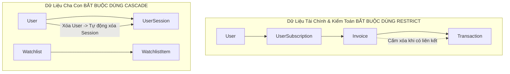

# 🔗 QUY CHUẨN QUẢN TRỊ QUAN HỆ PRISMA (PRISMA RELATIONSHIP RULES)

**Ngày ban hành:** 18/05/2026  
**Mục tiêu:** Thiết lập bộ quy chuẩn thực thi các quan hệ (1-1, 1-N, N-N), chính sách `onDelete`, `onUpdate` và kiểm soát chặt chẽ các ranh giới dữ liệu môi giới (RLS) trên Prisma Schema.

---

## 1. QUY CHUẨN CHÍNH SÁCH CASCADE & RESTRICT (DELETION POLICIES)



### 1.1. Chính sách Bắt buộc (Mandatory Policies)
* **Thực thể Tài chính & Kế toán (`Invoice`, `Transaction`, `UserSubscription`):** Bắt buộc sử dụng `onDelete: Restrict` hoặc `onDelete: NoAction`.
  * *Lý do:* Tuyệt đối không để một thao tác xóa khách hàng làm mất đi chứng từ thanh toán ngân hàng phục vụ kiểm toán tài chính và tính thuế.
* **Thực thể Bất biến (`AuditLog`):** Không có quan hệ xóa dây chuyền.
* **Thực thể Phụ thuộc (`UserSession`, `AuthToken`):** Sử dụng `onDelete: Cascade`.

---

## 2. QUY CHUẨN QUAN HỆ TỰ THAM CHIẾU (SELF-REFERENCING FK RULES)

### 2.1. Quan hệ Môi giới (Broker - Client)
Bảng `User` chứa thuộc tính `brokerId` tham chiếu chính mình để tạo ranh giới Multi-tenancy RLS:
```prisma
model User {
  id        Int    @id @default(autoincrement())
  brokerId  Int?
  broker    User?  @relation("BrokerToClient", fields: [brokerId], references: [id], onDelete: SetNull)
  clients   User[] @relation("BrokerToClient")
}
```
* **Quy tắc an toàn (Safe Relation Rule):** Bắt buộc phải sử dụng `onDelete: SetNull`. Nếu một nhân viên Sale nghỉ việc và bị vô hiệu hóa hoặc xóa, toàn bộ tệp KH của Sale đó sẽ được chuyển về `null` (trạng thái tự do, chờ phân bổ mới), tránh gây ra lỗi sụp đổ khóa ngoại.

---

## 3. PHÂN TÍCH ANTI-PATTERNS QUAN HỆ (RELATIONSHIP ANTI-PATTERNS)

```
+-------------------------------------------------------------------------------------------------------+
|                                    RELATIONSHIP SAFETY COMPARISON                                      |
+-------------------+-----------------------------------+-----------------------------------------------+
| Ví Dụ Anti-Pattern| Phân Tích Rủi Ro (Risk Reasoning) | Định Dạng Chuẩn Enterprise (Correct Format)   |
+-------------------+-----------------------------------+-----------------------------------------------+
| @relation(...,     | Một quản trị viên vô tình bấm xóa  | @relation(fields: [invoiceId], references: [i |
| onDelete: Cascade)| hóa đơn sẽ làm bốc hơi toàn bộ log| d], onDelete: Restrict)                       |
| (Trên Transaction)| chuyển khoản VietQR từ ngân hàng. |                                               |
+-------------------+-----------------------------------+-----------------------------------------------+
| Quan hệ N-N ngầm  | Không thể theo dõi được ngày giờ  | Bắt buộc phải tạo model `UserRole` chứa trường|
| `roles Role[]`    | gán quyền hoặc người thực hiện.   | `assignedAt DateTime @default(now())`.        |
+-------------------+-----------------------------------+-----------------------------------------------+
```

---

## 4. MA TRẬN RỦI RO VÀ MỨC ĐỘ TỰ TIN (EVIDENCE & PRIORITY)

| STT | Khía Cạnh Quan Hệ | Đánh Giá Tác Động Rủi Ro | Mức Độ Tự Tin | Mức Ưu Tiên |
| :---: | :--- | :--- | :---: | :---: |
| 1 | Xóa Dây Chuyền Hóa Đơn | Nếu dùng Cascade, hệ thống có rủi ro mất bằng chứng tài chính không thể cứu vãn. | `HIGH` | `P0` |
| 2 | Bảng Trung Gian Phân Quyền | Cần lưu trữ thời điểm và người gán quyền để truy vết bảo mật. | `HIGH` | `P0` |

Quy chuẩn quản trị quan hệ đã được làm rõ, bảo đảm an toàn dữ liệu ở mức tối đa trước khi tiến hành viết mã nguồn Prisma.
