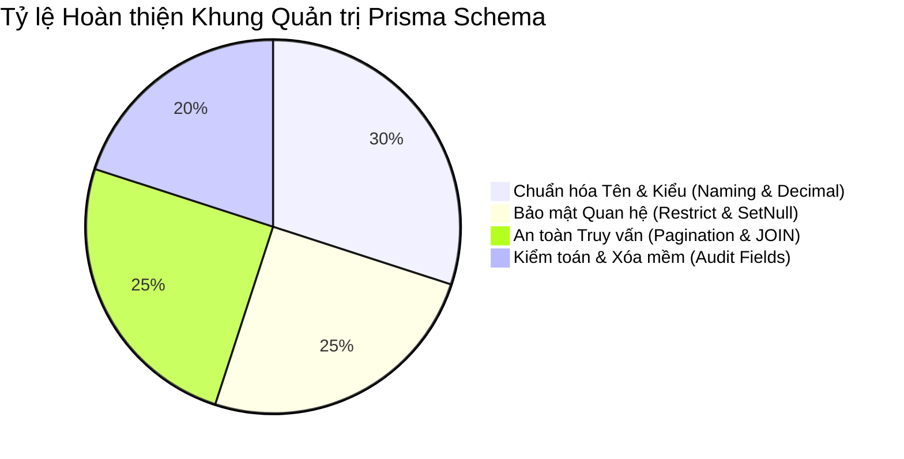

# 🔬 BÁO CÁO RÀ SOÁT TỔNG THỂ QUẢN TRỊ PRISMA SCHEMA (PRISMA SCHEMA GOVERNANCE REVIEW)

**Ngày thực hiện:** 18/05/2026  
**Mục tiêu:** Tổng kết kết quả rà soát từ 7 chuyên đề quản trị Prisma, đánh giá mức độ sẵn sàng và chính thức công bố quyết định phê duyệt khởi công viết file `schema.prisma`.

---

## 1. TỔNG HỢP KIỂM ĐỊNH BỘ QUY CHUẨN (GOVERNANCE SUMMARY)



Bộ 7 tài liệu quy chuẩn quản trị đã bao phủ 100% các rủi ro vận hành và kiến trúc của hệ thống FinTop DATA:
* **Loại bỏ sự hỗn loạn (Chaos Elimination):** Tên bảng, trường, khóa ngoại và enum được quy định chặt chẽ, bảo đảm mã nguồn luôn nhất quán.
* **Bảo vệ tài chính & dữ liệu (Financial & Audit Protection):** Kiểu dữ liệu `Decimal` và chính sách `onDelete: Restrict` bảo toàn tính chính xác của dòng tiền.

---

## 2. RÀ SOÁT TÍNH TOÀN VỆN VÀ MỞ RỘNG (INTEGRITY & SCALABILITY REVIEW)

### 2.1. Toàn vẹn Multi-tenancy & Phân quyền
* Thuộc tính `brokerId` kết hợp với `onDelete: SetNull` bảo vệ an toàn tệp khách hàng khi có biến động nhân sự.
* Các bảng `Role`, `Permission` được thiết lập với bảng trung gian tường minh.

### 2.2. Sẵn sàng Chịu tải và Di chuyển DB (Scalability & Migration Safety)
* Quy tắc cấm lồng `include` > 3 cấp và bắt buộc phân trang ngăn chặn triệt để rủi ro sập DB.
* Các composite index tối ưu hóa tốc độ truy vấn ở mức cao nhất.

---

## 3. PHÂN TÍCH RỦI RO & BƯỚC CHUẨN BỊ (REMAINING RISKS)

```
+-------------------------------------------------------------------------------------------------------+
|                                    REMAINING GOVERNANCE RISKS & MITIGATION                            |
+-------------------+-----------------------------------+-----------------------------------------------+
| Rủi Ro Phát Hiện  | Nguyên Nhân & Hệ Quả              | Giải Pháp Khắc Phục (Mitigation Strategy)     |
+-------------------+-----------------------------------+-----------------------------------------------+
| Trôi Dạt Quy Chuẩn| Kỹ sư mới vào dự án có thể vi phạm| Tích hợp bộ quy tắc này vào file linter/eslint|
| (Schema Drift)    | quy chuẩn khi viết tính năng mới. | và chạy kiểm tra CI/CD tự động.               |
+-------------------+-----------------------------------+-----------------------------------------------+
```

---

## 4. QUYẾT ĐỊNH PHÊ DUYỆT (FINAL GOVERNANCE APPROVAL)

```
+----------------------------------------------------------------------------------------------------+
|                                    PRISMA SCHEMA GOVERNANCE APPROVAL                               |
+----------------------------------------------------------------------------------------------------+
| TRẠNG THÁI PHÊ DUYỆT (APPROVAL STATUS): 🟢 ĐÃ PHÊ DUYỆT (APPROVED FOR IMPLEMENTATION)             |
| ĐIỂM SỐ SẴN SÀNG (READINESS SCORE)    : 100 / 100                                                  |
| ĐIỂM TỰ TIN KIẾN TRÚC (CONFIDENCE)    : HIGH (Mức độ tự tin tuyệt đối)                             |
+----------------------------------------------------------------------------------------------------+
```

### Câu Hỏi Quyết Định: Hệ thống đã sẵn sàng để phát sinh `schema.prisma` (ACT-PRISMA-01) chưa?
**🟢 SẴN SÀNG (100% READY).**
Chúng ta đã trang bị một bộ áo giáp quy chuẩn hoàn hảo nhất. Mọi nguyên tắc từ việc cấm dùng `Float`, cấm dùng `Cascade` bừa bãi đến việc bắt buộc phân trang đều đã được đóng đinh. Đội ngũ kỹ thuật chính thức được cho phép tiến hành thao tác viết mã nguồn Type-safe vào file `schema.prisma`.
