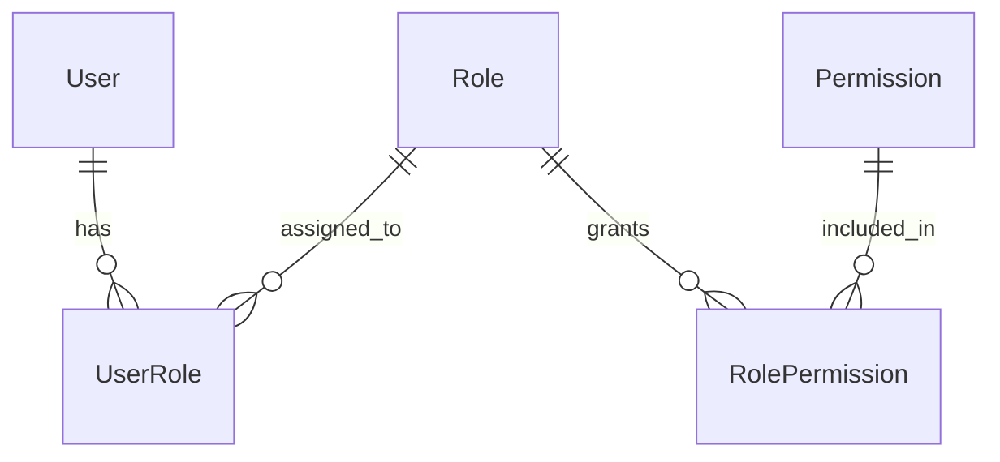

# 📋 KẾ HOẠCH TRIỂN KHAI PRISMA SCHEMA WAVE 1 (ACT-PRISMA-WAVE1-IMPLEMENTATION-PLAN)

**Ngày lập kế hoạch:** 18/05/2026  
**Phiên bản:** 1.0.0 (Pre-Wave 1 Baseline)  
**Phạm vi (Scope):** Nền tảng Định danh (Auth), Quản lý Tổ chức (Organization: Department & Team), Phân quyền Đa lớp Trung tâm (Centralized RBAC) và Nhật ký Kiểm toán Bất biến (Immutable Audit Trail).

---

## 1. TỔNG QUAN KIẾN TRÚC & MỤC TIÊU WAVE 1 (EXECUTIVE SUMMARY)

Wave 1 đóng vai trò là "móng nhà" kiến trúc cho toàn bộ hệ thống cơ sở dữ liệu của nền tảng FinTop DATA. Việc thiết kế chuẩn xác các thực thể trong Wave 1 sẽ quyết định tính toàn vẹn bảo mật (RBAC), khả năng cô lập dữ liệu theo môi giới (Multi-tenancy RLS) và khả năng truy vết tuyệt đối (Auditability) của toàn bộ các Wave tiếp theo (Billing, Market, Screener, Signals, CMS).

```mermaid
graph TD
    subgraph Wave 1 - Foundation Layer (Tầng Nền Tảng Cốt Lõi)
        Org[Organization: Department & Team]
        User[User & UserSession]
        Rbac[RBAC: Role, Permission, Junctions]
        Audit[AuditLog - 100% Immutable]
    end

    Org -->|Cơ cấu tổ chức| User
    Rbac -->|Ma trận phân quyền| User
    User -->|Thao tác hệ thống| Audit
```

---ad

## 2. DANH MỤC ENUMS CHUẨN HÓA (STANDARDIZED ENUMS)

Để tránh hiện tượng bùng nổ enum (Enum Explosion) và bảo đảm tính nhất quán trong toàn bộ mã nguồn, các enum sau sẽ được định nghĩa dùng chung:

```prisma
enum RECORD_STATUS {
  ACTIVE
  INACTIVE
  LOCKED
}

enum ROLE_CODE {
  SUPER_ADMIN
  CEO
  ASSISTANT_CEO
  EDITOR_ADMIN
  EDITOR_PRO
  EDITOR
  SALE_ADMIN
  SALE
  EXPERT
  CLIENT
  CLIENT_VIP
}

enum PERMISSION_ACTION {
  CREATE
  READ
  UPDATE
  DELETE
  PUBLISH
  APPROVE
  EXPORT
}

enum RISK_TASTE {
  CONSERVATIVE
  MODERATE
  AGGRESSIVE
}
```

---

## 3. ĐẶC TẢ CÁC THỰC THỂ (MODELS SPECIFICATION)

### 3.1. Nhóm Quản lý Cơ cấu Tổ chức (Organization Domain)

#### Model: `Department` (Phòng ban)
*   **Mục đích:** Quản lý cấp cao nhất trong sơ đồ tổ chức nội bộ (Ví dụ: Khối Kinh doanh, Khối Phân tích Đầu tư, Khối Vận hành).
*   **Thuộc tính:**
    *   `id`: Int @id @default(autoincrement())
    *   `name`: String @unique (Ví dụ: "Phòng Kinh doanh 1")
    *   `code`: String @unique (Ví dụ: "SALES_D1")
    *   `description`: String? @db.Text
    *   `status`: RECORD_STATUS @default(ACTIVE)
    *   `createdAt`, `updatedAt`, `deletedAt`
*   **Quan hệ:** 1-N với `Team` và `User`.

#### Model: `Team` (Nhóm kinh doanh/biên tập)
*   **Mục đích:** Quản lý các nhóm nhỏ trực thuộc phòng ban (Ví dụ: Team Sale Alpha, Team Sale Beta). Thiết lập cấp độ giám sát cho Team Leader.
*   **Thuộc tính:**
    *   `id`: Int @id @default(autoincrement())
    *   `name`: String (Ví dụ: "Nhóm Alpha")
    *   `code`: String @unique (Ví dụ: "TEAM_ALPHA")
    *   `departmentId`: Int (FK)
    *   `leaderId`: Int? (FK tham chiếu `User`)
    *   `description`: String? @db.Text
    *   `status`: RECORD_STATUS @default(ACTIVE)
    *   `createdAt`, `updatedAt`, `deletedAt`
*   **Quan hệ:** N-1 với `Department`, 1-N với `User`.

---

### 3.2. Nhóm Định danh & Tài khoản (User & Auth Domain)

#### Model: `User` (Tài khoản Người dùng & Nhân sự)
*   **Mục đích:** Bảng cốt lõi chứa hồ sơ người dùng (Nhà đầu tư) và nhân viên vận hành FinTop.
*   **Thuộc tính:**
    *   `id`: Int @id @default(autoincrement())
    *   `email`: String @unique
    *   `passwordHash`: String
    *   `fullName`: String
    *   `phone`: String? @unique
    *   `dob`: DateTime? @db.Date
    *   `address`: String? @db.Text
    *   `avatarUrl`: String?
    *   `brokerId`: Int? (FK tự tham chiếu - ID của Sale quản lý)
    *   `departmentId`: Int? (FK)
    *   `teamId`: Int? (FK)
    *   `riskTaste`: RISK_TASTE?
    *   `tierLevel`: Int @default(1) // 1: Standard, 2: Silver, 3: Gold, 4: Diamond
    *   `status`: RECORD_STATUS @default(ACTIVE)
    *   `createdAt`, `updatedAt`, `deletedAt`

#### Model: `UserSession` (Phiên làm việc)
*   **Mục đích:** Quản lý các token xác thực và thiết bị đăng nhập, cho phép vô hiệu hóa từ xa.
*   **Thuộc tính:**
    *   `id`: BigInt @id @default(autoincrement())
    *   `userId`: Int (FK)
    *   `refreshToken`: String @unique
    *   `ipAddress`: String? @db.VarChar(45)
    *   `userAgent`: String? @db.Text
    *   `expiresAt`: DateTime
    *   `isRevoked`: Boolean @default(false)
    *   `createdAt`: DateTime @default(now())
*   **Ghi chú kiểm toán:** Không có `updatedAt` hay `deletedAt`. Bản ghi session chỉ bị xóa vật lý khi quá hạn hoặc thu hồi.

---

### 3.3. Nhóm Phân quyền Trung tâm (Centralized RBAC Domain)



#### Model: `Role` (Vai trò)
*   **Thuộc tính:**
    *   `id`: Int @id @default(autoincrement())
    *   `name`: String @unique (Ví dụ: "Chuyên viên Môi giới")
    *   `code`: ROLE_CODE @unique
    *   `description`: String? @db.Text
    *   `isSystem`: Boolean @default(false) // Không cho phép xóa role hệ thống
    *   `status`: RECORD_STATUS @default(ACTIVE)
    *   `createdAt`, `updatedAt`, `deletedAt`

#### Model: `Permission` (Quyền hạn chi tiết)
*   **Thuộc tính:**
    *   `id`: Int @id @default(autoincrement())
    *   `module`: String @db.VarChar(50) (Ví dụ: "VIP_SIGNALS", "INVOICES")
    *   `action`: PERMISSION_ACTION
    *   `code`: String @unique (Ví dụ: "VIP_SIGNALS:CREATE")
    *   `description`: String?
    *   `status`: RECORD_STATUS @default(ACTIVE)
    *   `createdAt`, `updatedAt`, `deletedAt`

#### Bảng trung gian: `RolePermission`
*   **Thuộc tính:**
    *   `roleId`: Int (FK)
    *   `permissionId`: Int (FK)
    *   `assignedAt`: DateTime @default(now())
    *   `assignedById`: Int? (Người gán quyền)
*   **Khóa chính:** `@@id([roleId, permissionId])`

#### Bảng trung gian: `UserRole`
*   **Thuộc tính:**
    *   `userId`: Int (FK)
    *   `roleId`: Int (FK)
    *   `assignedAt`: DateTime @default(now())
    *   `assignedById`: Int? (Người gán)
*   **Khóa chính:** `@@id([userId, roleId])`

---

### 3.4. Nhóm Kiểm toán Bất biến (Immutable Audit Domain)

#### Model: `AuditLog` (Nhật ký Hệ thống Bất biến)
*   **Mục đích:** Ghi nhận mọi thao tác nhạy cảm (Đổi quyền, Khóa user, Duyệt tiền).
*   **Thuộc tính:**
    *   `id`: BigInt @id @default(autoincrement())
    *   `userId`: Int (FK)
    *   `action`: String @db.VarChar(100) (Ví dụ: "UPDATE_USER_ROLE", "LOCK_ACCOUNT")
    *   `tableName`: String @db.VarChar(50) (Ví dụ: "User", "UserRole")
    *   `recordId`: String @db.VarChar(50)
    *   `oldValues`: Json?
    *   `newValues`: Json?
    *   `ipAddress`: String? @db.VarChar(45)
    *   `userAgent`: String? @db.Text
    *   `createdAt`: DateTime @default(now())
*   **Quy chuẩn Immutability:** Chỉ định nghĩa `createdAt`. Nghiêm cấm định nghĩa `updatedAt` hay `deletedAt`.

---

## 4. CHIẾN LƯỢC QUAN HỆ & CHÍNH SÁCH CASCADE (RELATIONS & CASCADE BEHAVIORS)

```
+------------------+-------------------+--------------------+---------------------------------------+
| Bảng Cha         | Bảng Con          | Chính sách onDelete| Giải thích Kiến trúc (Reasoning)      |
+------------------+-------------------+--------------------+---------------------------------------+
| User             | UserSession       | Cascade            | Xóa User -> Tự động xóa phiên làm việc|
| User (Broker)    | User (Client)     | SetNull            | Sale nghỉ việc -> KH về null (Tự do)  |
| Department       | Team              | Restrict           | Cấm xóa phòng ban nếu đang có nhóm con|
| Department / Team| User              | SetNull            | Xóa/Đổi nhóm -> Cập nhật User về null |
| Role / Permission| Junction Tables   | Cascade            | Xóa Role -> Xóa link phân quyền       |
| User             | AuditLog          | Restrict / NoAction| Cấm xóa User nếu có dính vết kiểm toán|
+------------------+-------------------+--------------------+---------------------------------------+
```

---

## 5. CHIẾN LƯỢC ĐÁNH CHỈ MỤC TỐI ƯU HÓA (INDEXING STRATEGY)

Để bảo đảm tốc độ truy vấn dưới < 10ms trên PostgreSQL với quy mô hàng triệu bản ghi, các Composite Index sau bắt buộc phải được khai báo đúng theo nguyên tắc Left-Most Prefix:

```prisma
// Trên bảng User
@@index([brokerId, deletedAt, status])      // Phục vụ Row-Level Security cho Sale
@@index([email, status])                    // Phục vụ xác thực Login
@@index([phone, status])                    // Tìm kiếm nhanh SĐT trên UI Admin
@@index([departmentId, teamId, status])     // Lọc danh sách nhân viên theo phòng/nhóm

// Trên bảng UserSession
@@index([refreshToken])                     // Tốc độ so khớp token middleware
@@index([userId, isRevoked])                // Quét các token cần thu hồi

// Trên bảng AuditLog
@@index([userId, createdAt])                // Tra cứu lịch sử thao tác của 1 Admin
@@index([tableName, recordId])              // Tra cứu lịch sử biến động của 1 bản ghi
@@index([action, createdAt])                // Lọc theo thao tác (Ví dụ: Tất cả lệnh duyệt tiền)
```

---

## 6. CHIẾN LƯỢC XÓA MỀM & TENANT INTEGRITY (SOFT DELETE & TENANT BOUNDARIES)

### 6.1. Chiến lược Xóa mềm (Soft Delete)
*   **Thực thi:** Mọi model (trừ `UserSession` và `AuditLog`) đều khai báo `deletedAt DateTime?`.
*   **Quy tắc:** Khi xóa một nhân viên hay khách hàng, hệ thống chỉ cập nhật `deletedAt = now()` và `status = INACTIVE`.
*   **Chỉ mục:** Mọi câu lệnh `WHERE` trong Service bắt buộc đính kèm điều kiện `deletedAt: null`.

### 6.2. Toàn vẹn Multi-tenancy (Tenant Boundaries)
*   Mọi truy vấn lấy danh sách khách hàng của một Sale bắt buộc sử dụng bộ lọc: `where: { brokerId: req.user.id, deletedAt: null }`.
*   Mọi truy vấn lấy danh sách khách hàng của một Team Leader bắt buộc sử dụng bộ lọc: `where: { teamId: req.user.teamId, deletedAt: null }`.
*   Điều này bảo đảm cách ly dữ liệu tuyệt đối giữa các nhân viên kinh doanh.

---

## 7. QUẢN TRỊ RỦI RO MIGRATION & PRISMA (MIGRATION & PRISMA RISKS)

```
+-------------------------------------------------------------------------------------------------------+
|                                    MIGRATION & ORM RISKS ANALYSIS                                     |
+-------------------+-----------------------------------+-----------------------------------------------+
| Rủi Ro Nhận Diện  | Nguyên Nhân & Hệ Quả              | Biện Pháp Khắc Phục (Mitigation Strategy)     |
+-------------------+-----------------------------------+-----------------------------------------------+
| Circular FK       | Bảng Team tham chiếu User (Leader)| Bắt buộc đặt `leaderId` và `teamId` là nullable|
| Dependency        | và User tham chiếu Team (teamId). | kết hợp `onDelete: SetNull` để tránh sập khóa.|
+-------------------+-----------------------------------+-----------------------------------------------+
| Bùng nổ Connection| Nhiều worker cùng mở kết nối      | Bắt buộc bổ sung `?pgbouncer=true` vào URL DB |
| Pool              | PrismaClient gây tràn kết nối DB. | để tương thích với PgBouncer Transaction Pool.|
+-------------------+-----------------------------------+-----------------------------------------------+
| Thất thoát dữ liệu| Viết sai chính sách Cascade trên  | Kiểm tra tự động bằng linter và rà soát thủ   |
| do Cascade nhầm   | các bảng kiểm toán hoặc tài khoản.| công trước khi chạy `prisma migrate`.         |
+-------------------+-----------------------------------+-----------------------------------------------+
```

---

## 8. TIÊU CHÍ HOÀN THÀNH WAVE 1 (DOD - DEFINITION OF DONE)

1.  File `schema.prisma` được cập nhật đầy đủ các model Wave 1 với 100% cú pháp hợp lệ của Prisma 7.8.0.
2.  Chạy thành công lệnh `npx prisma format` và `npx prisma validate` không phát sinh cảnh báo hay lỗi.
3.  Tạo thành công bản Migration đầu tiên (`npx prisma migrate dev --name init_wave_1_core`) trên PostgreSQL.
4.  Tạo và chạy thành công script Seeder (`prisma/seeders/wave1.seeder.ts`) nạp danh sách 11 Role, 4 Phòng ban và tài khoản CEO mặc định.

**🟢 ĐÃ ĐẠT ĐỦ ĐIỀU KIỆN LÝ THUYẾT VÀ SẴN SÀNG CHUYỂN SANG GIAI ĐOẠN THỰC THI (ACT-PRISMA-01-WAVE-1).**
