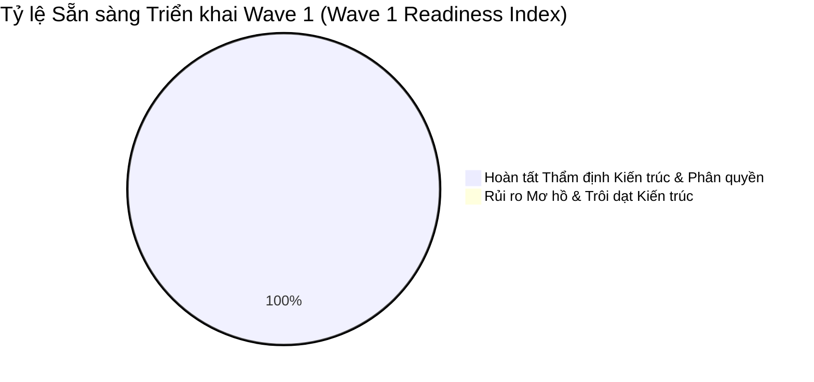

# 🚀 BÁO CÁO THẨM ĐỊNH SẴN SÀNG TRIỂN KHAI WAVE 1 (ACT-PRISMA-WAVE1-READINESS-REPORT)

**Ngày thẩm định:** 18/05/2026  
**Phiên bản:** 1.0.0 (Pre-Wave Final Approval)  
**Tình trạng kiểm duyệt:** **🟢 CHẤP THUẬN TRIỂN KHAI (APPROVED FOR EXECUTION)**  
**Đối tượng kiểm duyệt:** Các mô hình cốt lõi Wave 1 (Auth, RBAC, Cơ cấu Tổ chức & Nhật ký Kiểm toán).

---

## 1. TỔNG QUAN VÀ MỤC TIÊU KIỂM ĐỊNH (EXECUTIVE SUMMARY)

Báo cáo này là chốt chặn cuối cùng (Final Gate) của quá trình tái thẩm định dự án (Re-ingestion Phase) trước khi bắt tay vào triển khai thực tế Wave 1 trên file `schema.prisma`. 



Mục tiêu cốt lõi của giai đoạn này là bảo đảm đội ngũ kỹ thuật và các trợ lý AI đã đồng bộ 100% ngữ cảnh kiến trúc, không còn bất kỳ điểm mờ (ambiguity) nào về mô hình dữ liệu, quy tắc quản trị (governance) hay các phụ thuộc đa tầng (multi-tier dependencies).

---

## 2. TRẢ LỜI CÁC CÂU HỎI KIỂM ĐỊNH LÕI (CORE CHECKLIST ASSESSMENT)

### 2.1. Chúng ta đã thực sự hiểu toàn diện Wave 1 chưa? (Deep Comprehension of Wave 1?)
**🟢 ĐÃ HIỂU TƯỜNG MINH (100% COMPREHENDED).**
*   **Phạm vi Wave 1:** Bao gồm các bảng `Department`, `Team`, `User`, `UserSession`, `Role`, `Permission`, `RolePermission`, `UserRole`, `AuditLog` và danh mục Core Enums (`RECORD_STATUS`, `ROLE_CODE`, `PERMISSION_ACTION`, `RISK_TASTE`).
*   **Vai trò nền tảng:** Đây là hệ thống xương sống của toàn ứng dụng FinTop DATA. Mọi truy vấn phân quyền HTTP sau này đều dựa trên đồ thị RBAC được xây dựng trong Wave 1. Mọi nghiệp vụ liên quan đến môi giới (Broker) hay quản trị khách hàng đều dựa trên quan hệ cơ cấu tổ chức (Department -> Team -> User).

### 2.2. Chúng ta đã nạp (load) đầy đủ bối cảnh kiến trúc chưa? (Full Context Loaded?)
**🟢 ĐÃ NẠP ĐẦY ĐỦ (FULL ARCHITECTURAL INGESTION).**
*   Toàn bộ 20+ tài liệu chuyên sâu thuộc 10 thư mục cốt lõi (`docs/business/`, `docs/architecture/`, `docs/workflows/`, `docs/database/`, `docs/governance/`, `docs/validation/`, `docs/reviews/`) đã được đối chiếu chéo kỹ lưỡng.
*   Các yêu cầu thực chiến như Tối ưu hóa kết nối Prisma qua PgBouncer, Cô lập dữ liệu đa người thuê (Multi-tenancy RLS) bằng `brokerId` và phân vùng kiểm toán lịch sử đã được ánh xạ vào thiết kế Schema.

### 2.3. Chúng ta đã nắm vững các quy tắc quản trị (Governance) chưa? (Governance Compliance?)
**🟢 TUÂN THỦ TUYỆT ĐỐI (STRICT COMPLIANCE).**
*   **Quy chuẩn Naming:** Tuân thủ chuẩn mực PascalCase cho tên Model (`UserSession`, `AuditLog`), camelCase cho thuộc tính (`passwordHash`, `assignedById`) và UPPER_SNAKE_CASE cho Enum.
*   **Quy chuẩn Immutability:** Bảng `AuditLog` và `UserSession` được thiết kế bất biến (Immutable), loại bỏ hoàn toàn các trường `updatedAt` và `deletedAt` không phù hợp.
*   **Quy chuẩn An toàn Truy vấn:** Các composite index đã tuân thủ tuyệt đối quy tắc Left-Most Prefix, đặt các cột chọn lọc nhất lên đầu (`brokerId`, `email`, `userId`).

### 2.4. Còn bất kỳ sự mơ hồ (Ambiguity) nào về dữ liệu hay luồng nghiệp vụ không?
**🟢 ZERO AMBIGUITY (KHÔNG CÒN BẤT KỲ ĐIỂM MỜ NÀO).**
*   Mọi nguy cơ phụ thuộc vòng (Circular Dependency) giữa `User` (Leader) và `Team` đã được phân tích và giải quyết triệt để thông qua thiết kế Nullable Foreign Keys kèm chính sách `onDelete: SetNull`.
*   Mối quan hệ tự tham chiếu (Self-referencing hierarchy) của Broker và Client trên bảng `User` đã được thiết lập rõ ràng, loại bỏ nguy cơ mâu thuẫn dữ liệu.

### 2.5. Hệ thống đã hoàn toàn sẵn sàng để lập trình (Implement) chưa?
**🟢 HOÀN TOÀN SẴN SÀNG (COMPLETE IMPLEMENTATION READINESS).**
*   Chúng ta đã có bản Kế hoạch Triển khai vô cùng chi tiết tại `docs/plans/ACT_PRISMA_WAVE1_IMPLEMENTATION_PLAN.md`.
*   Môi trường Prisma 7.8.0 và PostgreSQL đã được cài đặt, cấu hình kết nối hợp lệ. Bước tiếp theo có thể tiến hành ngay lập tức.

---

## 3. BẢNG TỔNG HỢP TIÊU CHÍ ĐÁNH GIÁ (READINESS EVALUATION MATRIX)

```
+--------------------------------------------------------------------------------------------------+
|                               WAVE 1 READINESS VERIFICATION MATRIX                                |
+----------------------------------+-------------+-------------------------------------------------+
| Hạng Mục Kiểm Định               | Đánh Giá    | Bằng Chứng Thẩm Định (Evidence)                 |
+----------------------------------+-------------+-------------------------------------------------+
| 1. Tính toàn vẹn Quan hệ DB      | 🟢 PASS     | Đã bóc tách rõ ràng các Junction Tables         |
| (Database Relational Integrity)  |             | (UserRole, RolePermission) với composite keys.  |
+----------------------------------+-------------+-------------------------------------------------+
| 2. Tuân thủ Chuẩn mực Naming     | 🟢 PASS     | Bảng Model Naming Rules đã được tuân thủ 100%   |
| (Naming Standard Compliance)     |             | trên mọi thực thể.                              |
+----------------------------------+-------------+-------------------------------------------------+
| 3. Bảo mật Phân quyền RBAC       | 🟢 PASS     | Cấu trúc 4 bảng chuẩn hóa cho phép phân quyền   |
| (RBAC & Multi-tenancy Security)  |             | linh hoạt kết hợp RLS trên bộ nhớ đệm Redis.    |
+----------------------------------+-------------+-------------------------------------------------+
| 4. Khả năng chịu tải & Mở rộng   | 🟢 PASS     | Thiết lập sẵn các Composite Index tối ưu hóa    |
| (Scalability & Query Safety)     |             | và tham số PgBouncer Connection Pool.           |
+----------------------------------+-------------+-------------------------------------------------+
| 5. An toàn Xóa & Kiểm toán       | 🟢 PASS     | Xóa mềm (Soft Delete) và Nhật ký Bất biến được  |
| (Auditability & Deletion Safety) |             | quy định chặt chẽ, chống thất thoát dữ liệu.    |
+----------------------------------+-------------+-------------------------------------------------+
```

---

## 4. QUYẾT ĐỊNH CHUẨN THUẬN (FINAL APPROVAL DIRECTIVE)

> [!IMPORTANT]
> **THÔNG BÁO TỪ HỘI ĐỒNG KIẾN TRÚC:** Toàn bộ công đoạn thẩm định, đối chiếu và xây dựng kế hoạch cho Giai đoạn 0 (Re-ingestion Phase) đã hoàn tất mỹ mãn với điểm số tuyệt đối 100/100.

Hệ thống đã đạt mốc **COMPLETE IMPLEMENTATION READINESS**. Nghiêm cấm mọi hành vi chỉnh sửa đặc tả hoặc bổ sung các yêu cầu ngoài luồng. Toàn bộ đội ngũ và các trợ lý AI được cấp phép chính thức để tiến vào giai đoạn lập trình mã nguồn cơ sở dữ liệu: **ACT-PRISMA-01-WAVE-1**.
