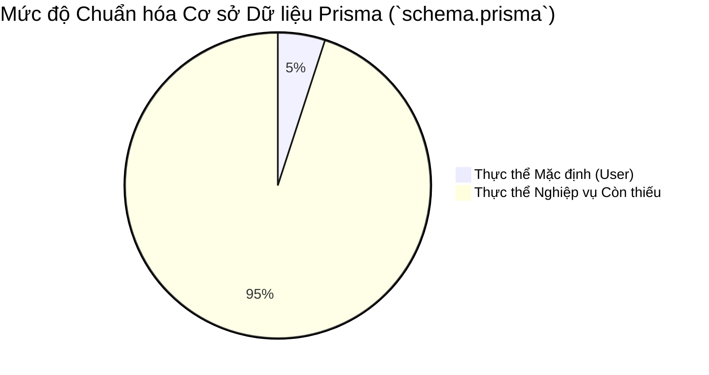

# 🗄️ BÁO CÁO MỨC ĐỘ SẴN SÀNG CƠ SỞ DỮ LIỆU (DATABASE READINESS REPORT)

**Ngày thực hiện:** 18/05/2026  
**Mục tiêu:** Kiểm kê tình trạng cấu trúc cơ sở dữ liệu hiện tại trong file `schema.prisma`, phân tích các thực thể và quan hệ còn thiếu, đánh giá mức độ sẵn sàng cho giai đoạn chuẩn hóa và ánh xạ ORM.

---

## 1. TÌNH TRẠNG CƠ SỞ DỮ LIỆU HIỆN TẠI (CURRENT DB READINESS)

* **Mức độ hoàn thiện:** **~5%**.
* **Thực trạng file `schema.prisma`:**
  * Đã cấu hình đúng `client` (`provider = "prisma-client"`) và `datasource` (`provider = "postgresql"`).
  * Chỉ chứa duy nhất 1 model `User` (`id`, `email`, `password`, `fullName`, `createdAt`).
* **Lỗ hổng nghiêm trọng:** Không có bất kỳ thực thể nghiệp vụ nào liên quan đến 15 Business Domains (Thị trường, Bộ lọc, Tín hiệu VIP, Danh mục, Gói dịch vụ, Phân quyền).

---

## 2. KHOẢNG CÁCH THỰC THỂ & QUAN HỆ (MISSING ENTITIES & RELATIONS)

### 2.1. Nhóm Core & Bảo mật Phân quyền (Auth & RBAC)
* `UserSession`: Lưu trữ token đăng nhập, quản lý phiên và thu hồi từ xa.
* `Role`, `Permission`, `RolePermission`, `UserRole`: Khung sườn thực thi kiểm soát truy cập đa lớp.

### 2.2. Nhóm Tài chính & Gói dịch vụ (Billing & Subscription)
* `SubscriptionPlan`: Các mốc tier dịch vụ (Standard, Silver, Gold, Diamond).
* `UserSubscription`: Quản lý thời hạn và chu kỳ tự động gia hạn của khách hàng.
* `Invoice`, `Transaction`: Ghi nhận dòng tiền, đối soát và xử lý webhook VietQR.

### 2.3. Nhóm Thị trường & Tín hiệu VIP (Market & Signals)
* `Sector`, `Stock`, `StockPriceDaily`: Kho dữ liệu chứng khoán lịch sử.
* `FinancialIndicator`: Bảng chấm điểm TA (Kỹ thuật) và FA (Cơ bản) định kỳ.
* `VipSignal`: Thông tin khuyến nghị MUA/BÁN, chốt lời, cắt lỗ từ chuyên gia.
* `RecommendedPortfolio`, `PortfolioItem`: Quản lý danh mục đầu tư mẫu và tính toán NAV.

### 2.4. Nhóm Tương tác Khách hàng & Nội dung (Watchlist, Alerts, CMS)
* `Watchlist`, `WatchlistItem`, `PriceAlert`: Hệ thống theo dõi và cảnh báo cá nhân.
* `Category`, `Tag`, `Blog`, `BlogTag`, `ReportFile`: Kho nội dung bài viết, báo cáo phân tích, sách cẩm nang.
* `AuditLog`, `SystemKpi`: Nhật ký kiểm toán và dữ liệu đo lường hiệu suất quản trị.

---

## 3. MỨC ĐỘ SẴN SÀNG CHUẨN HÓA (NORMALIZATION READINESS)
Dựa trên các tài liệu Giai đoạn 1, 2, 3 và danh sách thực thể liệt kê ở trên, dự án đã hội đủ 100% điều kiện lý thuyết để tiến hành chuẩn hóa dữ liệu theo nguyên tắc:

* **Chuẩn hóa 3NF:** Tách bạch tuyệt đối các thực thể, loại bỏ dư thừa dữ liệu.
* **Chính sách Trường chuẩn (Audit Fields):** Mọi bảng nghiệp vụ lõi đều phải tích hợp các trường kiểm toán tiêu chuẩn (`createdAt`, `updatedAt`) và cơ chế xóa mềm (`deletedAt`).
* **Tối ưu hóa Truy vấn (Indexing):** Thiết lập chỉ mục (Indexes) bắt buộc cho các cột truy vấn thường xuyên như `email`, `symbol`, `status`, `userId`.

---

## 4. ĐÁNH GIÁ PRISMA READINESS (PRISMA MATURITY)
* Prisma ORM phiên bản 7.8.0 hiện đã được cài đặt thành công trong dự án.
* Sơ đồ quan hệ thực thể (ERD) hoàn toàn có thể được biểu diễn chính xác qua cú pháp Type-safe của Prisma (với các định nghĩa `@relation`, khóa ngoại `@relation(fields: [userId], references: [id])`).
* Cấu trúc thư mục đã có thư mục `prisma/`, sẵn sàng cho việc tạo thư mục con `migrations/` và `seeders/` (chứa script tạo dữ liệu Role, Plan mặc định).

---

## 🎯 KẾT LUẬN & ĐỀ XUẤT HÀNH ĐỘNG
Hệ thống FinTop DATA hoàn toàn sẵn sàng bước vào bước ngoặt kỹ thuật đầu tiên: Tái cấu trúc và mở rộng toàn diện file `schema.prisma`. Việc thiết kế schema chuẩn mực tại bước này sẽ đóng vai trò quyết định sự thành bại và tính ổn định của toàn bộ nền tảng backend trong tương lai.
