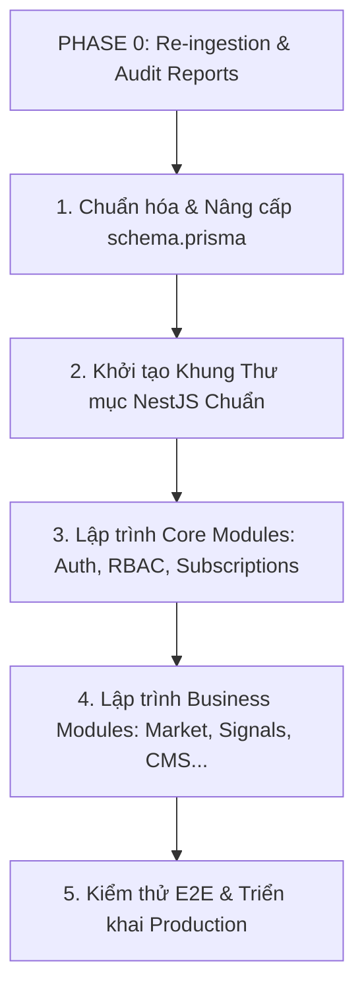

# 🚀 BÁO CÁO MỨC ĐỘ SẴN SÀNG KỸ THUẬT (ENGINEERING READINESS REPORT)

**Ngày thực hiện:** 18/05/2026  
**Mục tiêu:** Tổng hợp kết quả đánh giá từ toàn bộ quá trình tái thẩm định dự án (Re-ingestion Phase), trả lời các câu hỏi cốt lõi về mức độ sẵn sàng và đưa ra lộ trình thực thi kỹ thuật tiếp theo.

---

## 1. CÁC CÂU HỎI KIỂM ĐỊNH LÕI (ENGINEERING CHECKLIST)

### 1.1. Dự án đã sẵn sàng cho Chuẩn hóa Database chưa? (Ready for DB Normalization?)
**🟢 SẴN SÀNG (100% READY).**
* Bộ tài liệu Giai đoạn 1 (Business Capabilities), Giai đoạn 2 (Architecture & Infra) và Giai đoạn 3 (Production Behavior) đã vẽ nên bản đồ thực thể cực kỳ chi tiết. Chúng ta không còn bất kỳ sự mơ hồ nào về các trường thông tin cần thiết cho 15 Business Domains.

### 1.2. Dự án đã sẵn sàng để phát triển `schema.prisma` chưa? (Ready for schema.prisma?)
**🟢 SẴN SÀNG (100% READY).**
* File `schema.prisma` hiện đang trống trải (chỉ có bảng `User` cơ bản) và môi trường Prisma 7.8.0 đã cài đặt ổn định. Việc chuyển đổi các thực thể đã phân tích vào Prisma Schema có thể tiến hành ngay lập tức mà không gặp bất kỳ cản trở nào về hạ tầng.

### 1.3. Dự án đã sẵn sàng để lập trình các Module Backend chưa? (Ready for Backend Coding?)
**⚠️ CHƯA SẴN SÀNG (NOT READY YET - PENDING SCHEMA & ARCHITECTURE SCAFFOLDING).**
* Lý do: Chúng ta không thể viết Controller và Service khi chưa định nghĩa các Model trong Prisma, cũng như chưa thiết lập khung sườn thư mục chuẩn NestJS (`src/common`, `src/modules`, `src/infra`) kèm theo các Guard bảo vệ cốt lõi (`JwtAuthGuard`, `PermissionsGuard`, `SubscriptionTierGuard`).

---

## 2. TỔNG HỢP NĂNG LỰC DỊCH NGƯỢC (REVERSE ENGINEERING SUMMARY)
Qua 5 bản báo cáo thẩm định chuyên sâu, toàn bộ mô hình tư duy (mental model) về hệ thống FinTop DATA đã được định hình rõ ràng:
* **Mục tiêu sản phẩm:** Phục vụ hàng chục nghìn nhà đầu tư tra cứu chứng khoán TA/FA và nhận khuyến nghị VIP với độ tin cậy tuyệt đối.
* **Mô hình bảo mật:** Xây dựng ma trận phân quyền RBAC kết hợp kiểm soát mốc Tier hội viên (Subscription Gating) chặt chẽ tại cả Frontend và Backend.
* **Mô hình hiệu năng:** Sử dụng Redis Cluster làm bộ nhớ đệm cho dữ liệu nặng và hệ thống Hàng đợi (Queue) cho thông báo bất đồng bộ.

---

## 3. LỘ TRÌNH THỰC THI ĐỀ XUẤT (RECOMMENDED NEXT ENGINEERING STEPS)

### Bước 1: Chuẩn hóa Toàn diện `schema.prisma` (Immediate Action)
* Viết mới toàn bộ các thực thể thuộc 15 Domains vào file `prisma/schema.prisma`.
* Bổ sung đầy đủ quan hệ (Relations), khóa ngoại (Foreign Keys), các trường kiểm toán (`createdAt`, `updatedAt`, `deletedAt`) và chỉ mục tối ưu hóa (`@@index`).
* Tạo script Seeder tự động nạp danh sách 8 Role quản trị và 4 Tier hội viên mặc định vào DB.

### Bước 2: Thiết lập Khung Kiến trúc NestJS (Architecture Scaffolding)
* Khởi tạo cấu trúc thư mục Clean Architecture (`src/common`, `src/modules`, `src/infra`).
* Viết các Middleware, Filter và Guard cốt lõi (`JwtAuthGuard`, `RolesGuard`, `PermissionsGuard`, `SubscriptionTierGuard`).

### Bước 3: Phát triển tuần tự các Module (Modular Implementation)
* Triển khai từ các module nền tảng (`Auth`, `RBAC`, `Subscription`) đến các module nghiệp vụ thực chiến (`Market`, `Screener`, `Signals`, `CMS`).

---

## 🎯 KẾT LUẬN CHUNG
Giai đoạn 0 (Re-ingestion Phase) đã hoàn thành xuất sắc sứ mệnh tái thẩm định toàn bộ bối cảnh dự án. Chúng ta đã có trong tay cái nhìn thấu suốt về kiến trúc và một kế hoạch hành động vô cùng tường minh. Đội ngũ kỹ thuật hoàn toàn tự tin và sẵn sàng bước vào bước ngoặt kỹ thuật đầu tiên: **Chuẩn hóa Cơ sở dữ liệu trên Prisma Schema**.
