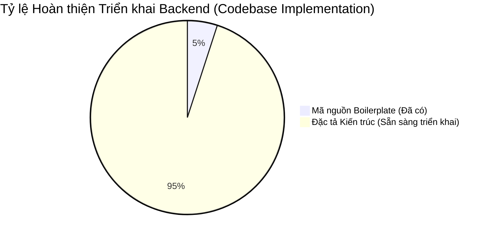

# 📊 BÁO CÁO TỔNG QUAN ĐÁNH GIÁ DỰ ÁN FINTOP DATA (PROJECT REVIEW REPORT)

**Ngày thực hiện:** 18/05/2026  
**Mục tiêu:** Đánh giá mức độ trưởng thành kiến trúc, tính toàn vẹn của mã nguồn hiện tại, xác định các khoản nợ kỹ thuật (technical debt) và phân tích rủi ro hệ thống trước khi bước vào giai đoạn chuẩn hóa cơ sở dữ liệu.

---

## 1. TRẠNG THÁI DỰ ÁN HIỆN TẠI (CURRENT PROJECT STATUS)
Hệ thống FinTop DATA hiện tại đang tồn tại sự chênh lệch lớn giữa **Đặc tả yêu cầu nghiệp vụ (Business Specifications - Phase 1, 2, 3)** và **Thực trạng triển khai mã nguồn (Current Codebase)**:
* **Tài liệu Đặc tả:** Hoàn chỉnh ở mức độ cao (Production-Grade). Đã định nghĩa tường minh 15 Business Domains, 19 System Domains, ma trận 8 Role quản trị, 4 Tier khách hàng và 10 luồng nghiệp vụ lõi.
* **Mã nguồn Backend (`fintop-backend`):** Đang ở trạng thái khởi tạo sơ khai (Boilerplate). Thư mục `src/` chỉ chứa duy nhất `app.module.ts`, `app.controller.ts`, `app.service.ts` và `main.ts`.
* **Cơ sở dữ liệu (`schema.prisma`):** Sơ sài và thiếu hoàn toàn các thực thể nghiệp vụ. Bảng `User` chỉ chứa các trường cơ bản (`id`, `email`, `password`, `fullName`, `createdAt`).

---

## 2. MỨC ĐỘ HOÀN THIỆN TRIỂN KHAI (IMPLEMENTATION COMPLETENESS)

* **Mức độ hoàn thiện:** **~5%** trên tổng thể kiến trúc mục tiêu.
* **Hạ tầng cơ bản:** Đã cài đặt các thư viện cần thiết trong `package.json` (`@nestjs/common`, `@nestjs/core`, `@prisma/client`, `prisma`).
* **Các Module Nghiệp vụ:** Chưa khởi tạo bất kỳ module nghiệp vụ độc lập nào (`AuthModule`, `UserModule`, `RbacModule`, `SubscriptionModule`, `MarketModule`...).

---

## 3. MỨC ĐỘ TRƯỞNG THÀNH KIẾN TRÚC (ARCHITECTURE MATURITY)
* **Mô hình mục tiêu:** NestJS Modular Monolith / Clean Architecture kết hợp Event-Driven (BullMQ / Redis PubSub).
* **Thực tế hiện tại:** Chưa định hình cấu trúc thư mục phân tầng (`common/`, `modules/`, `infra/`). Toàn bộ logic ứng dụng đang dồn vào `app.module.ts`.
* **Thiếu vắng ranh giới Module (Missing Boundaries):** Chưa có cơ chế bảo vệ Guard, Interceptor, Exception Filter hay Custom Decorators.

---

## 4. ĐIỂM MẠNH & ĐIỂM YẾU (STRENGTHS & WEAKNESSES)

### 4.1. Điểm mạnh (Current Strengths)
* **Nền tảng Đặc tả Hoàn hảo:** Bộ tài liệu Phase 1, 2, 3 và AI Workflow là kim chỉ nam tuyệt vời, bảo đảm không xảy ra hiện tượng trôi dạt kiến trúc (architectural drift) khi lập trình.
* **Lựa chọn Stack công nghệ Chuẩn xác:** NestJS (TypeScript chuẩn mực), Prisma ORM (Type-safe), PostgreSQL và Redis/BullMQ là bộ khung lý tưởng cho hệ thống Fintech yêu cầu hiệu năng và độ ổn định cao.

### 4.2. Điểm yếu (Current Weaknesses)
* **Chưa ánh xạ Database:** Toàn bộ ma trận RBAC, Subscription và Dữ liệu thị trường chưa được mô hình hóa trong `schema.prisma`.
* **Zero Security Enforcement:** Chưa có bất kỳ cơ chế Guard (`JwtAuthGuard`, `RolesGuard`, `PermissionsGuard`, `ThrottlerGuard`) nào được cài đặt trong mã nguồn.

---

## 5. NỢ KỸ THUẬT (TECHNICAL DEBT)
* **Nợ mô hình dữ liệu:** Bảng `User` hiện tại không có các trường thiết yếu của một ứng dụng Fintech (`phone`, `status`, `brokerId`, `riskTaste`, `updatedAt`, `deletedAt`).
* **Nợ cấu hình bảo mật:** File `.env` và `main.ts` chưa được cấu hình CORS, Rate Limiter và các biến môi trường cho Redis, SMTP, JWT Secrets.

---

## 6. PHÂN TÍCH RỦI RO HỆ THỐNG (RISK ANALYSIS)

### 6.1. Rủi ro Kiến trúc (Architectural Risks)
Nếu tiếp tục phát triển trực tiếp trên cấu trúc `app.module.ts` đơn lẻ, mã nguồn sẽ nhanh chóng biến thành "Spaghetti Monolith", gây nghẽn cổ chai khi nhiều kỹ sư cùng tham gia phát triển.

### 6.2. Rủi ro Mở rộng (Scalability Risks)
Việc thiếu vắng lớp Caching (Redis) và Hàng đợi (Queue) sẽ khiến Database PostgreSQL quá tải ngay khi lượng truy cập bảng giá và tra cứu bộ lọc tăng vọt trong phiên giao dịch.

### 6.3. Rủi ro Bảo mật (Security Risks)
* Thiếu cơ chế kiểm soát phân quyền tại tầng Backend (RBAC Guards), dẫn đến nguy cơ leo thang đặc quyền (Privilege Escalation).
* Nguy cơ rò rỉ dữ liệu VIP (Tín hiệu, Báo cáo chuyên sâu) nếu các endpoint không được bảo vệ bằng `SubscriptionTierGuard`.

---

## 🎯 KẾT LUẬN & ĐỊNH HƯỚNG
Dự án FinTop DATA sở hữu bộ đặc tả thiết kế xuất sắc nhưng mã nguồn backend thực tế đang ở mốc xuất phát 0. Việc cấp bách trước mắt là tiến hành **Chuẩn hóa Cơ sở dữ liệu (Database Normalization)** trên file `schema.prisma` và khởi tạo cấu trúc thư mục NestJS chuẩn mực theo đúng quy tắc định ra trong `AI_RULES.md`.
