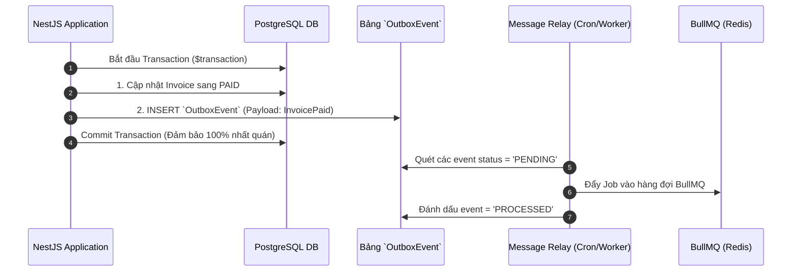

# 🔄 CHIẾN LƯỢC TÍNH NHẤT QUÁN SỰ KIÊN (EVENT CONSISTENCY STRATEGY)

**Ngày thực hiện:** 18/05/2026  
**Mục tiêu:** Thẩm định cơ chế đồng bộ sự kiện bất đồng bộ giữa Redis Pub/Sub, BullMQ và PostgreSQL; thiết lập mô hình Outbox Pattern và cơ chế chống xử lý đúp (Idempotency) bảo đảm an toàn dòng tiền cho nền tảng FinTop DATA.

---

## 1. PHÂN TÍCH RỦI RO ĐỒNG BỘ SỰ KIÊN (EVENT SYNCHRONIZATION RISKS)

```mermaid
graph TD
    subgraph Điểm Nghẽn & Rủi Ro Bất Nhất (Race Conditions)
        Req[Webhook NH báo tiền về] --> Dual1[Worker 1 xử lý]
        Req --> Dual2[Worker 2 xử lý đúp]
        Dual1 --> Sub1[Gia hạn gói + 1 năm]
        Dual2 --> Sub2[Gia hạn thành + 2 năm (Lỗi)]
    end

    subgraph Luồng Chuẩn (Idempotency Guarded)
        Req2[Webhook NH] --> Lock{Khóa Idempotency Redis}
        Lock -->|Đã có Key| Abort[Bỏ qua request đúp]
        Lock -->|Key mới| Process[Thực thi duy nhất 1 lần]
    end
```

### 1.1. Các luồng sự kiện nhạy cảm
* Webhook thanh toán VietQR từ ngân hàng.
* Tín hiệu V.I.P phát sóng tức thì qua WebSocket và Zalo/SMS.
* Tiến trình Cron tự động cắt gói khi hết hạn lúc 00:01.

---

## 2. KIẾN TRÚC OUTBOX PATTERN & IDEMPOTENCY

Để loại bỏ hoàn toàn nguy cơ mất đồng bộ giữa thao tác ghi DB và thao tác bắn event, hệ thống áp dụng **Transactional Outbox Pattern**:



### 2.1. Idempotency Lock trên Redis
Với mỗi mã giao dịch ngân hàng (`transactionRef`), hệ thống thực thi `redis.set(key, 'LOCKED', 'NX', 'EX', 86400)`. Nếu Redis trả về `null` (key đã tồn tại), API lập tức trả về HTTP 200 (Bỏ qua xử lý đúp), ngăn chặn triệt để rủi ro cộng dồn hạn sử dụng gói.

---

## 3. CHIẾN LƯỢC TỰ ĐỘNG THỬ LẠI & DEAD LETTER QUEUE (DLQ)
* **Quy tắc thử lại (Retry Policy):** Với các Job gọi API đối tác (Zalo ZNS / SendGrid / Firebase) thất bại do lỗi mạng, BullMQ được cấu hình tự động thử lại 3 lần với cơ chế Exponential Backoff (1s, 3s, 9s).
* **DLQ:** Nếu thất bại quá 3 lần, Job chuyển sang rổ Dead Letter Queue, bắn cảnh báo khẩn cấp lên kênh Telegram/Slack của đội ngũ DevOps để can thiệp thủ công.

---

## 4. MA TRẬN RỦI RO ĐỒNG BỘ VÀ MỨC ĐỘ TỰ TIN (EVIDENCE & PRIORITY)

| STT | Khía Cạnh Nhất Quán | Rủi Ro & Lý Do Đánh Giá (Risk & Reasoning) | Mức Độ Tự Tin | Mức Ưu Tiên |
| :---: | :--- | :--- | :---: | :---: |
| 1 | Bắn Event Trực Tiếp | Nếu bắn thông báo trước khi Commit DB, rủi ro DB lỗi rollback nhưng khách vẫn nhận được thông báo thành công. | `HIGH` | `P0` |
| 2 | Chống Trùng Lập NH | Ngân hàng có thể bắn Webhook IPN 2-3 lần cho cùng 1 giao dịch. Cần Idempotency Lock tuyệt đối. | `HIGH` | `P0` |
| 3 | Mất Gói Tin Socket | Redis Pub/Sub không lưu trữ tin nhắn. Cần lưu tín hiệu vào DB trước khi publish để client vào sau vẫn xem được. | `HIGH` | `P1` |

Chiến lược nhất quán sự kiện đã được thiết lập vô cùng chặt chẽ, bảo đảm an toàn dữ liệu và tài chính tuyệt đối cho hệ thống.
