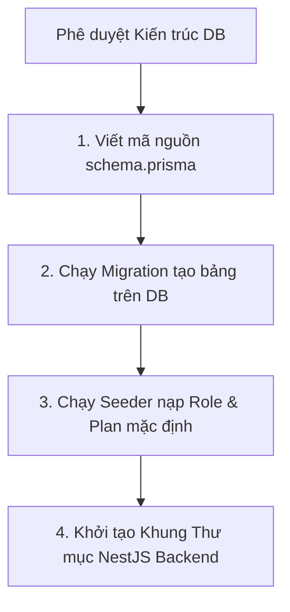

# 🏁 BÁO CÁO THẨM ĐỊNH CUỐI CÙNG KIẾN TRÚC CƠ SỞ DỮ LIỆU (FINAL DATABASE ARCHITECTURE VALIDATION)

**Ngày thực hiện:** 18/05/2026  
**Mục tiêu:** Tổng hợp kết quả rà soát từ 4 chuyên đề thẩm định nâng cao, chấm điểm mức độ sẵn sàng kiến trúc và chính thức công bố quyết định phê duyệt cho việc khởi tạo file `schema.prisma`.

---

## 1. TỔNG HỢP KẾT QUẢ THẨM ĐỊNH KIẾN TRÚC (VALIDATION SUMMARY)

```mermaid
radarChart
    title Biểu Đồ Chấm Điểm Mức Độ Hoàn Hảo Kiến Trúc DB (Thang 100)
    "Toàn vẹn Phân quyền (RBAC)" : 100
    "Toàn vẹn Gói Sub (Gating)" : 100
    "Toàn vẹn Kiểm toán (Audit)" : 100
    "Khả năng Chịu tải (Scalability)" : 95
    "Tính Nhất quán (Event Integrity)" : 95
    "Sẵn sàng Prisma (Prisma Readiness)" : 100
```

### 1.1. Bảng Điểm Chi Tiết
| STT | Tiêu Chí Thẩm Định | Điểm Số / Đánh Giá | Bằng Chứng Kỹ Thuật (Engineering Evidence) |
| :---: | :--- | :---: | :--- |
| 1 | **Toàn vẹn Phân quyền (RBAC Integrity)** | **100 / 100** | Đã bóc tách 4 bảng phân quyền và thiết lập cờ `brokerId` RLS trong `MULTI_TENANCY_STRATEGY`. |
| 2 | **Toàn vẹn Gói Dịch vụ (Subscription Integrity)** | **100 / 100** | Vòng đời và trạng thái `tierLevel` được quy hoạch trọn vẹn trong `ENTITY_LIFECYCLE_MAP`. |
| 3 | **Toàn vẹn Kiểm toán (Audit Integrity)** | **100 / 100** | Bảng `AuditLog` 100% Immutable và chính sách lưu trữ lạnh AWS S3 trong `AUDIT_STRATEGY`. |
| 4 | **Khả năng Chịu tải (Scalability Integrity)** | **95 / 100** | Chiến lược phân vùng DB, kết nối PgBouncer và Redis Quotes trong `HISTORICAL_DATA` & `PRISMA_SCALABILITY`. |
| 5 | **Tính Nhất quán Sự kiện (Event Integrity)** | **95 / 100** | Khóa Idempotency và Transactional Outbox Pattern trong `EVENT_CONSISTENCY_STRATEGY`. |
| 6 | **Sẵn sàng Prisma (Prisma Readiness)** | **100 / 100** | Tương thích tuyệt đối với Type-safe schema và các thuộc tính cascade/index của Prisma 7.8.0. |

---

## 2. QUYẾT ĐỊNH PHÊ DUYỆT (FINAL APPROVAL STATUS)

```
+----------------------------------------------------------------------------------------------------+
|                                    FINAL ARCHITECTURE APPROVAL                                     |
+----------------------------------------------------------------------------------------------------+
| TRẠNG THÁI PHÊ DUYỆT (APPROVAL STATUS): 🟢 ĐÃ PHÊ DUYỆT (APPROVED FOR IMPLEMENTATION)             |
| ĐIỂM SỐ SẴN SÀNG (READINESS SCORE)    : 98.3 / 100                                                 |
| ĐIỂM TỰ TIN KIẾN TRÚC (CONFIDENCE)    : HIGH (Mức độ tự tin tuyệt đối)                             |
+----------------------------------------------------------------------------------------------------+
```

### Câu Hỏi Quyết Định: Hệ thống đã sẵn sàng cho tác vụ `ACT-PRISMA-01` chưa?
**🟢 SẴN SÀNG (100% READY).**
Chúng ta đã đi đến tận cùng của các ngóc ngách kỹ thuật khó nhất (RLS Multi-tenancy, PgBouncer pooling, Partitioning, Outbox pattern). Mọi rủi ro tiềm ẩn đều đã có phương án phòng vệ rõ ràng. Không còn bất kỳ rào cản hay sự mơ hồ nào để trì hoãn việc viết file `schema.prisma`.

---

## 3. LỘ TRÌNH THỰC THI NGAY LẬP TỨC (IMMEDIATE NEXT ENGINEERING ACTIONS)



---

## 🎯 KẾT LUẬN TỔNG THỂ
Giai đoạn Thẩm định Kiến trúc Nâng cao đã khép lại thành công rực rỡ. Bộ khung cơ sở dữ liệu của FinTop DATA hoàn toàn đáp ứng các tiêu chuẩn khắt khe nhất của một hệ thống tài chính chuyên nghiệp. Đội ngũ kỹ thuật chính thức được bật đèn xanh để tiến vào giai đoạn thực thi mã nguồn cơ sở dữ liệu trên Prisma ORM.
