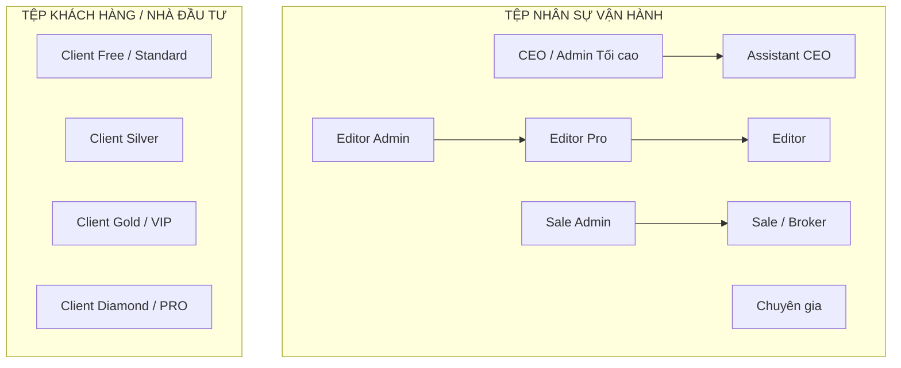
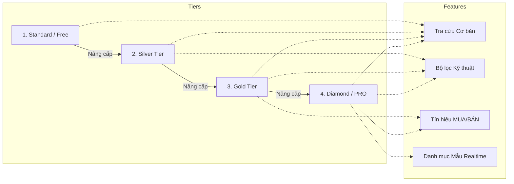
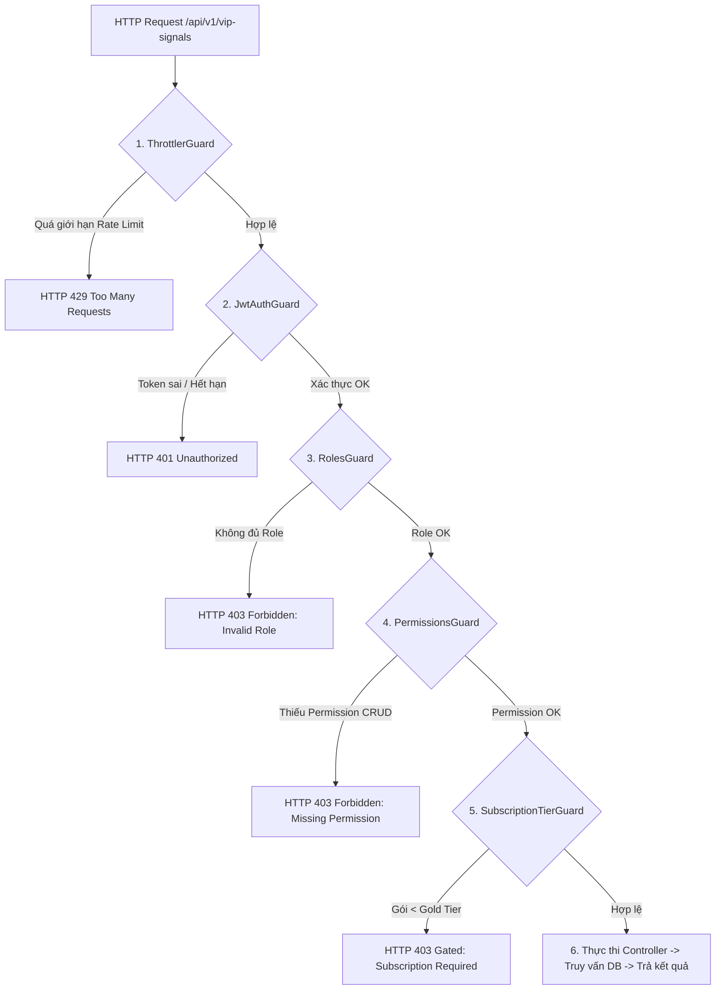
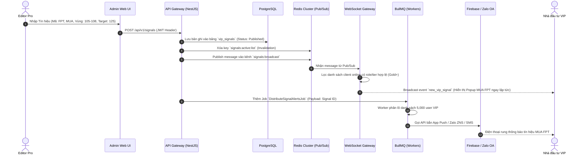
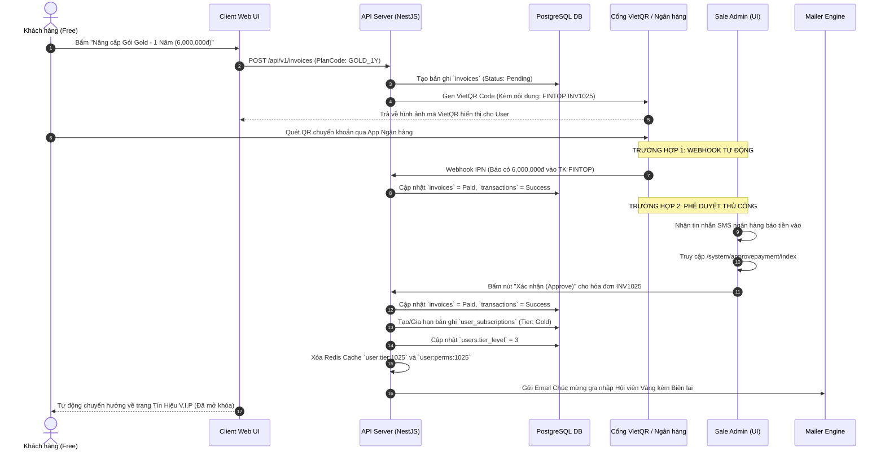
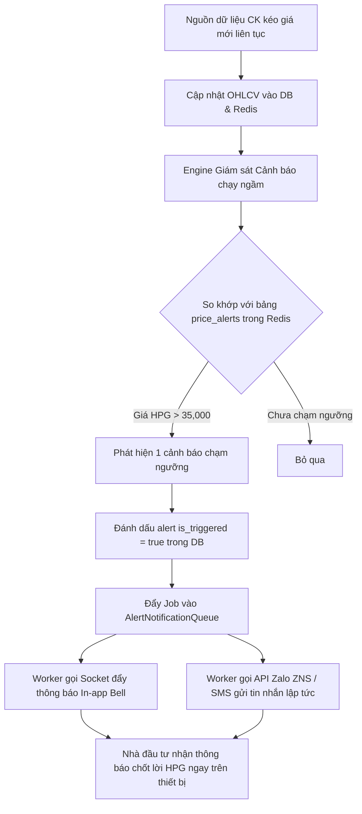
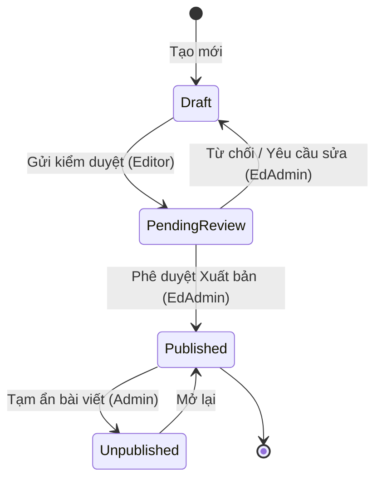

# ⚙️ FINTOP DATA — ĐẶC TẢ KIỂM SOÁT TRUY CẬP VÀ LOGIC VẬN HÀNH THỰC TẾ (PRODUCTION BEHAVIOR & ACCESS CONTROL SPECIFICATION)

**Phiên bản:** 3.0 (Production Reverse Engineering Spec)  
**Tác giả:** FinTop System Architecture Team  
**Mục tiêu:** Reverse engineer toàn bộ logic vận hành thực tế của hệ thống FinTop DATA trên production, bao gồm ma trận Vai trò (Role Matrix), cơ chế phân quyền RBAC, logic khóa/mở tính năng theo gói hội viên (Subscription Gating), các hành vi ngầm (Hidden System Behaviors) và đặc tả chi tiết 10 luồng nghiệp vụ thực chiến (Production Workflows).

---

## 📑 MỤC LỤC
1. [Ma Trận Phân Quyền & Vai Trò Toàn Diện (Role & Access Matrix)](#1-ma-trận-phân-quyền--vai-trò-toàn-diện-role--access-matrix)
2. [Hệ Thống Phân Cấp & Khóa Tính Năng (Subscription & Feature Gating)](#2-hệ-thống-phân-cấp--khóa-tính-năng-subscription--feature-gating)
3. [Logic Hiển Thị Menu & Render Động (Menu Visibility & Conditional Rendering)](#3-logic-hiển-thị-menu--render-động-menu-visibility--conditional-rendering)
4. [Kiến Trúc Kiểm Soát Truy Cập Backend (Backend Access Control Logic)](#4-kiến-trúc-kiểm-soát-truy-cập-backend-backend-access-control-logic)
5. [Hệ Thống Hành Vi Ngầm & Tự Động (Hidden System Behaviors)](#5-hệ-thống-hành-vi-ngầm--tự-động-hidden-system-behaviors)
6. [Đặc Tả 10 Luồng Nghiệp Vụ Thực Chiến (Production Workflows)](#6-đặc-tả-10-luồng-nghiệp-vụ-thực-chiến-production-workflows)

---

## 1. MA TRẬN PHÂN QUYỀN & VAI TRÒ TOÀN DIÊN (ROLE & ACCESS MATRIX)

Hệ thống phân quyền của FinTop DATA quản lý đồng thời hai tệp tài khoản: **Nhân sự quản trị (Admin Portal)** và **Khách hàng nhà đầu tư (Client Portal)**.



### 1.1. Bảng Tổng Hợp Hành Vi Theo Vai Trò (Full Role Matrix)
| Vai trò (Role) | Cổng truy cập | Thấy Menu / Module | Module bị Khóa / Ẩn | Quyền CRUD Đặc thù | Giới hạn & Ràng buộc Dữ liệu |
| :--- | :--- | :--- | :--- | :--- | :--- |
| **CEO** | Admin + Client | Toàn bộ 100% menu hệ thống. | Không bị khóa. | Toàn quyền CRUD mọi module. | Xem toàn bộ báo cáo doanh thu, 100% dữ liệu KH và nhân sự. |
| **Assistant CEO** | Admin | Các menu Admin (Nhân sự, Khách hàng, Bài viết, Tín hiệu, Thanh toán). | Cấu hình hệ thống cấp thấp (Redis, Cron, API Keys). | CRUD nhân sự (trừ CEO), KH, bài viết, tín hiệu. | Không được xóa hóa đơn thành công, không sửa Role CEO. |
| **Editor Admin**| Admin | Quản trị Bài viết, Danh mục, Cẩm nang, Dữ liệu CK. | Quản trị Nhân sự, Khách hàng, Phê duyệt thanh toán, Doanh thu. | CRUD và Phê duyệt (Publish) bài viết của Editor/Editor Pro. | Toàn quyền xem và duyệt kho bài viết, báo cáo phân tích. |
| **Editor Pro** | Admin | Quản trị Bài viết, Tín hiệu VIP, Danh mục VIP, Dữ liệu CK. | Quản trị Nhân sự, Khách hàng, Phê duyệt thanh toán, Doanh thu. | Tạo Tín hiệu VIP, Cập nhật danh mục VIP, Tạo bài viết VIP. | Không được xóa bài viết đã xuất bản (chỉ unpublish). |
| **Editor** | Admin | Quản trị Bài viết. | Tín hiệu VIP, Danh mục VIP, Nhân sự, Khách hàng, Thanh toán. | Tạo bài viết Basic, sửa bài viết của chính mình. | Bài viết mới tạo ở trạng thái `Pending Review` (chờ duyệt). |
| **Sale Admin** | Admin | Quản trị Khách hàng, Phê duyệt thanh toán, KPI Doanh thu. | Quản trị Nhân sự, Quản trị Bài viết, Khuyến nghị VIP. | CRUD Khách hàng, Gán Broker phụ trách, Duyệt thanh toán. | Không được xóa vĩnh viễn khách hàng khỏi DB. |
| **Sale (Broker)**| Admin | Quản trị Khách hàng (Chỉ tệp KH được gán), Yêu cầu thanh toán. | Các module Nhân sự, Bài viết, Tín hiệu VIP, Doanh thu tổng. | Tạo Khách hàng mới, Ghi chú lịch sử chăm sóc KH của mình. | **Row-Level Security:** Chỉ xem được tệp KH do mình phụ trách. |
| **Chuyên gia** | Admin + Client| Giao diện tạo Tín hiệu VIP và Bài viết thuộc chuyên mục riêng. | Nhân sự, Khách hàng, Phê duyệt thanh toán, Doanh thu. | Tạo tín hiệu và cập nhật danh mục mẫu của riêng chuyên gia. | Không xem/sửa được danh mục của chuyên gia khác. |
| **Client VIP** | Client | Toàn bộ 100% menu Client (Bảng giá, Tín hiệu VIP, Danh mục VIP, Báo cáo). | Toàn bộ Admin Portal (`/system/*`). | CRUD Watchlist cá nhân, Đặt cảnh báo giá/tín hiệu. | Truy cập toàn bộ dữ liệu thị trường và khuyến nghị. |
| **Client Free**| Client | Trang chủ, Giới thiệu, Tra cứu cơ bản, Báo cáo Free. | Tín hiệu VIP, Danh mục VIP, Báo cáo VIP, Bộ lọc nâng cao. | Cập nhật hồ sơ cá nhân, Gửi form yêu cầu nâng cấp gói. | **Gated:** Các menu VIP hiển thị icon Ổ khóa kèm popup nâng cấp. |

---

### 1.2. Ma Trận CRUD Chi Tiết (Full CRUD Matrix)
*(Quy ước: **C** = Create, **R** = Read, **U** = Update, **D** = Delete, **P** = Publish/Approve, **-** = No Access)*

```
+-------------------+-----+--------+---------+-------+-------+------+
|    MODULE/TABLE   | CEO | AssCEO | EdAdmin | EdPro | SaleA | Sale |
+-------------------+-----+--------+---------+-------+-------+------+
| Users (Nhân sự)   | CRUD| CRU    | -       | -     | -     | -    |
| Clients (KH)      | CRUD| CRU    | -       | -     | CRU   | CRU* |
| Blogs (Bài viết)  | CRUDP CRUDP  | CRUDP   | CRU   | -     | -    |
| VIP Signals       | CRUDP CRUDP  | R       | CRUDP | -     | -    |
| VIP Portfolios    | CRUDP CRUDP  | R       | CRUDP | -     | -    |
| Invoices/Payment  | CRUDP CRUP   | -       | -     | CRUP  | CR*  |
| Stock Data/Screener CRUD| CRUD   | CRUD    | CRU   | R     | R    |
| System Settings   | CRUD| R      | -       | -     | -     | -    |
+-------------------+-----+--------+---------+-------+-------+------+
* Ghi chú: Sale chỉ có quyền CRUD trên dữ liệu Khách hàng do chính Broker đó quản lý.
```

---

## 2. HỆ THỐNG PHÂN CẤP & KHÓA TÍNH NĂNG (SUBSCRIPTION & FEATURE GATING)

Hệ thống sử dụng mô hình Tiered-Subscription (Phân tầng dịch vụ) để giới hạn khả năng tiếp cận thông tin chứng khoán chuyên sâu và khuyến nghị đầu tư.



### 2.1. Ma Trận Gói Dịch Vụ & Quyền Truy Cập (Full Subscription Access Matrix)
| Tính năng & Dữ liệu (Features / Data) | Standard (Free) | Silver (Bạc) | Gold (Vàng) | Diamond (PRO) | Chuyên gia / Admin |
| :--- | :---: | :---: | :---: | :---: | :---: |
| **Tra cứu chứng khoán cơ bản (TA/FA)** | 🟢 Có | 🟢 Có | 🟢 Có | 🟢 Có | 🟢 Có |
| **Biểu đồ giá FireAnt (Nến ngày/phút)**| 🟢 Có | 🟢 Có | 🟢 Có | 🟢 Có | 🟢 Có |
| **Báo cáo phân tích Thị trường (Free)**| 🟢 Có | 🟢 Có | 🟢 Có | 🟢 Có | 🟢 Có |
| **Hướng dẫn đầu tư A-Z & Tin tức** | 🟢 Có | 🟢 Có | 🟢 Có | 🟢 Có | 🟢 Có |
| **Bộ lọc chứng khoán Kỹ thuật (Screener)**| 🔒 Khóa | 🟢 Có | 🟢 Có | 🟢 Có | 🟢 Có |
| **Lưu bộ lọc cá nhân (Saved Screeners)**| 🔒 Khóa | 🟢 Có | 🟢 Có | 🟢 Có | 🟢 Có |
| **Báo cáo Phân tích Ngành & DN (VIP)** | 🔒 Khóa | 🔒 Khóa | 🟢 Có | 🟢 Có | 🟢 Có |
| **Tín Hiệu V.I.P MUA/BÁN (`/recommendationsIndex`)**| 🔒 Khóa | 🔒 Khóa | 🟢 Có | 🟢 Có | 🟢 Có |
| **Danh Mục Mẫu V.I.P Realtime (`/categoryFintopIndex`)**| 🔒 Khóa | 🔒 Khóa | 🔒 Khóa | 🟢 Có | 🟢 Có |
| **Cảnh báo tín hiệu qua Zalo/SMS (Realtime Push)**| 🔒 Khóa | 🔒 Khóa | 🔒 Khóa | 🟢 Có | 🟢 Có |
| **Kho sách cẩm nang VIP (Tải file PDF full)** | 🔒 Khóa | 🔒 Khóa | 🔒 Khóa | 🟢 Có | 🟢 Có |

### 2.2. Logic Chuyển Hướng & Khóa Màn Hình (Redirect & Paywall Guard Logic)
Khi một người dùng ở cấp bậc **Standard (Free)** cố gắng truy cập vào đường dẫn độc quyền (ví dụ `/recommendationsIndex`):
1. **Frontend Interceptor:** Trình duyệt phát hiện route thay đổi, so khớp thuộc tính `route.meta.requiredTier = 3` (Gold).
2. **So khớp State:** Hệ thống kiểm tra trong Redux/Vuex store `user.subscription.tier_level` (Hiện tại bằng 1).
3. **Chặn Render (Paywall Rendering):** Thay vì render component chứa danh sách khuyến nghị, frontend render component `PaywallModalComponent`.
4. **Nội dung Paywall:** Hiển thị banner Premium: *"Đặc quyền Khuyến nghị V.I.P chỉ dành cho Hội viên Vàng và Kim Cương. Hãy nâng cấp ngay để đón đầu sóng tăng trưởng!"*
5. **CTA Redirect:** Nút bấm trên banner chuyển hướng người dùng đến trang `/client/privileges/index` kèm query string `?redirect_to=/recommendationsIndex` để tự động trả về trang tín hiệu sau khi thanh toán thành công.

---

## 3. LOGIC HIỂN THỊ MENU & RENDER ĐỘNG (CONDITIONAL RENDERING)

### 3.1. Cấu Trúc JWT Payload Chuẩn (Claims Structure)
Để frontend render DOM chính xác mà không cần gọi API liên tục, chuỗi JWT được thiết kế với đầy đủ thông tin định danh và ma trận quyền:

```json
{
  "sub": 1025,
  "email": "tuannv7105@gmail.com",
  "fullName": "Nguyễn Văn Tuấn",
  "brokerId": "BF14",
  "roles": ["CLIENT", "CLIENT_VIP"],
  "tier": "DIAMOND",
  "tierLevel": 4,
  "permissions": [
    "read:vip_signals",
    "read:vip_portfolio",
    "create:watchlist",
    "download:reports"
  ],
  "iat": 1779020000,
  "exp": 1780000000
}
```

### 3.2. Logic Render Thanh Menu Bên (Admin Sidebar Rendering Guard)
Trong mã nguồn giao diện quản trị (Vue/React), việc hiển thị từng thẻ DOM menu được bọc qua directive kiểm tra quyền:

```html
<!-- Giao diện Admin Sidebar Navigation -->
<ul class="sidebar-menu">
  <!-- Trang chủ Admin: Mọi Admin/Staff đều thấy -->
  <li class="menu-item"><a href="/system/home/index">Trang Chủ</a></li>

  <!-- Phê duyệt thanh toán: Chỉ Sale Admin và CEO thấy -->
  <li class="menu-item" v-if="hasPermission('approve:payment')">
    <a href="/system/approvepayment/index">Phê duyệt thanh toán</a>
  </li>

  <!-- Quản trị Bài viết: Editor và CEO thấy -->
  <li class="menu-item" v-if="hasPermission('read:blog')">
    <a href="/system/blog/index">Quản trị Bài viết</a>
  </li>

  <!-- Quản trị Nhân sự: Chỉ CEO và AssCEO thấy -->
  <li class="menu-item" v-if="hasRole(['CEO', 'ASSISTANT_CEO'])">
    <a href="/system/user/index">Quản trị Nhân sự</a>
  </li>
</ul>
```

### 3.3. Dashboard Widgets Rendering (Render Dashboard Động theo Role)
Khi Admin truy cập vào `/system/home/index`, bố cục màn hình được điều chỉnh linh hoạt:
- **CEO & Sale Admin:** Thấy biểu đồ doanh thu theo ngày/tháng, thẻ tổng số tiền chờ duyệt, tổng số khách hàng đăng ký mới.
- **Editor Admin & Editor Pro:** Thấy bảng xếp hạng các bài viết có traffic cao nhất, thống kê số lượng tín hiệu VIP MUA/BÁN đang active.
- **Sale (Broker):** Thấy widget "Khách hàng của tôi" (Danh sách KH sắp hết hạn cần gọi chăm sóc, thống kê hoa hồng dự kiến).

---

## 4. KIẾN TRÚC KIỂM SOÁT TRUY CẬP BACKEND (BACKEND ACCESS CONTROL LOGIC)

Tại tầng Backend NestJS, để ngăn chặn tuyệt đối các thao tác gọi trực tiếp API bằng Postman/cURL trái phép, một chuỗi vòng bảo vệ 5 lớp (5-Layer Defense Architecture) được triển khai:



### 4.1. Luồng Xác thực & Phân quyền trên Redis Cache (Permission Cache Flow)
1. **Login Event:** Khi user đăng nhập thành công, ngoài việc gen JWT, hệ thống chèn 2 bản ghi vào Redis Cluster:
   - `Key:` `user:perms:1025` -> `Value:` `["read:vip", "download:pdf"]` (TTL 7 ngày).
   - `Key:` `user:tier:1025` -> `Value:` `4` (Diamond) (TTL 7 ngày).
2. **Middleware Interceptor:** Mỗi request gọi vào API, `PermissionsGuard` và `SubscriptionTierGuard` truy vấn trực tiếp trên bộ nhớ đệm Redis (độ trễ < 2ms), bỏ qua hoàn toàn việc truy vấn bảng `users` hay `role_permissions` trong PostgreSQL.
3. **Cache Invalidation:** Khi Admin bấm gia hạn gói cho KH hoặc đổi Role của nhân sự, hệ thống thực thi lệnh `redis.del('user:perms:1025')` và `redis.del('user:tier:1025')`. Request tiếp theo của user sẽ tự động nạp lại cache mới từ DB.

---

## 5. HỆ THỐNG HÀNH VI NGẦM & TỰ ĐỘNG (HIDDEN SYSTEM BEHAVIORS)

Bên cạnh các thao tác CRUD của người dùng, hệ thống duy trì sự ổn định thông qua 5 luồng xử lý ngầm tự động (Automated Background Behaviors):

```
+--------------------------------------------------------------------------------------------------+
|                                  FINTOP HIDDEN AUTOMATION FLOWS                                   |
+--------------------------------------------------------------------------------------------------+
| 1. AUTO EXPIRE SUBSCRIPTIONS                                                                     |
| • 00:01 sáng mỗi ngày: Cronjob quét bảng user_subscriptions.                                     |
| • Chuyển status các gói hết hạn sang 'Expired'. Bắn event 'SubscriptionExpiredEvent'.            |
+--------------------------------------------------------------------------------------------------+
| 2. AUTO DOWNGRADE USERS                                                                          |
| • Worker nhặt event 'SubscriptionExpiredEvent', hạ tier_level trong bảng users về 1 (Standard).  |
| • Xóa Redis cache quyền. Gửi email thông báo gói đã hết hạn cho khách hàng.                      |
+--------------------------------------------------------------------------------------------------+
| 3. SIGNAL PUBLISH PROPAGATION                                                                    |
| • Khi Editor Pro tạo tín hiệu mới, ghi DB -> Bắn vào kênh Redis Pub/Sub 'channel:signals'.       |
| • WebSocket Gateways nhận tin, broadcast lập tức tới tất cả client VIP đang mở trình duyệt.      |
+--------------------------------------------------------------------------------------------------+
| 4. AUTOMATED CACHE INVALIDATION                                                                  |
| • Khi bài viết hoặc bảng giá gói được sửa, Interceptor trong ORM lập tức xóa các key Redis cũ.   |
| • Bảo đảm dữ liệu hiển thị trên web luôn chính xác tuyệt đối mà không cần chờ hết hạn TTL.       |
+--------------------------------------------------------------------------------------------------+
| 5. REALTIME PORTFOLIO NAV CALCULATOR                                                             |
| • Khi giá thị trường biến động, hệ thống chạy ngầm tự động tính toán lại tổng tài sản (NAV).     |
| • Cập nhật tự động tỷ lệ % lời/lỗ cho toàn bộ các danh mục mẫu VIP trên web.                     |
+--------------------------------------------------------------------------------------------------+
```

---

## 6. ĐẶC TẢ 10 LUỒNG NGHIỆP VỤ THỰC CHIẾN (PRODUCTION WORKFLOWS)

---

### 6.1. VIP Signal Flow (Luồng Xuất bản & Phân phối Tín hiệu VIP Realtime)



---

### 6.2. Report Publishing Flow (Luồng Kiểm duyệt & Đăng Báo cáo Phân tích)
1. **Soạn thảo (Editor UI):** Biên tập viên cơ bản (Editor) tạo bài báo cáo ngành Thép trong trình soạn thảo CKEditor, đính kèm file PDF 30 trang và gắn nhãn `is_vip_only = true`. Bấm nút *"Gửi kiểm duyệt"*.
2. **Lưu trạng thái (Backend & DB):** API xử lý, chèn bản ghi vào bảng `blogs` với trạng thái `status = 'Pending Review'`. Đồng thời bắn thông báo in-app cho Editor Admin.
3. **Phê duyệt (Editor Admin UI):** Trưởng ban biên tập đăng nhập, vào `/system/blog/index`, chọn tab bài viết chờ duyệt. Xem trước bài viết và bấm *"Xuất bản (Publish)"*.
4. **Cập nhật DB & Vô hiệu hóa Cache:** Backend cập nhật `status = 'Published'`, `published_at = NOW()`. Xóa toàn bộ Redis cache liên quan đến danh sách bài viết (`blogs:list:*`).
5. **Thông báo đến User:** BullMQ worker đẩy email tóm tắt bài báo cáo Thép mới ra mắt đến toàn bộ danh sách hội viên VIP đang đăng ký nhận bản tin.

---

### 6.3. Membership Upgrade & Payment Approval Flow (Luồng Nâng cấp & Phê duyệt Thanh toán)



---

### 6.4. User Registration Flow (Luồng Đăng ký & Khởi tạo Tài khoản)
1. **Input:** Người dùng nhập Email, Mật khẩu, Họ tên và Số điện thoại tại `/register`.
2. **Backend Validation:** Controller kiểm tra định dạng email, kiểm tra trùng lặp trong bảng `users`. Nếu hợp lệ, tiến hành băm mật khẩu với thuật toán `bcrypt` (10 rounds).
3. **Insert DB:** Chèn bản ghi vào bảng `users` (Mặc định `tier_level = 1`, `status = Active`). Gán quyền Role mặc định vào bảng `user_roles` (Role: `CLIENT`).
4. **Khởi tạo Gói Free:** Tự động tạo một bản ghi trong bảng `user_subscriptions` ứng với gói `Standard (Free)` không giới hạn thời gian.
5. **Cấp Token & Cache:** Gen cặp Access/Refresh token JWT. Nạp thông tin tier và permission mặc định vào Redis cache.
6. **Chào mừng:** Đẩy tác vụ gửi email onboarding (Giới thiệu các tính năng tra cứu chứng khoán và hướng dẫn tham gia group cộng đồng Zalo) qua BullMQ worker.

---

### 6.5. Watchlist Alert Flow (Luồng Cảnh báo Biến động Danh mục Cá nhân)



---

### 6.6. Realtime Stock Data Update Flow (Luồng Cập nhật Bảng giá Thời gian thực)
1. **ETL Ingestion:** Hệ thống kéo dữ liệu từ nguồn cấp FireAnt/Sở GDCK mỗi giây.
2. **Data Diffing:** Backend bóc tách các gói tin, so sánh với giá khớp lệnh liền trước để xác định có thay đổi giá mới hay không.
3. **Redis Pub/Sub Channel:** Nếu có giá mới (ví dụ FPT khớp giá 109.5, khối lượng 10,000), hệ thống đẩy chuỗi JSON tin nhắn vào kênh Redis `quotes:VN30`.
4. **WebSocket Gateways Broadcast:** Các node WebSocket Gateway đang subscribe kênh `quotes:VN30` nhận chuỗi JSON, chuyển đổi thành gói tin nén (Gzip hoặc Protobuf) và broadcast xuống tất cả các kết nối client đang mở trang Bảng giá chứng khoán.
5. **UI Update:** Trình duyệt nhận gói tin qua WebSocket, thực thi hiệu ứng nháy màu xanh lá (nếu tăng) hoặc đỏ (nếu giảm) tại ô giá FPT trên bảng dữ liệu.

---

### 6.7. CMS Editorial Workflow (Luồng Quản trị Nội dung CMS Toàn diện)


---

### 6.8. Admin Approval & Audit Logging Flow (Luồng Thao tác Quản trị & Ghi log Kiểm toán)
1. **Admin Action:** Quản trị viên (Assistant CEO) truy cập trang quản lý nhân sự `/system/user/index`, chọn tài khoản của một Sale viên và thay đổi trạng thái từ `Active` sang `Inactive` (Khóa tài khoản).
2. **RBAC Verification:** NestJS Middleware kiểm tra chuỗi JWT, xác thực tài khoản Assistant CEO có role hợp lệ và quyền `update:user`.
3. **Database Execution:** Thực thi câu lệnh SQL cập nhật trạng thái trong bảng `users`.
4. **Audit Interceptor:** ORM Interceptor (hoặc TypeORM Subscriber) bắt sự kiện `afterUpdate`. Tự động chụp lại giá trị cũ (`old_values: { status: 'Active' }`) và giá trị mới (`new_values: { status: 'Inactive' }`).
5. **Asynchronous Log Queue:** Đẩy thông số nhật ký kiểm toán vào hàng đợi `AuditLogQueue` để không làm chậm luồng xử lý chính.
6. **Persist Log:** Worker nhặt dữ liệu từ queue, lưu vào bảng `audit_logs` (ghi rõ `user_id` của AssCEO, IP thực hiện, thời gian và bảng bị đổi).

---

### 6.9. Subscription Expiration & Auto-Downgrade Flow (Luồng Xử lý Hết hạn Gói)
```mermaid
graph LR
    A[Cronjob 00:01 sáng mỗi ngày] --> B[Quét DB tìm gói VIP có end_date < NOW()]
    B --> C[Chuyển status gói sang 'Expired']
    C --> D[Bắn sự kiện 'SubscriptionExpiredEvent']
    D --> E[Worker cập nhật users.tier_level = 1 Standard]
    E --> F[Xóa key Redis user:perms:#id và user:tier:#id]
    F --> G[Gửi Email thông báo hết hạn và mời gia hạn]
```

---

### 6.10. Free Trial Activation Flow (Luồng Kích hoạt Trải nghiệm Dùng thử)
1. **Trigger:** Người dùng Free truy cập trang bảng giá gói `/client/privileges/index` và bấm vào nút *"Trải nghiệm Hội viên Vàng 7 Ngày Miễn Phí"*.
2. **Eligibility Check:** Backend truy vấn DB kiểm tra tài khoản này đã từng sử dụng quyền dùng thử (Trial) hay chưa (Dựa trên lịch sử bảng `user_subscriptions` hoặc cờ `has_used_trial` trong bảng `users`).
3. **Deny / Allow:** Nếu đã dùng thử -> Trả về HTTP 400 kèm thông báo lỗi. Nếu hợp lệ -> Tiến hành kích hoạt.
4. **Trial Subscription Creation:** Tạo bản ghi trong bảng `user_subscriptions` (Tier: Gold, `start_date` = NOW(), `end_date` = NOW() + 7 ngày, `status` = Active, `is_trial` = true).
5. **Cập nhật Quyền:** Cập nhật `tier_level = 3` trong bảng `users`. Xóa bộ nhớ đệm quyền trên Redis. Bắn email chúc mừng bắt đầu chuỗi 7 ngày trải nghiệm tính năng Khuyến nghị V.I.P.

---

## 🎯 KẾT LUẬN TỔNG THỂ PHASE 3

Qua quá trình reverse engineering chuyên sâu, chúng ta đã tường minh 100% logic vận hành của hệ thống **FinTop DATA** trên môi trường production. Sự phân cấp quyền hạn chặt chẽ (giữa 8 Role Admin và 4 Tier Client), kết hợp với cơ chế bảo mật nhiều lớp (NestJS Guards + Redis Permission Caching) và kiến trúc xử lý sự kiện bất đồng bộ (Queue/PubSub) chính là chìa khóa mang lại hiệu năng cao và độ ổn định tuyệt đối cho nền tảng.

Tài liệu đặc tả Phase 3 này kết hợp hoàn hảo với **Phase 1 (UI/Feature Audit)** và **Phase 2 (System & Database Architecture)** để tạo thành một bộ khung kỹ thuật toàn diện, cung cấp đủ dữ liệu và logic vững chắc nhất cho việc khởi tạo dự án, thiết kế cơ sở dữ liệu và viết mã nguồn Backend production-ready.
